<p align="center">
  <picture>
    <source media="(prefers-color-scheme: dark)" srcset="assets/hero/hero-dark.svg">
    <source media="(prefers-color-scheme: light)" srcset="assets/hero/hero-light.svg">
    
  </picture>
</p>

### I fix the bugs hiding in tools other engineers build on, and I 3D print my own VR headsets.

I'm in a combined B.S./M.S. program in Computer Science at Purdue University, and I'm looking for a software engineering role. My fixes have landed in ONNX export, Core ML conversion, the Lexical editor, Kiota's code generator, and Wrangler. You can reach me at [wengsinghal@gmail.com](mailto:wengsinghal@gmail.com).

## Open source

Merged pull requests at Microsoft, Meta, Apple, Cloudflare, and AWS, since my first merge on August 24, 2026. The skyline below redraws itself every day as new ones land.

<p align="center">
  <picture>
    <source media="(prefers-color-scheme: dark)" srcset="assets/skyline/oss-skyline-dark.svg">
    <source media="(prefers-color-scheme: light)" srcset="assets/skyline/oss-skyline-light.svg">
    
  </picture>
</p>

### Six worth a look

- **[microsoft/onnxscript#3009](https://github.com/microsoft/onnxscript/pull/3009)** Honor the `dtype` argument of `aten::mean` when exporting without `dim`.<br>
  Models that asked for a float64 mean quietly averaged in float32, so the mean of `[1e8, 1, -1e8]` came back as 0 instead of 1/3, with no error to warn anyone. Merged by justinchuby.
- **[facebook/lexical#9108](https://github.com/facebook/lexical/pull/9108)** Skip the sibling walk when no selection point reads the index.<br>
  Pasting a big block walked the whole sibling list on every insert, so paste time grew quadratically. The maintainer then carried the same guard into three more code paths.
- **[microsoft/playwright#42365](https://github.com/microsoft/playwright/pull/42365)** Drop the backend after `browser_close` with a shared browser.<br>
  Calling `browser_close` on a shared browser context left a dead backend cached in the MCP server, so every later tool call from that client failed until a restart.
- **[apple/coremltools#2845](https://github.com/apple/coremltools/pull/2845)** Fix unary `torch.einsum` with an empty output subscript.<br>
  Any single input einsum that reduced to a scalar, a matrix trace included, couldn't convert to Core ML at all.
- **[cloudflare/workers-sdk#15320](https://github.com/cloudflare/workers-sdk/pull/15320)** Detect an installed secret tool on Linux regardless of its exit status.<br>
  That tool exits nonzero even on a plain version check, so Wrangler told Linux users who had it installed that it was missing.
- **[microsoft/kiota#8185](https://github.com/microsoft/kiota/pull/8185)** Read collections in the factory for a collection of a primitive union.<br>
  The generated TypeScript factory promised an array but read a single value, so the client generated from GitHub's own REST description didn't compile.

<details>
<summary><b>Merged PRs, by repo</b></summary>
<br>

**Microsoft (14)**
- microsoft/onnxscript · [#3009](https://github.com/microsoft/onnxscript/pull/3009) · [#3013](https://github.com/microsoft/onnxscript/pull/3013) · [#3024](https://github.com/microsoft/onnxscript/pull/3024) · [#3026](https://github.com/microsoft/onnxscript/pull/3026) · [#3035](https://github.com/microsoft/onnxscript/pull/3035) · [#3036](https://github.com/microsoft/onnxscript/pull/3036)
- microsoft/kiota · [#8101](https://github.com/microsoft/kiota/pull/8101) · [#8162](https://github.com/microsoft/kiota/pull/8162) · [#8164](https://github.com/microsoft/kiota/pull/8164) · [#8185](https://github.com/microsoft/kiota/pull/8185)
- microsoft/playwright · [#42365](https://github.com/microsoft/playwright/pull/42365)
- microsoft/typespec · [#11744](https://github.com/microsoft/typespec/pull/11744)
- microsoft/mssql-python · [#727](https://github.com/microsoft/mssql-python/pull/727)
- microsoft/vscode-cmake-tools · [#5047](https://github.com/microsoft/vscode-cmake-tools/pull/5047)

**Meta (12)**
- facebook/lexical · [#9091](https://github.com/facebook/lexical/pull/9091) · [#9097](https://github.com/facebook/lexical/pull/9097) · [#9099](https://github.com/facebook/lexical/pull/9099) · [#9104](https://github.com/facebook/lexical/pull/9104) · [#9108](https://github.com/facebook/lexical/pull/9108) · [#9116](https://github.com/facebook/lexical/pull/9116) · [#9118](https://github.com/facebook/lexical/pull/9118) · [#9122](https://github.com/facebook/lexical/pull/9122) · [#9130](https://github.com/facebook/lexical/pull/9130) · [#9131](https://github.com/facebook/lexical/pull/9131)
- facebook/stylex · [#1817](https://github.com/facebook/stylex/pull/1817) · [#1828](https://github.com/facebook/stylex/pull/1828)

**Cloudflare (2)**
- cloudflare/workers-sdk · [#15320](https://github.com/cloudflare/workers-sdk/pull/15320) · [#15382](https://github.com/cloudflare/workers-sdk/pull/15382)

**Apple, Azure, and AWS (1 each)**
- apple/coremltools · [#2845](https://github.com/apple/coremltools/pull/2845)
- Azure/azure-sdk-for-js · [#39704](https://github.com/Azure/azure-sdk-for-js/pull/39704)
- awslabs/mcp · [#4523](https://github.com/awslabs/mcp/pull/4523)

</details>

## Projects

**[SonoXR](https://github.com/Om-singhaI/sonoxr-hackathon)** · [live demo](https://sonoxr-frontend.vercel.app)<br>
Reconstructs a beating heart from an ordinary 2D ultrasound sweep and renders it in mixed reality on a Quest 3. It's calibrated to show what it can't see instead of inventing tissue. Python reconstruction pipeline, WebXR client with a browser fallback.

**[NCAA seed prediction](https://github.com/Om-singhaI/NCAA)**<br>
Predicts the Selection Committee's exact 1 to 68 seeding. Pairwise comparisons feed a Logistic Regression and XGBoost blend, then the Hungarian algorithm finds the globally optimal one team per seed assignment. **78.0% exact seed match.** A paper on it is under review.

**[Epiphany](https://github.com/Om-singhaI/Epiphany)**<br>
An autonomous data scientist. Drop in a dataset and it explores, forms hypotheses, checks them with real statistics, then trains and deploys a model. Built with Gemini 2.5 and Google ADK.

**[PLAYER 1001](https://github.com/Om-singhaI/player-1001)** · [play it](https://om-singhai.github.io/player-1001/)<br>
Live crowd play inside a video premiere. One HTML file, one stylesheet, one script. Zero dependencies, zero external requests, with reduced motion, keyboard, and screen reader paths.

## Persephone 3 Pro, the headset I print

<p align="center">
  <picture>
    <source media="(prefers-color-scheme: dark)" srcset="assets/headset3d/headset-turntable-dark.svg">
    <source media="(prefers-color-scheme: light)" srcset="assets/headset3d/headset-turntable-light.svg">
    
  </picture>
</p>

Below is the same Main.stl shell, simplified to 1,792 triangles so the page stays light. Drag it to turn it around, or [open the STL file](assets/headset3d/headset.stl).

```stl
solid persephone_3_pro_shell
facet normal 0.83 0.19 0.53
outer loop
vertex -83.2 -19.3 7.7
vertex -82.1 -24.2 7.7
vertex -82.8 -19.2 7.1
endloop
endfacet
facet normal 0.8 0.19 0.57
outer loop
vertex -82.8 -19.2 7.1
vertex -82.1 -24.2 7.7
vertex -81.7 -24.1 7.1
endloop
endfacet
facet normal -0.03 -0.01 1
outer loop
vertex -82.8 -19.2 7.1
vertex -81.7 -24.1 7.1
vertex -82.2 -19.1 7.2
endloop
endfacet
facet normal 0.01 -0.01 1
outer loop
vertex -82.2 -19.1 7.2
vertex -81.7 -24.1 7.1
vertex -81.2 -24 7.1
endloop
endfacet
facet normal -0.59 -0.13 0.8
outer loop
vertex -82.2 -19.1 7.2
vertex -81.2 -24 7.1
vertex -80.9 -23.9 7.4
endloop
endfacet
facet normal -0.83 -0.2 0.53
outer loop
vertex -82.2 -19.1 7.2
vertex -80.9 -23.9 7.4
vertex -81.9 -19 7.6
endloop
endfacet
facet normal -0.96 -0.23 -0.15
outer loop
vertex -82 -19 8.1
vertex -81.9 -19 7.6
vertex -81.3 -21.4 7.9
endloop
endfacet
facet normal -0.9 -0.19 -0.39
outer loop
vertex -82 -19 8.1
vertex -81.3 -21.4 7.9
vertex -81 -23.9 8.2
endloop
endfacet
facet normal -0.46 -0.12 -0.88
outer loop
vertex -82 -19 8.1
vertex -81 -23.9 8.2
vertex -82.6 -19.2 8.4
endloop
endfacet
facet normal -0.26 -0.05 -0.96
outer loop
vertex -82.6 -19.2 8.4
vertex -81 -23.9 8.2
vertex -81.5 -24 8.4
endloop
endfacet
facet normal 0.37 0.09 -0.93
outer loop
vertex -82.6 -19.2 8.4
vertex -81.5 -24 8.4
vertex -81.8 -24.1 8.2
endloop
endfacet
facet normal 0.44 0.1 -0.89
outer loop
vertex -82.6 -19.2 8.4
vertex -81.8 -24.1 8.2
vertex -83 -19.3 8.2
endloop
endfacet
facet normal 0.9 0.21 -0.38
outer loop
vertex -83 -19.3 8.2
vertex -81.8 -24.1 8.2
vertex -83.2 -19.3 7.7
endloop
endfacet
facet normal 0.9 0.21 -0.38
outer loop
vertex -83.2 -19.3 7.7
vertex -81.8 -24.1 8.2
vertex -82.1 -24.2 7.7
endloop
endfacet
facet normal -0.87 -0.2 -0.46
outer loop
vertex -80.8 -23.9 7.8
vertex -81 -23.9 8.2
vertex -81.3 -21.4 7.9
endloop
endfacet
facet normal -0.97 -0.22 -0.07
outer loop
vertex -80.8 -23.9 7.8
vertex -81.3 -21.4 7.9
vertex -80.8 -23.9 7.7
endloop
endfacet
facet normal -0.97 -0.23 -0.05
outer loop
vertex -80.8 -23.9 7.7
vertex -81.3 -21.4 7.9
vertex -81.9 -19 7.6
endloop
endfacet
facet normal -0.94 -0.21 0.27
outer loop
vertex -80.8 -23.9 7.7
vertex -81.9 -19 7.6
vertex -80.9 -23.9 7.4
endloop
endfacet
facet normal 0.23 -0.97 0
outer loop
vertex -83.2 -19.3 7.7
vertex -81.9 -19 7.6
vertex -82 -19 8.1
endloop
endfacet
facet normal 0.23 -0.97 0
outer loop
vertex -83.2 -19.3 7.7
vertex -82 -19 8.1
vertex -83 -19.3 8.2
endloop
endfacet
facet normal 0.23 -0.97 0
outer loop
vertex -83 -19.3 8.2
vertex -82 -19 8.1
vertex -82.6 -19.2 8.4
endloop
endfacet
facet normal 0.23 -0.97 0
outer loop
vertex -81.9 -19 7.6
vertex -83.2 -19.3 7.7
vertex -82.2 -19.1 7.2
endloop
endfacet
facet normal 0.23 -0.97 0
outer loop
vertex -82.2 -19.1 7.2
vertex -83.2 -19.3 7.7
vertex -82.8 -19.2 7.1
endloop
endfacet
facet normal -0.01 -0.02 1
outer loop
vertex -62.7 -14.7 33.3
vertex -61.4 -19.5 33.2
vertex -62 -14.5 33.3
endloop
endfacet
facet normal -0.33 -0.07 0.94
outer loop
vertex -62 -14.5 33.3
vertex -61.4 -19.5 33.2
vertex -60.7 -19.3 33.4
endloop
endfacet
facet normal -0.86 -0.22 0.47
outer loop
vertex -62 -14.5 33.3
vertex -60.7 -19.3 33.4
vertex -61.7 -14.4 33.9
endloop
endfacet
facet normal -0.96 -0.21 0.18
outer loop
vertex -61.7 -14.4 33.9
vertex -60.7 -19.3 33.4
vertex -60.6 -19.3 34.1
endloop
endfacet
facet normal -0.82 -0.2 -0.53
outer loop
vertex -61.7 -14.4 33.9
vertex -60.6 -19.3 34.1
vertex -62.1 -14.5 34.5
endloop
endfacet
facet normal -0.63 -0.13 -0.76
outer loop
vertex -62.1 -14.5 34.5
vertex -60.6 -19.3 34.1
vertex -61.1 -19.4 34.5
endloop
endfacet
facet normal 0.04 0 -1
outer loop
vertex -62.1 -14.5 34.5
vertex -61.1 -19.4 34.5
vertex -62.7 -14.7 34.4
endloop
endfacet
facet normal 0.28 0.08 -0.96
outer loop
vertex -62.7 -14.7 34.4
vertex -61.1 -19.4 34.5
vertex -61.7 -19.6 34.3
endloop
endfacet
facet normal 0.87 0.19 -0.45
outer loop
vertex -62.7 -14.7 34.4
vertex -61.7 -19.6 34.3
vertex -63 -14.7 33.8
endloop
endfacet
facet normal 0.89 0.21 -0.4
outer loop
vertex -63 -14.7 33.8
vertex -61.7 -19.6 34.3
vertex -61.9 -19.6 33.8
endloop
endfacet
facet normal 0.52 0.13 0.84
outer loop
vertex -61.7 -19.6 33.4
vertex -61.4 -19.5 33.2
vertex -62.7 -14.7 33.3
endloop
endfacet
facet normal 0.89 0.19 0.41
outer loop
vertex -61.7 -19.6 33.4
vertex -62.7 -14.7 33.3
vertex -61.9 -19.6 33.8
endloop
endfacet
facet normal 0.82 0.19 0.55
outer loop
vertex -61.9 -19.6 33.8
vertex -62.7 -14.7 33.3
vertex -63 -14.7 33.8
endloop
endfacet
facet normal 0.23 -0.97 0
outer loop
vertex -63 -14.7 33.8
vertex -61.7 -14.4 33.9
vertex -62.7 -14.7 34.4
endloop
endfacet
facet normal 0.23 -0.97 0
outer loop
vertex -62.7 -14.7 34.4
vertex -61.7 -14.4 33.9
vertex -62.1 -14.5 34.5
endloop
endfacet
facet normal 0.23 -0.97 0
outer loop
vertex -61.7 -14.4 33.9
vertex -63 -14.7 33.8
vertex -62 -14.5 33.3
endloop
endfacet
facet normal 0.23 -0.97 0
outer loop
vertex -62 -14.5 33.3
vertex -63 -14.7 33.8
vertex -62.7 -14.7 33.3
endloop
endfacet
facet normal 0.96 -0.22 -0.16
outer loop
vertex 81.7 -18.9 8.4
vertex 80.6 -23.8 8.3
vertex 81.1 -21.3 8
endloop
endfacet
facet normal 0.97 -0.25 0
outer loop
vertex 81.7 -18.9 8.4
vertex 81.1 -21.3 8
vertex 81.7 -18.9 7.8
endloop
endfacet
facet normal 0.94 -0.21 0.28
outer loop
vertex 81.7 -18.9 7.8
vertex 81.1 -21.3 8
vertex 80.7 -23.8 7.6
endloop
endfacet
facet normal 0.67 -0.17 0.73
outer loop
vertex 82.1 -19 7.4
vertex 81.7 -18.9 7.8
vertex 80.7 -23.8 7.6
endloop
endfacet
facet normal -0.05 0 1
outer loop
vertex 82.1 -19 7.4
vertex 81.3 -23.9 7.4
vertex 82.6 -19.1 7.5
endloop
endfacet
facet normal -0.84 0.18 0.51
outer loop
vertex 82.6 -19.1 7.5
vertex 81.8 -24.1 7.8
vertex 83 -19.2 8.1
endloop
endfacet
facet normal -0.85 0.18 -0.49
outer loop
vertex 83 -19.2 8.1
vertex 81.7 -24 8.5
vertex 82.7 -19.1 8.7
endloop
endfacet
facet normal -0.09 0.02 -1
outer loop
vertex 82.7 -19.1 8.7
vertex 81.1 -23.9 8.7
vertex 82.1 -19 8.7
endloop
endfacet
facet normal 0.57 -0.12 -0.81
outer loop
vertex 82.1 -19 8.7
vertex 81.1 -23.9 8.7
vertex 81.7 -18.9 8.4
endloop
endfacet
facet normal 0.93 -0.22 0.3
outer loop
vertex 80.6 -23.8 8
vertex 80.7 -23.8 7.6
vertex 81.1 -21.3 8
endloop
endfacet
facet normal 0.97 -0.22 -0.07
outer loop
vertex 80.6 -23.8 8
vertex 81.1 -21.3 8
vertex 80.6 -23.8 8.2
endloop
endfacet
facet normal 0.95 -0.23 -0.22
outer loop
vertex 80.6 -23.8 8.2
vertex 81.1 -21.3 8
vertex 80.6 -23.8 8.3
endloop
endfacet
facet normal 0.61 -0.13 -0.78
outer loop
vertex 80.6 -23.8 8.3
vertex 81.7 -18.9 8.4
vertex 81.1 -23.9 8.7
endloop
endfacet
facet normal -0.35 0.1 -0.93
outer loop
vertex 81.7 -24 8.5
vertex 81.1 -23.9 8.7
vertex 82.7 -19.1 8.7
endloop
endfacet
facet normal -0.96 0.24 -0.15
outer loop
vertex 81.8 -24.1 7.8
vertex 81.7 -24 8.5
vertex 83 -19.2 8.1
endloop
endfacet
facet normal -0.61 0.15 0.78
outer loop
vertex 81.3 -23.9 7.4
vertex 81.8 -24.1 7.8
vertex 82.6 -19.1 7.5
endloop
endfacet
facet normal 0.36 -0.07 0.93
outer loop
vertex 80.7 -23.8 7.6
vertex 81.3 -23.9 7.4
vertex 82.1 -19 7.4
endloop
endfacet
facet normal 0.33 0.07 0.94
outer loop
vertex -55.2 5.8 29.5
vertex -55.3 7 29.4
vertex -55.9 7.1 29.6
endloop
endfacet
facet normal 0.33 0.07 0.94
outer loop
vertex -55.2 5.8 29.5
vertex -55.9 7.1 29.6
vertex -55.8 5.7 29.7
endloop
endfacet
facet normal 0.33 0.07 0.94
outer loop
vertex -55.8 5.7 29.7
vertex -55.9 7.1 29.6
vertex -56.3 6.6 29.8
endloop
endfacet
facet normal 0.33 0.07 0.94
outer loop
vertex -55.8 5.7 29.7
vertex -56.3 6.6 29.8
vertex -56.2 6 29.8
endloop
endfacet
facet normal 0.33 0.07 0.94
outer loop
vertex -55.3 7 29.4
vertex -55.2 5.8 29.5
vertex -55 6.3 29.3
endloop
endfacet
facet normal 0.33 0.07 0.94
outer loop
vertex -55.3 7 29.4
vertex -55 6.3 29.3
vertex -55 6.6 29.3
endloop
endfacet
facet normal 0.33 0.07 0.94
outer loop
vertex -57.6 16.2 29.5
vertex -58.1 17.5 29.6
vertex -58.2 16.1 29.7
endloop
endfacet
facet normal 0.33 0.07 0.94
outer loop
vertex -58.2 16.1 29.7
vertex -58.1 17.5 29.6
vertex -58.4 17.4 29.7
endloop
endfacet
facet normal 0.33 0.07 0.94
outer loop
vertex -58.2 16.1 29.7
vertex -58.4 17.4 29.7
vertex -58.6 17.3 29.8
endloop
endfacet
facet normal 0.33 0.07 0.94
outer loop
vertex -58.1 17.5 29.6
vertex -57.6 16.2 29.5
vertex -57.8 17.4 29.5
endloop
endfacet
facet normal 0.33 0.07 0.94
outer loop
vertex -57.8 17.4 29.5
vertex -57.6 16.2 29.5
vertex -57.5 17.2 29.4
endloop
endfacet
facet normal 0.33 0.07 0.94
outer loop
vertex -57.5 17.2 29.4
vertex -57.6 16.2 29.5
vertex -57.4 16.9 29.4
endloop
endfacet
facet normal 0.33 0.07 0.94
outer loop
vertex -58.2 16.1 29.7
vertex -58.6 17.3 29.8
vertex -58.6 16.5 29.8
endloop
endfacet
facet normal 0.33 0.07 0.94
outer loop
vertex -58.6 16.5 29.8
vertex -58.6 17.3 29.8
vertex -58.7 16.9 29.8
endloop
endfacet
facet normal 0.92 0.21 -0.34
outer loop
vertex -73.4 -6 -15.3
vertex -53.9 -1.7 40.2
vertex -73.2 -7 -15.3
endloop
endfacet
facet normal 0.92 0.21 -0.34
outer loop
vertex -73.2 -7 -15.3
vertex -53.9 -1.7 40.2
vertex -53.7 -2.6 40.2
endloop
endfacet
facet normal 0.18 0.97 -0.14
outer loop
vertex -52.7 6.5 39.1
vertex -52.2 6.4 39
vertex -55.8 5.7 29.7
endloop
endfacet
facet normal 0.55 0.79 -0.25
outer loop
vertex -52.7 6.5 39.1
vertex -55.8 5.7 29.7
vertex -56.2 6 29.8
endloop
endfacet
facet normal 0.82 0.47 -0.33
outer loop
vertex -52.7 6.5 39.1
vertex -56.2 6 29.8
vertex -53 7.1 39.2
endloop
endfacet
facet normal 0.95 -0.1 -0.3
outer loop
vertex -52.9 7.3 39.2
vertex -53 7.1 39.2
vertex -54.1 7.3 35.5
endloop
endfacet
facet normal 0.89 -0.36 -0.29
outer loop
vertex -52.9 7.3 39.2
vertex -54.1 7.3 35.5
vertex -52.9 7.5 39.1
endloop
endfacet
facet normal 0.77 -0.59 -0.24
outer loop
vertex -52.9 7.5 39.1
vertex -54.1 7.3 35.5
vertex -52.8 7.6 39.1
endloop
endfacet
facet normal 0.61 -0.78 -0.16
outer loop
vertex -52.8 7.6 39.1
vertex -54.1 7.3 35.5
vertex -52.6 7.7 39
endloop
endfacet
facet normal 0.4 -0.91 -0.06
outer loop
vertex -52.6 7.7 39
vertex -54.1 7.3 35.5
vertex -52.5 7.8 39
endloop
endfacet
facet normal 0.43 -0.9 -0.07
outer loop
vertex -52.5 7.8 39
vertex -54.1 7.3 35.5
vertex -53.5 7.6 35.8
endloop
endfacet
facet normal 0.16 -0.99 0.02
outer loop
vertex -52.5 7.8 39
vertex -53.5 7.6 35.8
vertex -52.3 7.8 38.9
endloop
endfacet
facet normal -0.08 -0.99 0.11
outer loop
vertex -52.3 7.8 38.9
vertex -53.5 7.6 35.8
vertex -52.1 7.8 38.9
endloop
endfacet
facet normal -0.14 -0.98 0.13
outer loop
vertex -52.1 7.8 38.9
vertex -53.5 7.6 35.8
vertex -53.1 7.5 35.7
endloop
endfacet
facet normal -0.32 -0.93 0.18
outer loop
vertex -52.1 7.8 38.9
vertex -53.1 7.5 35.7
vertex -52 7.7 38.8
endloop
endfacet
facet normal -0.54 -0.8 0.25
outer loop
vertex -52 7.7 38.8
vertex -53.1 7.5 35.7
vertex -51.8 7.6 38.8
endloop
endfacet
facet normal -0.67 -0.67 0.31
outer loop
vertex -51.8 7.6 38.8
vertex -53.1 7.5 35.7
vertex -51.7 7.5 38.7
endloop
endfacet
facet normal -0.92 -0.18 0.34
outer loop
vertex -51.7 7.5 38.7
vertex -55 6.6 29.3
vertex -51.6 7 38.7
endloop
endfacet
facet normal -0.94 -0.09 0.34
outer loop
vertex -51.6 7 38.7
vertex -55 6.6 29.3
vertex -55 6.3 29.3
endloop
endfacet
facet normal -0.82 0.51 0.25
outer loop
vertex -51.6 7 38.7
vertex -55 6.3 29.3
vertex -51.8 6.6 38.8
endloop
endfacet
facet normal -0.8 0.54 0.25
outer loop
vertex -55.2 5.8 29.5
vertex -51.8 6.6 38.8
vertex -55 6.3 29.3
endloop
endfacet
facet normal -0.68 -0.67 0.3
outer loop
vertex -55 6.6 29.3
vertex -51.7 7.5 38.7
vertex -55.3 7 29.4
endloop
endfacet
facet normal 0.91 0.25 -0.34
outer loop
vertex -56.3 6.6 29.8
vertex -53 7.1 39.2
vertex -56.2 6 29.8
endloop
endfacet
facet normal -0.14 0.99 -0.02
outer loop
vertex -55.8 5.7 29.7
vertex -52.2 6.4 39
vertex -55.2 5.8 29.5
endloop
endfacet
facet normal -0.39 0.92 0.06
outer loop
vertex -55.2 5.8 29.5
vertex -52.2 6.4 39
vertex -51.8 6.6 38.8
endloop
endfacet
facet normal 0.9 -0.31 -0.3
outer loop
vertex -54.1 7.3 35.5
vertex -53 7.1 39.2
vertex -56.3 6.6 29.8
endloop
endfacet
facet normal 0.71 -0.68 -0.18
outer loop
vertex -54.1 7.3 35.5
vertex -56.3 6.6 29.8
vertex -55.9 7.1 29.6
endloop
endfacet
facet normal 0.43 -0.9 -0.09
outer loop
vertex -54.1 7.3 35.5
vertex -55.9 7.1 29.6
vertex -53.5 7.6 35.8
endloop
endfacet
facet normal -0.13 -0.98 0.13
outer loop
vertex -53.5 7.6 35.8
vertex -55.9 7.1 29.6
vertex -53.1 7.5 35.7
endloop
endfacet
facet normal -0.06 -0.99 0.1
outer loop
vertex -53.1 7.5 35.7
vertex -55.9 7.1 29.6
vertex -55.3 7 29.4
endloop
endfacet
facet normal -0.59 -0.76 0.27
outer loop
vertex -53.1 7.5 35.7
vertex -55.3 7 29.4
vertex -51.7 7.5 38.7
endloop
endfacet
facet normal 0.35 -0.94 -0.05
outer loop
vertex -54.8 18.2 39
vertex -55.1 18.1 39.1
vertex -57.1 17.7 33.1
endloop
endfacet
facet normal 0.57 -0.81 -0.13
outer loop
vertex -57.1 17.7 33.1
vertex -55.1 18.1 39.1
vertex -57 17.7 34
endloop
endfacet
facet normal 0.72 -0.66 -0.21
outer loop
vertex -57 17.7 34
vertex -55.1 18.1 39.1
vertex -55.3 17.9 39.2
endloop
endfacet
facet normal 0.73 -0.65 -0.21
outer loop
vertex -57 17.7 34
vertex -55.3 17.9 39.2
vertex -56.8 17.6 34.9
endloop
endfacet
facet normal 0.86 -0.43 -0.27
outer loop
vertex -56.8 17.6 34.9
vertex -55.3 17.9 39.2
vertex -57.1 17.4 34.4
endloop
endfacet
facet normal 0.93 -0.19 -0.32
outer loop
vertex -57.1 17.4 34.4
vertex -55.3 17.9 39.2
vertex -55.4 17.5 39.2
endloop
endfacet
facet normal 0.92 -0.22 -0.32
outer loop
vertex -57.1 17.4 34.4
vertex -55.4 17.5 39.2
vertex -56.5 17.3 36.1
endloop
endfacet
facet normal 0.94 0.04 -0.33
outer loop
vertex -56.5 17.3 36.1
vertex -55.4 17.5 39.2
vertex -57.4 16.9 33.4
endloop
endfacet
facet normal 0.88 0.32 -0.34
outer loop
vertex -57.4 16.9 33.4
vertex -57.1 16.8 34.2
vertex -58.6 16.5 29.8
endloop
endfacet
facet normal 0.75 0.58 -0.31
outer loop
vertex -58.6 16.5 29.8
vertex -57.1 16.8 34.2
vertex -57.4 16.6 32.9
endloop
endfacet
facet normal 0.62 0.74 -0.27
outer loop
vertex -58.6 16.5 29.8
vertex -57.4 16.6 32.9
vertex -58.2 16.1 29.7
endloop
endfacet
facet normal 0.56 0.79 -0.26
outer loop
vertex -58.2 16.1 29.7
vertex -57.4 16.6 32.9
vertex -56.3 16.7 35.6
endloop
endfacet
facet normal 0.38 0.9 -0.21
outer loop
vertex -58.2 16.1 29.7
vertex -56.3 16.7 35.6
vertex -56.1 16.6 35.8
endloop
endfacet
facet normal 0.12 0.99 -0.12
outer loop
vertex -58.2 16.1 29.7
vertex -56.1 16.6 35.8
vertex -56.9 16.4 32.8
endloop
endfacet
facet normal -0.15 0.99 -0.01
outer loop
vertex -58.2 16.1 29.7
vertex -56.9 16.4 32.8
vertex -57.6 16.2 29.5
endloop
endfacet
facet normal -0.1 1 -0.02
outer loop
vertex -57.6 16.2 29.5
vertex -56.9 16.4 32.8
vertex -56.8 16.4 32.7
endloop
endfacet
facet normal -0.34 0.94 0.05
outer loop
vertex -57.6 16.2 29.5
vertex -56.8 16.4 32.7
vertex -56.6 16.4 32.7
endloop
endfacet
facet normal -0.56 0.82 0.12
outer loop
vertex -57.6 16.2 29.5
vertex -56.6 16.4 32.7
vertex -56.5 16.5 32.6
endloop
endfacet
facet normal -0.74 0.64 0.2
outer loop
vertex -57.6 16.2 29.5
vertex -56.5 16.5 32.6
vertex -56.4 16.7 32.6
endloop
endfacet
facet normal -0.86 0.42 0.28
outer loop
vertex -57.6 16.2 29.5
vertex -56.4 16.7 32.6
vertex -56.3 16.9 32.5
endloop
endfacet
facet normal -0.89 0.34 0.3
outer loop
vertex -57.6 16.2 29.5
vertex -56.3 16.9 32.5
vertex -57.4 16.9 29.4
endloop
endfacet
facet normal -0.93 0.16 0.32
outer loop
vertex -57.4 16.9 29.4
vertex -56.3 16.9 32.5
vertex -55.8 17.1 33.9
endloop
endfacet
facet normal -0.94 -0.11 0.34
outer loop
vertex -57.4 16.9 29.4
vertex -55.8 17.1 33.9
vertex -56.3 17.2 32.5
endloop
endfacet
facet normal -0.88 -0.32 0.34
outer loop
vertex -57.4 16.9 29.4
vertex -56.3 17.2 32.5
vertex -57.5 17.2 29.4
endloop
endfacet
facet normal -0.88 -0.34 0.34
outer loop
vertex -57.5 17.2 29.4
vertex -56.3 17.2 32.5
vertex -56.3 17.4 32.5
endloop
endfacet
facet normal -0.77 -0.55 0.31
outer loop
vertex -57.5 17.2 29.4
vertex -56.3 17.4 32.5
vertex -56 17.6 33.9
endloop
endfacet
facet normal -0.61 -0.75 0.28
outer loop
vertex -57.5 17.2 29.4
vertex -56 17.6 33.9
vertex -57.8 17.4 29.5
endloop
endfacet
facet normal -0.6 -0.76 0.27
outer loop
vertex -57.8 17.4 29.5
vertex -56 17.6 33.9
vertex -56.4 17.7 33.2
endloop
endfacet
facet normal -0.37 -0.91 0.2
outer loop
vertex -57.8 17.4 29.5
vertex -56.4 17.7 33.2
vertex -56.7 17.7 32.6
endloop
endfacet
facet normal -0.16 -0.98 0.14
outer loop
vertex -57.8 17.4 29.5
vertex -56.7 17.7 32.6
vertex -58.1 17.5 29.6
endloop
endfacet
facet normal -0.14 -0.98 0.13
outer loop
vertex -58.1 17.5 29.6
vertex -56.7 17.7 32.6
vertex -56.9 17.8 32.7
endloop
endfacet
facet normal 0.1 -0.99 0.04
outer loop
vertex -58.1 17.5 29.6
vertex -56.9 17.8 32.7
vertex -57.1 17.7 32.7
endloop
endfacet
facet normal 0.35 -0.94 -0.05
outer loop
vertex -58.1 17.5 29.6
vertex -57.1 17.7 32.7
vertex -57.1 17.7 33.1
endloop
endfacet
facet normal 0.88 0.33 -0.34
outer loop
vertex -57.4 16.9 33.4
vertex -55.4 17.5 39.2
vertex -57.1 16.8 34.2
endloop
endfacet
facet normal 0.89 0.3 -0.34
outer loop
vertex -55.4 17.5 39.2
vertex -55.3 17.2 39.2
vertex -57.1 16.8 34.2
endloop
endfacet
facet normal 0.76 0.57 -0.31
outer loop
vertex -57.1 16.8 34.2
vertex -55.3 17.2 39.2
vertex -56.3 16.8 36.1
endloop
endfacet
facet normal 0.76 0.57 -0.31
outer loop
vertex -57.1 16.8 34.2
vertex -56.3 16.8 36.1
vertex -57.4 16.6 32.9
endloop
endfacet
facet normal 0.59 0.76 -0.27
outer loop
vertex -57.4 16.6 32.9
vertex -56.3 16.8 36.1
vertex -56.3 16.7 35.6
endloop
endfacet
facet normal 0.76 0.57 -0.31
outer loop
vertex -55.3 17.2 39.2
vertex -55.2 17.1 39.2
vertex -56.3 16.8 36.1
endloop
endfacet
facet normal 0.59 0.76 -0.27
outer loop
vertex -56.3 16.8 36.1
vertex -55.2 17.1 39.2
vertex -56.3 16.7 35.6
endloop
endfacet
facet normal 0.59 0.76 -0.27
outer loop
vertex -55.2 17.1 39.2
vertex -55 17 39.2
vertex -56.3 16.7 35.6
endloop
endfacet
facet normal 0.38 0.9 -0.21
outer loop
vertex -56.3 16.7 35.6
vertex -55 17 39.2
vertex -56.1 16.6 35.8
endloop
endfacet
facet normal 0.38 0.9 -0.2
outer loop
vertex -55 17 39.2
vertex -54.9 16.9 39.1
vertex -56.1 16.6 35.8
endloop
endfacet
facet normal 0.14 0.98 -0.13
outer loop
vertex -56.1 16.6 35.8
vertex -54.9 16.9 39.1
vertex -55.8 16.6 35.9
endloop
endfacet
facet normal 0.14 0.98 -0.13
outer loop
vertex -56.1 16.6 35.8
vertex -55.8 16.6 35.9
vertex -56.9 16.4 32.8
endloop
endfacet
facet normal -0.1 0.99 -0.04
outer loop
vertex -56.9 16.4 32.8
vertex -55.8 16.6 35.9
vertex -56.8 16.4 32.7
endloop
endfacet
facet normal 0.14 0.98 -0.13
outer loop
vertex -54.9 16.9 39.1
vertex -54.7 16.9 39.1
vertex -55.8 16.6 35.9
endloop
endfacet
facet normal -0.1 0.99 -0.04
outer loop
vertex -55.8 16.6 35.9
vertex -54.7 16.9 39.1
vertex -55.7 16.6 35.9
endloop
endfacet
facet normal -0.1 0.99 -0.04
outer loop
vertex -55.8 16.6 35.9
vertex -55.7 16.6 35.9
vertex -56.8 16.4 32.7
endloop
endfacet
facet normal -0.34 0.94 0.05
outer loop
vertex -56.8 16.4 32.7
vertex -55.7 16.6 35.9
vertex -56.6 16.4 32.7
endloop
endfacet
facet normal -0.1 0.99 -0.04
outer loop
vertex -54.7 16.9 39.1
vertex -54.5 16.9 39
vertex -55.7 16.6 35.9
endloop
endfacet
facet normal -0.34 0.94 0.05
outer loop
vertex -55.7 16.6 35.9
vertex -54.5 16.9 39
vertex -55.5 16.7 35.8
endloop
endfacet
facet normal -0.34 0.94 0.05
outer loop
vertex -55.7 16.6 35.9
vertex -55.5 16.7 35.8
vertex -56.6 16.4 32.7
endloop
endfacet
facet normal -0.56 0.82 0.13
outer loop
vertex -56.6 16.4 32.7
vertex -55.5 16.7 35.8
vertex -56.5 16.5 32.6
endloop
endfacet
facet normal -0.34 0.94 0.05
outer loop
vertex -54.5 16.9 39
vertex -54.4 16.9 38.9
vertex -55.5 16.7 35.8
endloop
endfacet
facet normal -0.56 0.82 0.13
outer loop
vertex -55.5 16.7 35.8
vertex -54.4 16.9 38.9
vertex -55.4 16.8 35.7
endloop
endfacet
facet normal -0.56 0.82 0.13
outer loop
vertex -55.5 16.7 35.8
vertex -55.4 16.8 35.7
vertex -56.5 16.5 32.6
endloop
endfacet
facet normal -0.74 0.64 0.21
outer loop
vertex -56.5 16.5 32.6
vertex -55.4 16.8 35.7
vertex -56.4 16.7 32.6
endloop
endfacet
facet normal -0.56 0.82 0.13
outer loop
vertex -54.4 16.9 38.9
vertex -54.2 17 38.9
vertex -55.4 16.8 35.7
endloop
endfacet
facet normal -0.74 0.64 0.21
outer loop
vertex -55.4 16.8 35.7
vertex -54.2 17 38.9
vertex -55.2 16.9 35.7
endloop
endfacet
facet normal -0.74 0.64 0.21
outer loop
vertex -55.4 16.8 35.7
vertex -55.2 16.9 35.7
vertex -56.4 16.7 32.6
endloop
endfacet
facet normal -0.86 0.42 0.27
outer loop
vertex -56.4 16.7 32.6
vertex -55.2 16.9 35.7
vertex -56.3 16.9 32.5
endloop
endfacet
facet normal -0.74 0.64 0.21
outer loop
vertex -54.2 17 38.9
vertex -54.1 17.2 38.8
vertex -55.2 16.9 35.7
endloop
endfacet
facet normal -0.86 0.42 0.27
outer loop
vertex -55.2 16.9 35.7
vertex -54.1 17.2 38.8
vertex -55.2 17.1 35.7
endloop
endfacet
facet normal -0.86 0.42 0.27
outer loop
vertex -55.2 16.9 35.7
vertex -55.2 17.1 35.7
vertex -56.3 16.9 32.5
endloop
endfacet
facet normal -0.93 0.18 0.32
outer loop
vertex -56.3 16.9 32.5
vertex -55.2 17.1 35.7
vertex -55.8 17.1 33.9
endloop
endfacet
facet normal -0.86 0.42 0.27
outer loop
vertex -54.1 17.2 38.8
vertex -54.1 17.3 38.8
vertex -55.2 17.1 35.7
endloop
endfacet
facet normal -0.93 0.18 0.32
outer loop
vertex -55.2 17.1 35.7
vertex -54.1 17.3 38.8
vertex -55.8 17.1 33.9
endloop
endfacet
facet normal -0.94 0.12 0.32
outer loop
vertex -54.1 17.3 38.8
vertex -54 17.6 38.8
vertex -55.8 17.1 33.9
endloop
endfacet
facet normal -0.93 -0.11 0.34
outer loop
vertex -55.8 17.1 33.9
vertex -54 17.6 38.8
vertex -55.2 17.5 35.6
endloop
endfacet
facet normal -0.94 -0.08 0.34
outer loop
vertex -55.8 17.1 33.9
vertex -55.2 17.5 35.6
vertex -56.3 17.2 32.5
endloop
endfacet
facet normal -0.88 -0.34 0.34
outer loop
vertex -56.3 17.2 32.5
vertex -55.2 17.5 35.6
vertex -56.3 17.4 32.5
endloop
endfacet
facet normal -0.88 -0.34 0.34
outer loop
vertex -55.2 17.5 35.6
vertex -54 17.6 38.8
vertex -55.2 17.6 35.6
endloop
endfacet
facet normal -0.88 -0.34 0.34
outer loop
vertex -55.2 17.5 35.6
vertex -55.2 17.6 35.6
vertex -56.3 17.4 32.5
endloop
endfacet
facet normal -0.76 -0.57 0.31
outer loop
vertex -56.3 17.4 32.5
vertex -55.2 17.6 35.6
vertex -56 17.6 33.9
endloop
endfacet
facet normal -0.87 -0.36 0.33
outer loop
vertex -54 17.6 38.8
vertex -54.2 18 38.8
vertex -55.2 17.6 35.6
endloop
endfacet
facet normal -0.77 -0.55 0.32
outer loop
vertex -55.2 17.6 35.6
vertex -54.2 18 38.8
vertex -56 17.6 33.9
endloop
endfacet
facet normal -0.58 -0.77 0.27
outer loop
vertex -56 17.6 33.9
vertex -54.2 18 38.8
vertex -56.4 17.7 33.2
endloop
endfacet
facet normal -0.57 -0.78 0.26
outer loop
vertex -54.2 18 38.8
vertex -54.5 18.2 38.9
vertex -56.4 17.7 33.2
endloop
endfacet
facet normal -0.35 -0.92 0.2
outer loop
vertex -56.4 17.7 33.2
vertex -54.5 18.2 38.9
vertex -55.6 18 35.8
endloop
endfacet
facet normal -0.38 -0.9 0.2
outer loop
vertex -56.4 17.7 33.2
vertex -55.6 18 35.8
vertex -56.7 17.7 32.6
endloop
endfacet
facet normal -0.14 -0.98 0.13
outer loop
vertex -56.7 17.7 32.6
vertex -55.6 18 35.8
vertex -56.9 17.8 32.7
endloop
endfacet
facet normal -0.14 -0.98 0.12
outer loop
vertex -55.6 18 35.8
vertex -54.5 18.2 38.9
vertex -55.8 18 35.8
endloop
endfacet
facet normal -0.14 -0.98 0.13
outer loop
vertex -55.6 18 35.8
vertex -55.8 18 35.8
vertex -56.9 17.8 32.7
endloop
endfacet
facet normal 0.1 -0.99 0.04
outer loop
vertex -56.9 17.8 32.7
vertex -55.8 18 35.8
vertex -57.1 17.7 32.7
endloop
endfacet
facet normal -0.1 -0.99 0.11
outer loop
vertex -54.5 18.2 38.9
vertex -54.8 18.2 39
vertex -55.8 18 35.8
endloop
endfacet
facet normal 0.08 -1 0.05
outer loop
vertex -55.8 18 35.8
vertex -54.8 18.2 39
vertex -57.1 17.7 32.7
endloop
endfacet
facet normal 0.34 -0.94 -0.05
outer loop
vertex -57.1 17.7 32.7
vertex -54.8 18.2 39
vertex -57.1 17.7 33.1
endloop
endfacet
facet normal 0.93 0.13 -0.34
outer loop
vertex -57.4 16.9 33.4
vertex -58.6 16.5 29.8
vertex -58.7 16.9 29.8
endloop
endfacet
facet normal 0.94 0.07 -0.34
outer loop
vertex -57.4 16.9 33.4
vertex -58.7 16.9 29.8
vertex -56.5 17.3 36.1
endloop
endfacet
facet normal 0.93 -0.19 -0.32
outer loop
vertex -56.5 17.3 36.1
vertex -58.7 16.9 29.8
vertex -57.1 17.4 34.4
endloop
endfacet
facet normal 0.88 -0.38 -0.28
outer loop
vertex -57.1 17.4 34.4
vertex -58.7 16.9 29.8
vertex -58.6 17.3 29.8
endloop
endfacet
facet normal 0.86 -0.43 -0.27
outer loop
vertex -57.1 17.4 34.4
vertex -58.6 17.3 29.8
vertex -56.8 17.6 34.9
endloop
endfacet
facet normal 0.73 -0.65 -0.21
outer loop
vertex -56.8 17.6 34.9
vertex -58.6 17.3 29.8
vertex -57 17.7 34
endloop
endfacet
facet normal 0.6 -0.78 -0.15
outer loop
vertex -57 17.7 34
vertex -58.6 17.3 29.8
vertex -58.4 17.4 29.7
endloop
endfacet
facet normal 0.56 -0.82 -0.13
outer loop
vertex -57 17.7 34
vertex -58.4 17.4 29.7
vertex -57.1 17.7 33.1
endloop
endfacet
facet normal 0.31 -0.95 -0.04
outer loop
vertex -57.1 17.7 33.1
vertex -58.4 17.4 29.7
vertex -58.1 17.5 29.6
endloop
endfacet
facet normal 0.14 -0.99 0
outer loop
vertex -4.3 17.2 7.9
vertex -4.4 17.2 6.5
vertex -4 17.3 6.7
endloop
endfacet
facet normal 0.13 -0.99 0
outer loop
vertex -4.3 17.2 7.9
vertex -4 17.3 6.7
vertex -3.8 17.3 7.3
endloop
endfacet
facet normal 0.19 -0.98 0
outer loop
vertex -4.5 16.8 6.5
vertex -4.4 16.8 7.9
vertex -4.8 16.7 7.8
endloop
endfacet
facet normal 0.19 -0.98 0
outer loop
vertex -4.5 16.8 6.5
vertex -4.8 16.7 7.8
vertex -4.9 16.7 6.6
endloop
endfacet
facet normal 0.19 -0.98 0
outer loop
vertex -4.9 16.7 6.6
vertex -4.8 16.7 7.8
vertex -5.2 16.7 7.2
endloop
endfacet
facet normal 0.98 -0.21 -0.01
outer loop
vertex -4.5 16.8 6.5
vertex -4.4 17.2 6.5
vertex -4.4 16.8 7.9
endloop
endfacet
facet normal 0.97 -0.26 -0.02
outer loop
vertex -4.4 16.8 7.9
vertex -4.4 17.2 6.5
vertex -4.3 17.2 7.9
endloop
endfacet
facet normal 0 -1 0
outer loop
vertex -14.4 19 6.3
vertex -8.4 19 6.3
vertex -8.9 19 21
endloop
endfacet
facet normal -0.13 -0.99 0
outer loop
vertex -8.3 19 6.3
vertex -8.3 19 8.8
vertex -8.4 19 6.3
endloop
endfacet
facet normal -0.13 -0.99 0
outer loop
vertex -8.4 19 6.3
vertex -8.3 19 8.8
vertex -8.3 19 11.2
endloop
endfacet
facet normal -0.13 -0.99 0
outer loop
vertex -8.4 19 6.3
vertex -8.3 19 11.2
vertex -8.3 19 13.7
endloop
endfacet
facet normal -0.38 -0.92 0
outer loop
vertex -8.3 19 13.7
vertex -8.3 19 11.2
vertex -8.2 19 13.7
endloop
endfacet
facet normal -0.38 -0.92 0
outer loop
vertex -8.3 19 13.7
vertex -8.2 19 13.7
vertex -8.2 18.9 16.1
endloop
endfacet
facet normal -0.61 -0.79 0
outer loop
vertex -8.2 18.9 16.1
vertex -8.2 19 13.7
vertex -8.1 18.9 16.1
endloop
endfacet
facet normal -0.61 -0.79 0
outer loop
vertex -8.2 18.9 16.1
vertex -8.1 18.9 16.1
vertex -8.1 18.9 18.5
endloop
endfacet
facet normal -0.79 -0.61 0
outer loop
vertex -8.1 18.9 18.5
vertex -8.1 18.9 16.1
vertex -8 18.8 18.5
endloop
endfacet
facet normal -0.79 -0.61 0
outer loop
vertex -8.1 18.9 18.5
vertex -8 18.8 18.5
vertex -8 18.7 21
endloop
endfacet
facet normal -0.92 -0.38 0
outer loop
vertex -8 18.7 21
vertex -8 18.8 18.5
vertex -8 18.6 18.5
endloop
endfacet
facet normal -0.98 -0.19 0
outer loop
vertex -8 18.7 21
vertex -8 18.6 18.5
vertex -7.9 18.5 21
endloop
endfacet
facet normal -0.99 -0.13 0
outer loop
vertex -7.9 18.5 21
vertex -8 18.6 18.5
vertex -8 18.6 16.1
endloop
endfacet
facet normal -0.99 -0.13 0
outer loop
vertex -7.9 18.5 21
vertex -8 18.6 16.1
vertex -8 18.6 13.7
endloop
endfacet
facet normal -0.92 -0.38 0
outer loop
vertex -8 18.6 13.7
vertex -8 18.6 16.1
vertex -8 18.8 13.7
endloop
endfacet
facet normal -0.92 -0.38 0
outer loop
vertex -8 18.6 13.7
vertex -8 18.8 13.7
vertex -8 18.8 11.2
endloop
endfacet
facet normal -0.79 -0.61 0
outer loop
vertex -8 18.8 11.2
vertex -8 18.8 13.7
vertex -8.1 18.9 11.2
endloop
endfacet
facet normal -0.79 -0.61 0
outer loop
vertex -8 18.8 11.2
vertex -8.1 18.9 11.2
vertex -8.1 18.9 8.8
endloop
endfacet
facet normal -0.61 -0.79 0
outer loop
vertex -8.1 18.9 8.8
vertex -8.1 18.9 11.2
vertex -8.2 19 8.8
endloop
endfacet
facet normal -0.61 -0.79 0
outer loop
vertex -8.1 18.9 8.8
vertex -8.2 19 8.8
vertex -8.2 19 6.3
endloop
endfacet
facet normal -0.38 -0.92 0
outer loop
vertex -8.2 19 6.3
vertex -8.2 19 8.8
vertex -8.3 19 6.3
endloop
endfacet
facet normal -0.38 -0.92 0
outer loop
vertex -8.3 19 6.3
vertex -8.2 19 8.8
vertex -8.3 19 8.8
endloop
endfacet
facet normal -0.61 -0.79 0
outer loop
vertex -8.2 19 6.3
vertex -8.1 18.9 6.3
vertex -8.1 18.9 8.8
endloop
endfacet
facet normal -0.79 -0.61 0
outer loop
vertex -8.1 18.9 8.8
vertex -8.1 18.9 6.3
vertex -8 18.8 8.8
endloop
endfacet
facet normal -0.79 -0.61 0
outer loop
vertex -8.1 18.9 8.8
vertex -8 18.8 8.8
vertex -8 18.8 11.2
endloop
endfacet
facet normal -0.92 -0.38 0
outer loop
vertex -8 18.8 11.2
vertex -8 18.8 8.8
vertex -8 18.7 8.8
endloop
endfacet
facet normal -0.92 -0.38 0
outer loop
vertex -8 18.8 11.2
vertex -8 18.7 8.8
vertex -8 18.6 13.7
endloop
endfacet
facet normal -0.99 -0.13 0
outer loop
vertex -8 18.6 13.7
vertex -8 18.7 8.8
vertex -7.9 18.5 6.3
endloop
endfacet
facet normal -0.99 -0.13 0
outer loop
vertex -8 18.6 13.7
vertex -7.9 18.5 6.3
vertex -7.9 18.5 21
endloop
endfacet
facet normal -0.79 -0.61 0
outer loop
vertex -8.1 18.9 6.3
vertex -8 18.8 6.3
vertex -8 18.8 8.8
endloop
endfacet
facet normal -0.92 -0.38 0
outer loop
vertex -8 18.8 8.8
vertex -8 18.8 6.3
vertex -8 18.7 8.8
endloop
endfacet
facet normal -0.92 -0.38 0
outer loop
vertex -8 18.8 6.3
vertex -8 18.7 6.3
vertex -8 18.7 8.8
endloop
endfacet
facet normal -0.99 -0.13 0
outer loop
vertex -8 18.7 8.8
vertex -8 18.7 6.3
vertex -7.9 18.5 6.3
endloop
endfacet
facet normal -0.81 -0.58 0
outer loop
vertex -8 18.7 21
vertex -8.1 18.8 21
vertex -8.1 18.9 18.5
endloop
endfacet
facet normal -0.61 -0.79 0
outer loop
vertex -8.1 18.9 18.5
vertex -8.1 18.8 21
vertex -8.2 18.9 18.5
endloop
endfacet
facet normal -0.61 -0.79 0
outer loop
vertex -8.1 18.9 18.5
vertex -8.2 18.9 18.5
vertex -8.2 18.9 16.1
endloop
endfacet
facet normal -0.38 -0.92 0
outer loop
vertex -8.2 18.9 16.1
vertex -8.2 18.9 18.5
vertex -8.3 19 18.3
endloop
endfacet
facet normal -0.38 -0.92 0
outer loop
vertex -8.2 18.9 16.1
vertex -8.3 19 18.3
vertex -8.3 19 13.7
endloop
endfacet
facet normal -0.08 -1 0
outer loop
vertex -8.3 19 13.7
vertex -8.3 19 18.3
vertex -8.9 19 21
endloop
endfacet
facet normal -0.09 -1 0
outer loop
vertex -8.3 19 13.7
vertex -8.9 19 21
vertex -8.4 19 6.3
endloop
endfacet
facet normal -0.61 -0.79 0
outer loop
vertex -8.1 18.8 21
vertex -8.2 18.9 21
vertex -8.2 18.9 18.5
endloop
endfacet
facet normal -0.38 -0.92 0
outer loop
vertex -8.2 18.9 18.5
vertex -8.2 18.9 21
vertex -8.3 19 18.3
endloop
endfacet
facet normal -0.14 -0.99 -0.02
outer loop
vertex -8.2 18.9 21
vertex -8.9 19 21
vertex -8.3 19 18.3
endloop
endfacet
facet normal -0.38 -0.92 0
outer loop
vertex -8.3 19 11.2
vertex -8.3 19 8.8
vertex -8.2 19 11.2
endloop
endfacet
facet normal -0.38 -0.92 0
outer loop
vertex -8.2 19 11.2
vertex -8.3 19 8.8
vertex -8.2 19 8.8
endloop
endfacet
facet normal -0.61 -0.79 0
outer loop
vertex -8.2 19 11.2
vertex -8.2 19 8.8
vertex -8.1 18.9 11.2
endloop
endfacet
facet normal -0.38 -0.92 0
outer loop
vertex -8.3 19 11.2
vertex -8.2 19 11.2
vertex -8.2 19 13.7
endloop
endfacet
facet normal -0.61 -0.79 0
outer loop
vertex -8.2 19 13.7
vertex -8.2 19 11.2
vertex -8.1 18.9 13.7
endloop
endfacet
facet normal -0.61 -0.79 0
outer loop
vertex -8.2 19 13.7
vertex -8.1 18.9 13.7
vertex -8.1 18.9 16.1
endloop
endfacet
facet normal -0.79 -0.61 0
outer loop
vertex -8.1 18.9 16.1
vertex -8.1 18.9 13.7
vertex -8 18.8 16.1
endloop
endfacet
facet normal -0.79 -0.61 0
outer loop
vertex -8.1 18.9 16.1
vertex -8 18.8 16.1
vertex -8 18.8 18.5
endloop
endfacet
facet normal -0.92 -0.38 0
outer loop
vertex -8 18.8 18.5
vertex -8 18.8 16.1
vertex -8 18.6 18.5
endloop
endfacet
facet normal -0.61 -0.79 0
outer loop
vertex -8.1 18.9 13.7
vertex -8.2 19 11.2
vertex -8.1 18.9 11.2
endloop
endfacet
facet normal -0.79 -0.61 0
outer loop
vertex -8 18.8 16.1
vertex -8.1 18.9 13.7
vertex -8 18.8 13.7
endloop
endfacet
facet normal -0.79 -0.61 0
outer loop
vertex -8 18.8 13.7
vertex -8.1 18.9 13.7
vertex -8.1 18.9 11.2
endloop
endfacet
facet normal -0.92 -0.38 0
outer loop
vertex -8 18.6 18.5
vertex -8 18.8 16.1
vertex -8 18.6 16.1
endloop
endfacet
facet normal -0.92 -0.38 0
outer loop
vertex -8 18.6 16.1
vertex -8 18.8 16.1
vertex -8 18.8 13.7
endloop
endfacet
facet normal -1 0 0
outer loop
vertex -7.9 16.8 21
vertex -7.9 18.5 21
vertex -7.9 16.9 6.3
endloop
endfacet
facet normal -1 0 0
outer loop
vertex -7.9 16.9 6.3
vertex -7.9 18.5 21
vertex -7.9 18.5 6.3
endloop
endfacet
facet normal 0.13 -0.99 0
outer loop
vertex 6.7 19 21
vertex 6.5 19 13.7
vertex 6.7 19.1 6.3
endloop
endfacet
facet normal 0.13 -0.99 0
outer loop
vertex 6.7 19.1 6.3
vertex 6.5 19 13.7
vertex 6.5 19 11.2
endloop
endfacet
facet normal 0.13 -0.99 0
outer loop
vertex 6.7 19.1 6.3
vertex 6.5 19 11.2
vertex 6.5 19 8.8
endloop
endfacet
facet normal 0.38 -0.92 0
outer loop
vertex 6.5 19 8.8
vertex 6.5 19 11.2
vertex 6.4 19 8.8
endloop
endfacet
facet normal 0.38 -0.92 0
outer loop
vertex 6.5 19 8.8
vertex 6.4 19 8.8
vertex 6.4 19 6.3
endloop
endfacet
facet normal 0.61 -0.79 0
outer loop
vertex 6.4 19 6.3
vertex 6.4 19 8.8
vertex 6.3 18.9 6.3
endloop
endfacet
facet normal 0.61 -0.79 0
outer loop
vertex 6.3 18.9 6.3
vertex 6.4 19 8.8
vertex 6.3 18.9 8.8
endloop
endfacet
facet normal 0.79 -0.61 0
outer loop
vertex 6.3 18.9 6.3
vertex 6.3 18.9 8.8
vertex 6.2 18.8 6.3
endloop
endfacet
facet normal 0.79 -0.61 0
outer loop
vertex 6.2 18.8 6.3
vertex 6.3 18.9 8.8
vertex 6.2 18.8 8.8
endloop
endfacet
facet normal 0.92 -0.38 0
outer loop
vertex 6.2 18.8 6.3
vertex 6.2 18.8 8.8
vertex 6.2 18.7 6.3
endloop
endfacet
facet normal 0.92 -0.38 0
outer loop
vertex 6.2 18.7 6.3
vertex 6.2 18.8 8.8
vertex 6.2 18.7 10.7
endloop
endfacet
facet normal 1 -0.07 0
outer loop
vertex 6.2 18.7 6.3
vertex 6.2 18.7 10.7
vertex 6.1 17.6 6.3
endloop
endfacet
facet normal 0.79 -0.61 0
outer loop
vertex 6.2 18.8 15.3
vertex 6.3 18.9 16.1
vertex 6.3 18.9 18.5
endloop
endfacet
facet normal 0.61 -0.79 0
outer loop
vertex 6.3 18.9 18.5
vertex 6.3 18.9 16.1
vertex 6.4 18.9 18.5
endloop
endfacet
facet normal 0.61 -0.79 0
outer loop
vertex 6.3 18.9 18.5
vertex 6.4 18.9 18.5
vertex 6.4 18.9 21
endloop
endfacet
facet normal 0.38 -0.92 0
outer loop
vertex 6.4 18.9 21
vertex 6.4 18.9 18.5
vertex 6.5 19 21
endloop
endfacet
facet normal 0.38 -0.92 0
outer loop
vertex 6.5 19 21
vertex 6.4 18.9 18.5
vertex 6.5 19 18.5
endloop
endfacet
facet normal 0.13 -0.99 0
outer loop
vertex 6.5 19 21
vertex 6.5 19 18.5
vertex 6.7 19 21
endloop
endfacet
facet normal 0.13 -0.99 0
outer loop
vertex 6.7 19 21
vertex 6.5 19 18.5
vertex 6.5 19 16.1
endloop
endfacet
facet normal 0.13 -0.99 0
outer loop
vertex 6.7 19 21
vertex 6.5 19 16.1
vertex 6.5 19 13.7
endloop
endfacet
facet normal 0.38 -0.92 0
outer loop
vertex 6.5 19 13.7
vertex 6.5 19 16.1
vertex 6.4 19 13.7
endloop
endfacet
facet normal 0.38 -0.92 0
outer loop
vertex 6.5 19 13.7
vertex 6.4 19 13.7
vertex 6.4 19 11.2
endloop
endfacet
facet normal 0.61 -0.79 0
outer loop
vertex 6.4 19 11.2
vertex 6.4 19 13.7
vertex 6.3 18.9 11.2
endloop
endfacet
facet normal 0.61 -0.79 0
outer loop
vertex 6.4 19 11.2
vertex 6.3 18.9 11.2
vertex 6.3 18.9 8.8
endloop
endfacet
facet normal 0.79 -0.61 0
outer loop
vertex 6.3 18.9 8.8
vertex 6.3 18.9 11.2
vertex 6.2 18.8 8.8
endloop
endfacet
facet normal 0.71 -0.7 -0.01
outer loop
vertex 6.4 18.9 21
vertex 6.2 18.7 21
vertex 6.3 18.9 18.5
endloop
endfacet
facet normal 0.79 -0.62 0
outer loop
vertex 6.3 18.9 18.5
vertex 6.2 18.7 21
vertex 6.2 18.8 15.3
endloop
endfacet
facet normal 0.97 -0.26 0
outer loop
vertex 6.2 18.8 15.3
vertex 6.2 18.7 21
vertex 6.1 18.3 21
endloop
endfacet
facet normal 0.95 -0.31 0
outer loop
vertex 6.2 18.8 15.3
vertex 6.1 18.3 21
vertex 6.2 18.7 10.7
endloop
endfacet
facet normal 1 -0.09 0
outer loop
vertex 6.2 18.7 10.7
vertex 6.1 18.3 21
vertex 6.1 17.6 6.3
endloop
endfacet
facet normal 0.38 -0.92 0
outer loop
vertex 6.4 19 6.3
vertex 6.5 19 6.3
vertex 6.5 19 8.8
endloop
endfacet
facet normal 0.13 -0.99 0
outer loop
vertex 6.5 19 8.8
vertex 6.5 19 6.3
vertex 6.7 19.1 6.3
endloop
endfacet
facet normal 0.38 -0.92 0
outer loop
vertex 6.5 19 16.1
vertex 6.5 19 18.5
vertex 6.4 18.9 16.1
endloop
endfacet
facet normal 0.38 -0.92 0
outer loop
vertex 6.4 18.9 16.1
vertex 6.5 19 18.5
vertex 6.4 18.9 18.5
endloop
endfacet
facet normal 0.61 -0.79 0
outer loop
vertex 6.4 18.9 16.1
vertex 6.4 18.9 18.5
vertex 6.3 18.9 16.1
endloop
endfacet
facet normal 0.38 -0.92 0
outer loop
vertex 6.4 19 8.8
vertex 6.5 19 11.2
vertex 6.4 19 11.2
endloop
endfacet
facet normal 0.38 -0.92 0
outer loop
vertex 6.4 19 11.2
vertex 6.5 19 11.2
vertex 6.5 19 13.7
endloop
endfacet
facet normal 0.38 -0.92 0
outer loop
vertex 6.5 19 16.1
vertex 6.4 18.9 16.1
vertex 6.4 19 13.7
endloop
endfacet
facet normal 0.61 -0.79 0
outer loop
vertex 6.4 19 13.7
vertex 6.4 18.9 16.1
vertex 6.3 18.9 13.7
endloop
endfacet
facet normal 0.61 -0.79 0
outer loop
vertex 6.4 19 13.7
vertex 6.3 18.9 13.7
vertex 6.3 18.9 11.2
endloop
endfacet
facet normal 0.79 -0.61 0
outer loop
vertex 6.3 18.9 11.2
vertex 6.3 18.9 13.7
vertex 6.2 18.8 11.2
endloop
endfacet
facet normal 0.79 -0.61 0
outer loop
vertex 6.3 18.9 11.2
vertex 6.2 18.8 11.2
vertex 6.2 18.8 8.8
endloop
endfacet
facet normal 0.92 -0.38 0
outer loop
vertex 6.2 18.8 8.8
vertex 6.2 18.8 11.2
vertex 6.2 18.7 10.7
endloop
endfacet
facet normal 0.61 -0.79 0
outer loop
vertex 6.3 18.9 13.7
vertex 6.4 18.9 16.1
vertex 6.3 18.9 16.1
endloop
endfacet
facet normal 0.61 -0.79 0
outer loop
vertex 6.3 18.9 8.8
vertex 6.4 19 8.8
vertex 6.4 19 11.2
endloop
endfacet
facet normal 0.79 -0.61 0
outer loop
vertex 6.2 18.8 11.2
vertex 6.3 18.9 13.7
vertex 6.2 18.8 15.3
endloop
endfacet
facet normal 0.79 -0.61 0
outer loop
vertex 6.2 18.8 15.3
vertex 6.3 18.9 13.7
vertex 6.3 18.9 16.1
endloop
endfacet
facet normal 0.92 -0.38 0
outer loop
vertex 6.2 18.7 10.7
vertex 6.2 18.8 11.2
vertex 6.2 18.8 15.3
endloop
endfacet
facet normal 0 -1 0
outer loop
vertex 14.2 19.1 6.3
vertex 8.8 19 21
vertex 6.7 19.1 6.3
endloop
endfacet
facet normal 0 -1 0
outer loop
vertex 6.7 19.1 6.3
vertex 8.8 19 21
vertex 6.7 19 21
endloop
endfacet
facet normal 0.92 -0.21 0.34
outer loop
vertex 14.7 21.1 6.3
vertex 9.3 21 21
vertex 14.2 19.1 6.3
endloop
endfacet
facet normal 0.92 -0.21 0.34
outer loop
vertex 14.2 19.1 6.3
vertex 9.3 21 21
vertex 8.8 19 21
endloop
endfacet
facet normal 0 1 0
outer loop
vertex -9.4 21 21
vertex 9.3 21 21
vertex -14.8 21 6.3
endloop
endfacet
facet normal 0 1 0
outer loop
vertex -14.8 21 6.3
vertex 9.3 21 21
vertex 14.7 21.1 6.3
endloop
endfacet
facet normal -0.91 -0.24 0.34
outer loop
vertex -8.9 19 21
vertex -9.4 21 21
vertex -14.4 19 6.3
endloop
endfacet
facet normal -0.92 -0.21 0.34
outer loop
vertex -14.4 19 6.3
vertex -9.4 21 21
vertex -14.8 21 6.3
endloop
endfacet
facet normal -0.35 0.94 0
outer loop
vertex -8.3 16.3 21
vertex -8.1 16.4 21
vertex -8.2 16.4 18.5
endloop
endfacet
facet normal -0.53 0.85 0.01
outer loop
vertex -8.2 16.4 18.5
vertex -8.1 16.4 21
vertex -8.1 16.4 18.5
endloop
endfacet
facet normal -0.71 0.71 0.01
outer loop
vertex -8.1 16.4 18.5
vertex -8.1 16.4 21
vertex -8 16.5 18.5
endloop
endfacet
facet normal -0.85 0.53 0
outer loop
vertex -8 16.5 18.5
vertex -8.1 16.4 21
vertex -8 16.6 18.5
endloop
endfacet
facet normal -0.94 0.33 -0.02
outer loop
vertex -8 16.6 18.5
vertex -8.1 16.4 21
vertex -8 16.7 18.5
endloop
endfacet
facet normal -0.89 0.45 0
outer loop
vertex -8 16.7 18.5
vertex -8.1 16.4 21
vertex -8 16.7 21
endloop
endfacet
facet normal -0.99 0.12 0
outer loop
vertex -8 16.7 18.5
vertex -8 16.7 21
vertex -7.9 16.9 6.3
endloop
endfacet
facet normal -0.99 0.11 0
outer loop
vertex -7.9 16.9 6.3
vertex -8 16.7 21
vertex -7.9 16.8 21
endloop
endfacet
facet normal -0.97 0.24 0.01
outer loop
vertex -8 16.6 6.3
vertex -8 16.8 8.8
vertex -7.9 16.9 6.3
endloop
endfacet
facet normal -0.99 0.11 0
outer loop
vertex -7.9 16.9 6.3
vertex -8 16.8 8.8
vertex -8 16.8 11.2
endloop
endfacet
facet normal -0.99 0.11 0
outer loop
vertex -7.9 16.9 6.3
vertex -8 16.8 11.2
vertex -8 16.7 13.6
endloop
endfacet
facet normal -0.94 0.33 0
outer loop
vertex -8 16.7 13.6
vertex -8 16.8 11.2
vertex -8 16.6 13.6
endloop
endfacet
facet normal -0.94 0.33 0
outer loop
vertex -8 16.7 13.6
vertex -8 16.6 13.6
vertex -8 16.6 16.1
endloop
endfacet
facet normal -0.85 0.53 0
outer loop
vertex -8 16.6 16.1
vertex -8 16.6 13.6
vertex -8 16.5 16.1
endloop
endfacet
facet normal -0.85 0.53 0
outer loop
vertex -8 16.6 16.1
vertex -8 16.5 16.1
vertex -8 16.5 18.5
endloop
endfacet
facet normal -0.71 0.71 0
outer loop
vertex -8 16.5 18.5
vertex -8 16.5 16.1
vertex -8.1 16.4 18.5
endloop
endfacet
facet normal -0.94 0.33 0
outer loop
vertex -8 16.8 8.8
vertex -8 16.6 6.3
vertex -8 16.7 8.8
endloop
endfacet
facet normal -0.85 0.53 -0.01
outer loop
vertex -8 16.7 8.8
vertex -8 16.6 6.3
vertex -8.1 16.6 8.8
endloop
endfacet
facet normal -0.71 0.71 0
outer loop
vertex -8.1 16.6 8.8
vertex -8 16.6 6.3
vertex -8.1 16.5 8.8
endloop
endfacet
facet normal -0.61 0.79 0.01
outer loop
vertex -8.1 16.5 8.8
vertex -8 16.6 6.3
vertex -8.2 16.4 6.3
endloop
endfacet
facet normal -0.33 0.94 0
outer loop
vertex -8.3 16.3 21
vertex -8.2 16.4 13.6
vertex -8.3 16.4 6.3
endloop
endfacet
facet normal -0.33 0.94 0
outer loop
vertex -8.3 16.4 6.3
vertex -8.2 16.4 13.6
vertex -8.2 16.4 11.2
endloop
endfacet
facet normal -0.33 0.94 0
outer loop
vertex -8.3 16.4 6.3
vertex -8.2 16.4 11.2
vertex -8.2 16.4 6.3
endloop
endfacet
facet normal -0.53 0.85 0
outer loop
vertex -8.2 16.4 6.3
vertex -8.2 16.4 11.2
vertex -8.1 16.5 8.8
endloop
endfacet
facet normal -0.33 0.94 0
outer loop
vertex -8.2 16.4 13.6
vertex -8.3 16.3 21
vertex -8.2 16.4 16.1
endloop
endfacet
facet normal -0.33 0.94 0
outer loop
vertex -8.2 16.4 16.1
vertex -8.3 16.3 21
vertex -8.2 16.4 18.5
endloop
endfacet
facet normal -0.53 0.85 0
outer loop
vertex -8.2 16.4 16.1
vertex -8.2 16.4 18.5
vertex -8.1 16.5 16.1
endloop
endfacet
facet normal -0.53 0.85 0
outer loop
vertex -8.1 16.5 16.1
vertex -8.2 16.4 18.5
vertex -8.1 16.4 18.5
endloop
endfacet
facet normal -0.71 0.71 0
outer loop
vertex -8.1 16.5 16.1
vertex -8.1 16.4 18.5
vertex -8 16.5 16.1
endloop
endfacet
facet normal -0.53 0.85 0
outer loop
vertex -8.2 16.4 13.6
vertex -8.2 16.4 16.1
vertex -8.1 16.5 13.6
endloop
endfacet
facet normal -0.53 0.85 0
outer loop
vertex -8.1 16.5 13.6
vertex -8.2 16.4 16.1
vertex -8.1 16.5 16.1
endloop
endfacet
facet normal -0.71 0.71 0
outer loop
vertex -8.1 16.5 13.6
vertex -8.1 16.5 16.1
vertex -8 16.5 16.1
endloop
endfacet
facet normal -0.85 0.53 0
outer loop
vertex -8.1 16.5 13.6
vertex -8 16.5 16.1
vertex -8 16.6 13.6
endloop
endfacet
facet normal -0.53 0.85 0
outer loop
vertex -8.2 16.4 11.2
vertex -8.2 16.4 13.6
vertex -8.1 16.5 11.2
endloop
endfacet
facet normal -0.53 0.85 0
outer loop
vertex -8.1 16.5 11.2
vertex -8.2 16.4 13.6
vertex -8.1 16.5 13.6
endloop
endfacet
facet normal -0.71 0.71 0
outer loop
vertex -8.1 16.5 11.2
vertex -8.1 16.5 13.6
vertex -8.1 16.6 11.2
endloop
endfacet
facet normal -0.85 0.53 0
outer loop
vertex -8.1 16.6 11.2
vertex -8.1 16.5 13.6
vertex -8 16.6 11.2
endloop
endfacet
facet normal -0.85 0.53 0
outer loop
vertex -8 16.6 11.2
vertex -8.1 16.5 13.6
vertex -8 16.6 13.6
endloop
endfacet
facet normal -0.94 0.33 0
outer loop
vertex -8 16.6 11.2
vertex -8 16.6 13.6
vertex -8 16.8 11.2
endloop
endfacet
facet normal -0.71 0.71 0
outer loop
vertex -8.1 16.6 8.8
vertex -8.1 16.5 8.8
vertex -8.1 16.5 11.2
endloop
endfacet
facet normal -0.53 0.85 0
outer loop
vertex -8.1 16.5 11.2
vertex -8.1 16.5 8.8
vertex -8.2 16.4 11.2
endloop
endfacet
facet normal -0.71 0.71 0
outer loop
vertex -8.1 16.6 8.8
vertex -8.1 16.5 11.2
vertex -8.1 16.6 11.2
endloop
endfacet
facet normal -0.85 0.53 0
outer loop
vertex -8 16.7 8.8
vertex -8.1 16.6 8.8
vertex -8.1 16.6 11.2
endloop
endfacet
facet normal -0.85 0.53 0
outer loop
vertex -8 16.7 8.8
vertex -8.1 16.6 11.2
vertex -8 16.6 11.2
endloop
endfacet
facet normal -0.85 0.53 0
outer loop
vertex -8 16.5 18.5
vertex -8 16.6 18.5
vertex -8 16.6 16.1
endloop
endfacet
facet normal -0.94 0.33 0
outer loop
vertex -8 16.6 16.1
vertex -8 16.6 18.5
vertex -8 16.7 16.1
endloop
endfacet
facet normal -0.94 0.33 0
outer loop
vertex -8 16.6 16.1
vertex -8 16.7 16.1
vertex -8 16.7 13.6
endloop
endfacet
facet normal -0.99 0.11 0
outer loop
vertex -8 16.7 13.6
vertex -8 16.7 16.1
vertex -7.9 16.9 6.3
endloop
endfacet
facet normal -0.94 0.33 0
outer loop
vertex -8 16.7 16.1
vertex -8 16.6 18.5
vertex -8 16.7 18.5
endloop
endfacet
facet normal -0.94 0.33 0
outer loop
vertex -8 16.8 8.8
vertex -8 16.7 8.8
vertex -8 16.6 11.2
endloop
endfacet
facet normal -0.94 0.33 0
outer loop
vertex -8 16.8 8.8
vertex -8 16.6 11.2
vertex -8 16.8 11.2
endloop
endfacet
facet normal -0.99 0.11 0
outer loop
vertex -7.9 16.9 6.3
vertex -8 16.7 16.1
vertex -8 16.7 18.5
endloop
endfacet
facet normal 0.94 0.25 -0.23
outer loop
vertex -49.2 6.8 37.8
vertex -48.7 4.9 37.6
vertex -49.4 6.8 36.9
endloop
endfacet
facet normal 0.93 0.22 -0.31
outer loop
vertex -49.4 6.8 36.9
vertex -48.7 4.9 37.6
vertex -48.9 4.8 36.9
endloop
endfacet
facet normal 0.86 0.15 0.48
outer loop
vertex -49.2 6.8 37.8
vertex -48.9 4.8 37.9
vertex -48.7 4.9 37.6
endloop
endfacet
facet normal 0.8 -0.33 0.5
outer loop
vertex -57.6 5 17.4
vertex -44.3 8.1 -1.9
vertex -57.5 20 27.2
endloop
endfacet
facet normal 0.8 -0.33 0.5
outer loop
vertex -57.5 20 27.2
vertex -44.3 8.1 -1.9
vertex -39.5 24.3 1
endloop
endfacet
facet normal 0.92 0.21 -0.34
outer loop
vertex -53.5 20.9 38.3
vertex -50.2 6.6 38.3
vertex -57.5 20 27.2
endloop
endfacet
facet normal 0.92 0.21 -0.34
outer loop
vertex -57.5 20 27.2
vertex -50.2 6.6 38.3
vertex -57.6 5 17.4
endloop
endfacet
facet normal -0.8 0.33 -0.5
outer loop
vertex -41.1 9.6 -9.6
vertex -65.3 3.9 25.7
vertex -40.4 24.1 -1.1
endloop
endfacet
facet normal -0.8 0.33 -0.5
outer loop
vertex -40.4 24.1 -1.1
vertex -65.3 3.9 25.7
vertex -59.6 19.5 27
endloop
endfacet
facet normal -0.91 0.3 0.3
outer loop
vertex -55.4 20.5 39
vertex -59.6 19.5 27
vertex -59.6 5.1 41.7
endloop
endfacet
facet normal -0.91 0.3 0.3
outer loop
vertex -59.6 5.1 41.7
vertex -59.6 19.5 27
vertex -65.3 3.9 25.7
endloop
endfacet
facet normal -0.41 -0.1 0.91
outer loop
vertex -61.4 4.7 42.4
vertex -62.2 4.5 42
vertex -56.1 -18.3 42.3
endloop
endfacet
facet normal -0.41 -0.1 0.91
outer loop
vertex -56.1 -18.3 42.3
vertex -62.2 4.5 42
vertex -77.5 -23.2 32
endloop
endfacet
facet normal -0.04 -0.13 -0.99
outer loop
vertex 0.3 9.3 0.8
vertex -0.1 8.2 1
vertex -0.3 8.9 0.9
endloop
endfacet
facet normal 0.09 -0.93 -0.35
outer loop
vertex -1.2 13.3 -2.5
vertex -1.4 13.6 -3.3
vertex -0.4 14 -4
endloop
endfacet
facet normal 0.2 -0.96 -0.21
outer loop
vertex -0.4 14 -4
vertex -1.4 13.6 -3.3
vertex -2 13.8 -4.6
endloop
endfacet
facet normal 0.16 -0.99 -0.07
outer loop
vertex -0.4 14 -4
vertex -2 13.8 -4.6
vertex -1.6 13.9 -5.7
endloop
endfacet
facet normal 0.14 -0.99 -0.06
outer loop
vertex -1.6 13.9 -5.7
vertex -0.1 14.1 -5.7
vertex -0.4 14 -4
endloop
endfacet
facet normal 0.06 -0.93 -0.37
outer loop
vertex -1.2 13.3 -2.5
vertex -0.4 14 -4
vertex 0.3 13.3 -2.1
endloop
endfacet
facet normal 0.09 -0.85 -0.52
outer loop
vertex -1.2 13.3 -2.5
vertex 0.3 13.3 -2.1
vertex -0.9 12.7 -1.5
endloop
endfacet
facet normal 0.04 -0.8 -0.59
outer loop
vertex -0.9 12.7 -1.5
vertex 0.3 13.3 -2.1
vertex -0.6 12.4 -1
endloop
endfacet
facet normal -0.07 -0.99 -0.1
outer loop
vertex -0.4 14 -4
vertex -0.1 14.1 -5.7
vertex 1.2 13.9 -4.4
endloop
endfacet
facet normal -0.12 -0.99 -0.05
outer loop
vertex 1.2 13.9 -4.4
vertex -0.1 14.1 -5.7
vertex 1.3 14 -5.7
endloop
endfacet
facet normal -0.1 -0.97 -0.21
outer loop
vertex 1.2 13.9 -4.4
vertex 1.1 13.7 -3.4
vertex -0.4 14 -4
endloop
endfacet
facet normal -0.04 -0.94 -0.34
outer loop
vertex -0.4 14 -4
vertex 1.1 13.7 -3.4
vertex 0.3 13.3 -2.1
endloop
endfacet
facet normal -0.13 -0.92 -0.38
outer loop
vertex 1.1 13.7 -3.4
vertex 1.1 13.3 -2.4
vertex 0.3 13.3 -2.1
endloop
endfacet
facet normal -0.06 -0.76 -0.65
outer loop
vertex 0.3 13.3 -2.1
vertex 1.1 12.2 -0.9
vertex -0.6 12.4 -1
endloop
endfacet
facet normal -0.04 -0.65 -0.76
outer loop
vertex -0.6 12.4 -1
vertex 1.1 12.2 -0.9
vertex -0.7 11.6 -0.3
endloop
endfacet
facet normal -0.04 -0.65 -0.76
outer loop
vertex 1.1 12.2 -0.9
vertex 1 11.4 -0.2
vertex -0.7 11.6 -0.3
endloop
endfacet
facet normal -0.03 -0.56 -0.83
outer loop
vertex -0.7 11.6 -0.3
vertex 1 11.4 -0.2
vertex -0.6 10.9 0.2
endloop
endfacet
facet normal -0.07 -0.35 -0.93
outer loop
vertex -0.3 9.9 0.6
vertex 0.8 10.7 0.2
vertex 0.3 9.3 0.8
endloop
endfacet
facet normal 0.04 -0.25 -0.97
outer loop
vertex -0.3 9.9 0.6
vertex 0.3 9.3 0.8
vertex -0.3 8.9 0.9
endloop
endfacet
facet normal -0.02 -0.42 -0.91
outer loop
vertex 0.8 10.7 0.2
vertex -0.3 9.9 0.6
vertex -0.6 10.9 0.2
endloop
endfacet
facet normal -0.04 -0.53 -0.85
outer loop
vertex 1 11.4 -0.2
vertex 0.8 10.7 0.2
vertex -0.6 10.9 0.2
endloop
endfacet
facet normal -0.78 0.55 -0.3
outer loop
vertex -72.5 2.4 -26.6
vertex -75.7 -1.4 -25.2
vertex -80.3 0.5 -9.5
endloop
endfacet
facet normal -0.78 0.55 -0.3
outer loop
vertex -80.3 0.5 -9.5
vertex -75.7 -1.4 -25.2
vertex -82.3 -3 -10.8
endloop
endfacet
facet normal -0.88 0.38 0.28
outer loop
vertex -77.5 -23.2 32
vertex -62.2 4.5 42
vertex -86.1 -25.1 7.6
endloop
endfacet
facet normal -0.88 0.38 0.28
outer loop
vertex -86.1 -25.1 7.6
vertex -62.2 4.5 42
vertex -82.3 -3 -10.8
endloop
endfacet
facet normal -0.88 0.38 0.28
outer loop
vertex -82.3 -3 -10.8
vertex -62.2 4.5 42
vertex -80.3 0.5 -9.5
endloop
endfacet
facet normal 0.23 -0.97 0
outer loop
vertex -86.1 -25.1 7.6
vertex -82.1 -24.2 7.7
vertex -81.8 -24.1 8.2
endloop
endfacet
facet normal 0.23 -0.97 0
outer loop
vertex -86.1 -25.1 7.6
vertex -81.8 -24.1 8.2
vertex -77.5 -23.2 32
endloop
endfacet
facet normal 0.23 -0.97 0
outer loop
vertex -77.5 -23.2 32
vertex -81.8 -24.1 8.2
vertex -81.5 -24 8.4
endloop
endfacet
facet normal 0.23 -0.97 0
outer loop
vertex -77.5 -23.2 32
vertex -81.5 -24 8.4
vertex -81 -23.9 8.2
endloop
endfacet
facet normal 0.23 -0.97 0
outer loop
vertex -77.5 -23.2 32
vertex -81 -23.9 8.2
vertex -80.8 -23.9 7.8
endloop
endfacet
facet normal 0.23 -0.97 0
outer loop
vertex -80.8 -23.9 7.7
vertex -61.7 -19.6 33.4
vertex -80.8 -23.9 7.8
endloop
endfacet
facet normal 0.23 -0.97 0
outer loop
vertex -80.8 -23.9 7.8
vertex -61.7 -19.6 33.4
vertex -61.9 -19.6 33.8
endloop
endfacet
facet normal 0.23 -0.97 0
outer loop
vertex -80.8 -23.9 7.8
vertex -61.9 -19.6 33.8
vertex -77.5 -23.2 32
endloop
endfacet
facet normal 0.23 -0.97 0
outer loop
vertex -80.9 -23.9 7.4
vertex -73.4 -22.1 -14.8
vertex -80.8 -23.9 7.7
endloop
endfacet
facet normal 0.23 -0.97 0
outer loop
vertex -80.8 -23.9 7.7
vertex -73.4 -22.1 -14.8
vertex -61.4 -19.5 33.2
endloop
endfacet
facet normal 0.23 -0.97 0
outer loop
vertex -80.8 -23.9 7.7
vertex -61.4 -19.5 33.2
vertex -61.7 -19.6 33.4
endloop
endfacet
facet normal 0.23 -0.97 0
outer loop
vertex -73.4 -22.1 -14.8
vertex -80.9 -23.9 7.4
vertex -81.2 -24 7.1
endloop
endfacet
facet normal 0.23 -0.97 0
outer loop
vertex -73.4 -22.1 -14.8
vertex -81.2 -24 7.1
vertex -74.4 -22.3 -17.9
endloop
endfacet
facet normal 0.23 -0.97 0
outer loop
vertex -74.4 -22.3 -17.9
vertex -81.2 -24 7.1
vertex -81.7 -24.1 7.1
endloop
endfacet
facet normal 0.23 -0.97 0
outer loop
vertex -74.4 -22.3 -17.9
vertex -81.7 -24.1 7.1
vertex -86.1 -25.1 7.6
endloop
endfacet
facet normal 0.23 -0.97 0
outer loop
vertex -86.1 -25.1 7.6
vertex -81.7 -24.1 7.1
vertex -82.1 -24.2 7.7
endloop
endfacet
facet normal 0.23 -0.97 0
outer loop
vertex -77.5 -23.2 32
vertex -61.9 -19.6 33.8
vertex -61.7 -19.6 34.3
endloop
endfacet
facet normal 0.23 -0.97 0
outer loop
vertex -77.5 -23.2 32
vertex -61.7 -19.6 34.3
vertex -56.1 -18.3 42.3
endloop
endfacet
facet normal 0.23 -0.97 0
outer loop
vertex -56.1 -18.3 42.3
vertex -61.7 -19.6 34.3
vertex -61.1 -19.4 34.5
endloop
endfacet
facet normal 0.23 -0.97 0
outer loop
vertex -61.1 -19.4 34.5
vertex -60.6 -19.3 34.1
vertex -56.1 -18.3 42.3
endloop
endfacet
facet normal 0.23 -0.97 0
outer loop
vertex -56.1 -18.3 42.3
vertex -60.6 -19.3 34.1
vertex -53.6 -17.7 41.4
endloop
endfacet
facet normal 0.23 -0.97 0
outer loop
vertex -53.6 -17.7 41.4
vertex -60.6 -19.3 34.1
vertex -60.7 -19.3 33.4
endloop
endfacet
facet normal 0.23 -0.97 0
outer loop
vertex -53.6 -17.7 41.4
vertex -60.7 -19.3 33.4
vertex -73.4 -22.1 -14.8
endloop
endfacet
facet normal 0.23 -0.97 0
outer loop
vertex -60.7 -19.3 33.4
vertex -61.4 -19.5 33.2
vertex -73.4 -22.1 -14.8
endloop
endfacet
facet normal 0.92 0.21 -0.34
outer loop
vertex -76.1 -10.2 -14.8
vertex -56.3 -5.8 41.4
vertex -73.4 -22.1 -14.8
endloop
endfacet
facet normal 0.92 0.21 -0.34
outer loop
vertex -73.4 -22.1 -14.8
vertex -56.3 -5.8 41.4
vertex -53.6 -17.7 41.4
endloop
endfacet
facet normal 0.23 -0.97 0
outer loop
vertex -27.1 3.8 -37.4
vertex -70.4 -6.3 -21.3
vertex -28.3 3.5 -38
endloop
endfacet
facet normal 0.23 -0.97 0
outer loop
vertex -28.3 3.5 -38
vertex -70.4 -6.3 -21.3
vertex -70.5 -6.3 -22.4
endloop
endfacet
facet normal 0.23 -0.97 0
outer loop
vertex -70.5 -6.3 -22.4
vertex -70.4 -6.3 -21.3
vertex -73.2 -7 -15.3
endloop
endfacet
facet normal 0.23 -0.97 0
outer loop
vertex -70.5 -6.3 -22.4
vertex -73.2 -7 -15.3
vertex -74 -7.1 -14.7
endloop
endfacet
facet normal 0.23 -0.97 0
outer loop
vertex -74 -7.1 -14.7
vertex -73.2 -7 -15.3
vertex -54.6 -2.9 40.6
endloop
endfacet
facet normal 0.23 -0.97 0
outer loop
vertex -54.6 -2.9 40.6
vertex -73.2 -7 -15.3
vertex -53.7 -2.6 40.2
endloop
endfacet
facet normal 0.88 0.2 0.43
outer loop
vertex -73.2 -7 -15.3
vertex -70.4 -6.3 -21.3
vertex -73.4 -6 -15.3
endloop
endfacet
facet normal 0.88 0.2 0.43
outer loop
vertex -73.4 -6 -15.3
vertex -70.4 -6.3 -21.3
vertex -70.7 -5.3 -21.3
endloop
endfacet
facet normal -0.23 0.97 0
outer loop
vertex -24 5.5 -38.6
vertex -28.4 4.5 -40.7
vertex -70.7 -5.3 -21.3
endloop
endfacet
facet normal -0.23 0.97 0
outer loop
vertex -70.7 -5.3 -21.3
vertex -28.4 4.5 -40.7
vertex -72.5 -5.7 -24.4
endloop
endfacet
facet normal -0.23 0.97 0
outer loop
vertex -70.7 -5.3 -21.3
vertex -72.5 -5.7 -24.4
vertex -73.4 -6 -15.3
endloop
endfacet
facet normal -0.23 0.97 0
outer loop
vertex -73.4 -6 -15.3
vertex -72.5 -5.7 -24.4
vertex -76.9 -6.8 -14.8
endloop
endfacet
facet normal -0.23 0.97 0
outer loop
vertex -73.4 -6 -15.3
vertex -76.9 -6.8 -14.8
vertex -57.1 -2.4 41.4
endloop
endfacet
facet normal -0.23 0.97 0
outer loop
vertex -57.1 -2.4 41.4
vertex -53.9 -1.7 40.2
vertex -73.4 -6 -15.3
endloop
endfacet
facet normal 0.89 -0.4 -0.21
outer loop
vertex -5.5 9.7 -1.2
vertex -7.4 9.4 -8.8
vertex -6.6 10.7 -8
endloop
endfacet
facet normal 0.89 -0.41 -0.21
outer loop
vertex -5.5 9.7 -1.2
vertex -6.6 10.7 -8
vertex -4.9 11.2 -1.8
endloop
endfacet
facet normal 0.78 -0.6 -0.17
outer loop
vertex -4.9 11.2 -1.8
vertex -6.6 10.7 -8
vertex -5.4 12 -7.2
endloop
endfacet
facet normal 0.76 -0.63 -0.17
outer loop
vertex -4.9 11.2 -1.8
vertex -5.4 12 -7.2
vertex -4.2 12.3 -2.6
endloop
endfacet
facet normal 0.63 -0.76 -0.13
outer loop
vertex -4.2 12.3 -2.6
vertex -5.4 12 -7.2
vertex -4.3 12.8 -6.6
endloop
endfacet
facet normal 0.95 -0.22 -0.23
outer loop
vertex -7.4 9.4 -8.8
vertex -5.5 9.7 -1.2
vertex -7.9 8.1 -9.5
endloop
endfacet
facet normal 0.96 -0.14 -0.25
outer loop
vertex -7.9 8.1 -9.5
vertex -5.5 9.7 -1.2
vertex -5.6 8.2 -0.8
endloop
endfacet
facet normal 0.64 -0.76 -0.13
outer loop
vertex -4.2 12.3 -2.6
vertex -4.3 12.8 -6.6
vertex -3.5 13 -3.3
endloop
endfacet
facet normal 0.47 -0.88 -0.08
outer loop
vertex -3.5 13 -3.3
vertex -4.3 12.8 -6.6
vertex -2.9 13.5 -5.8
endloop
endfacet
facet normal 0.39 -0.91 -0.11
outer loop
vertex -3.5 13 -3.3
vertex -2.9 13.5 -5.8
vertex -2 13.8 -4.6
endloop
endfacet
facet normal 0.29 -0.96 -0.02
outer loop
vertex -2 13.8 -4.6
vertex -2.9 13.5 -5.8
vertex -1.6 13.9 -5.7
endloop
endfacet
facet normal -0.89 -0.2 0.41
outer loop
vertex -9.5 12 -1.8
vertex -8.5 9 -1.2
vertex -9.3 12.1 -1.4
endloop
endfacet
facet normal -0.82 -0.18 0.54
outer loop
vertex -9.3 12.1 -1.4
vertex -8.5 9 -1.2
vertex -9.1 12.1 -1
endloop
endfacet
facet normal -0.73 -0.17 0.66
outer loop
vertex -9.1 12.1 -1
vertex -8.5 9 -1.2
vertex -8.8 12.2 -0.6
endloop
endfacet
facet normal -0.41 -0.64 0.65
outer loop
vertex -8.5 12.3 -0.4
vertex -8.8 12.2 -0.6
vertex -8.1 12.3 -0.1
endloop
endfacet
facet normal -0.53 -0.04 0.85
outer loop
vertex -8.5 12.3 -0.4
vertex -8.1 12.3 -0.1
vertex -8.1 12.4 -0.1
endloop
endfacet
facet normal -0.39 -0.04 0.92
outer loop
vertex -8.1 12.4 -0.1
vertex -8.1 12.3 -0.1
vertex -7.7 12.5 0
endloop
endfacet
facet normal -0.1 -0.58 0.81
outer loop
vertex -7.7 12.5 0
vertex -8.1 12.3 -0.1
vertex -7.4 12.5 0.1
endloop
endfacet
facet normal -0.76 -0.16 0.62
outer loop
vertex -8.5 9 -1.2
vertex -7.9 9.1 -0.4
vertex -8.8 12.2 -0.6
endloop
endfacet
facet normal -0.58 -0.09 0.81
outer loop
vertex -8.8 12.2 -0.6
vertex -7.9 9.1 -0.4
vertex -8.1 12.3 -0.1
endloop
endfacet
facet normal -0.5 -0.09 0.86
outer loop
vertex -7.9 9.1 -0.4
vertex -6.9 9.4 0.3
vertex -8.1 12.3 -0.1
endloop
endfacet
facet normal -0.35 -0.01 0.94
outer loop
vertex -8.1 12.3 -0.1
vertex -6.9 9.4 0.3
vertex -7.4 12.5 0.1
endloop
endfacet
facet normal -0.14 0.03 0.99
outer loop
vertex -6.9 9.4 0.3
vertex -6.9 12.7 0.2
vertex -7.4 12.5 0.1
endloop
endfacet
facet normal -0.91 -0.22 0.34
outer loop
vertex -9.5 12 -1.8
vertex -22.1 9.3 -37.3
vertex -8.5 9 -1.2
endloop
endfacet
facet normal -0.92 -0.21 0.34
outer loop
vertex -8.5 9 -1.2
vertex -22.1 9.3 -37.3
vertex -21.4 6.1 -37.3
endloop
endfacet
facet normal 0.33 0.07 0.94
outer loop
vertex -29.1 7.6 -40.7
vertex -73.2 -2.6 -24.4
vertex -28.4 4.5 -40.7
endloop
endfacet
facet normal 0.33 0.07 0.94
outer loop
vertex -28.4 4.5 -40.7
vertex -73.2 -2.6 -24.4
vertex -72.5 -5.7 -24.4
endloop
endfacet
facet normal 0.88 0.2 0.43
outer loop
vertex -76.9 -6.8 -14.8
vertex -72.5 -5.7 -24.4
vertex -77.6 -3.7 -14.8
endloop
endfacet
facet normal 0.88 0.2 0.43
outer loop
vertex -77.6 -3.7 -14.8
vertex -72.5 -5.7 -24.4
vertex -73.2 -2.6 -24.4
endloop
endfacet
facet normal 0.92 0.21 -0.34
outer loop
vertex -57.1 -2.4 41.4
vertex -76.9 -6.8 -14.8
vertex -57.8 0.7 41.4
endloop
endfacet
facet normal 0.92 0.21 -0.34
outer loop
vertex -57.8 0.7 41.4
vertex -76.9 -6.8 -14.8
vertex -77.6 -3.7 -14.8
endloop
endfacet
facet normal 0.33 0.07 0.94
outer loop
vertex -55.1 18.1 39.1
vertex -54.8 18.2 39
vertex -55.4 20.5 39
endloop
endfacet
facet normal 0.33 0.07 0.94
outer loop
vertex -55.4 20.5 39
vertex -54.8 18.2 39
vertex -54.5 18.2 38.9
endloop
endfacet
facet normal 0.33 0.07 0.94
outer loop
vertex -55.4 20.5 39
vertex -54.5 18.2 38.9
vertex -54.2 18 38.8
endloop
endfacet
facet normal 0.33 0.07 0.94
outer loop
vertex -55.4 20.5 39
vertex -54.2 18 38.8
vertex -53.5 20.9 38.3
endloop
endfacet
facet normal 0.33 0.07 0.94
outer loop
vertex -53.5 20.9 38.3
vertex -54.2 18 38.8
vertex -54 17.6 38.8
endloop
endfacet
facet normal 0.33 0.07 0.94
outer loop
vertex -53.5 20.9 38.3
vertex -54 17.6 38.8
vertex -50.2 6.6 38.3
endloop
endfacet
facet normal 0.33 0.07 0.94
outer loop
vertex -50.2 6.6 38.3
vertex -54 17.6 38.8
vertex -54.1 17.3 38.8
endloop
endfacet
facet normal 0.33 0.07 0.94
outer loop
vertex -50.2 6.6 38.3
vertex -54.1 17.3 38.8
vertex -51.7 7.5 38.7
endloop
endfacet
facet normal 0.33 0.07 0.94
outer loop
vertex -51.7 7.5 38.7
vertex -54.1 17.3 38.8
vertex -51.8 7.6 38.8
endloop
endfacet
facet normal 0.33 0.07 0.94
outer loop
vertex -51.8 7.6 38.8
vertex -54.1 17.3 38.8
vertex -54.1 17.2 38.8
endloop
endfacet
facet normal 0.33 0.07 0.94
outer loop
vertex -51.8 7.6 38.8
vertex -54.1 17.2 38.8
vertex -52 7.7 38.8
endloop
endfacet
facet normal 0.33 0.07 0.94
outer loop
vertex -52 7.7 38.8
vertex -54.1 17.2 38.8
vertex -54.2 17 38.9
endloop
endfacet
facet normal 0.33 0.07 0.94
outer loop
vertex -52 7.7 38.8
vertex -54.2 17 38.9
vertex -52.1 7.8 38.9
endloop
endfacet
facet normal 0.33 0.07 0.94
outer loop
vertex -52.1 7.8 38.9
vertex -54.2 17 38.9
vertex -54.4 16.9 38.9
endloop
endfacet
facet normal 0.33 0.07 0.94
outer loop
vertex -52.1 7.8 38.9
vertex -54.4 16.9 38.9
vertex -52.3 7.8 38.9
endloop
endfacet
facet normal 0.33 0.07 0.94
outer loop
vertex -52.3 7.8 38.9
vertex -54.4 16.9 38.9
vertex -54.5 16.9 39
endloop
endfacet
facet normal 0.33 0.07 0.94
outer loop
vertex -52.3 7.8 38.9
vertex -54.5 16.9 39
vertex -52.5 7.8 39
endloop
endfacet
facet normal 0.33 0.07 0.94
outer loop
vertex -52.5 7.8 39
vertex -54.5 16.9 39
vertex -54.7 16.9 39.1
endloop
endfacet
facet normal 0.33 0.07 0.94
outer loop
vertex -52.5 7.8 39
vertex -54.7 16.9 39.1
vertex -52.6 7.7 39
endloop
endfacet
facet normal 0.33 0.07 0.94
outer loop
vertex -52.6 7.7 39
vertex -54.7 16.9 39.1
vertex -54.9 16.9 39.1
endloop
endfacet
facet normal 0.33 0.07 0.94
outer loop
vertex -52.6 7.7 39
vertex -54.9 16.9 39.1
vertex -52.8 7.6 39.1
endloop
endfacet
facet normal 0.33 0.07 0.94
outer loop
vertex -52.8 7.6 39.1
vertex -54.9 16.9 39.1
vertex -55 17 39.2
endloop
endfacet
facet normal 0.33 0.07 0.94
outer loop
vertex -52.8 7.6 39.1
vertex -55 17 39.2
vertex -52.9 7.5 39.1
endloop
endfacet
facet normal 0.33 0.07 0.94
outer loop
vertex -52.9 7.5 39.1
vertex -55 17 39.2
vertex -55.2 17.1 39.2
endloop
endfacet
facet normal 0.33 0.07 0.94
outer loop
vertex -52.9 7.5 39.1
vertex -55.2 17.1 39.2
vertex -52.9 7.3 39.2
endloop
endfacet
facet normal 0.33 0.07 0.94
outer loop
vertex -52.9 7.3 39.2
vertex -55.2 17.1 39.2
vertex -55.3 17.2 39.2
endloop
endfacet
facet normal 0.33 0.07 0.94
outer loop
vertex -52.9 7.3 39.2
vertex -55.3 17.2 39.2
vertex -53 7.1 39.2
endloop
endfacet
facet normal 0.33 0.07 0.94
outer loop
vertex -53 7.1 39.2
vertex -55.3 17.2 39.2
vertex -53.2 3.8 39.5
endloop
endfacet
facet normal 0.33 0.07 0.94
outer loop
vertex -53 7.1 39.2
vertex -53.2 3.8 39.5
vertex -52.7 6.5 39.1
endloop
endfacet
facet normal 0.33 0.07 0.94
outer loop
vertex -52.7 6.5 39.1
vertex -53.2 3.8 39.5
vertex -52.2 6.4 39
endloop
endfacet
facet normal 0.33 0.07 0.94
outer loop
vertex -52.2 6.4 39
vertex -53.2 3.8 39.5
vertex -51.8 6.6 38.8
endloop
endfacet
facet normal 0.34 0.07 0.94
outer loop
vertex -51.8 6.6 38.8
vertex -53.2 3.8 39.5
vertex -48.9 4.8 37.9
endloop
endfacet
facet normal 0.33 0.07 0.94
outer loop
vertex -51.8 6.6 38.8
vertex -48.9 4.8 37.9
vertex -50.2 6.6 38.3
endloop
endfacet
facet normal 0.33 0.07 0.94
outer loop
vertex -51.8 6.6 38.8
vertex -50.2 6.6 38.3
vertex -51.6 7 38.7
endloop
endfacet
facet normal 0.33 0.07 0.94
outer loop
vertex -51.6 7 38.7
vertex -50.2 6.6 38.3
vertex -51.7 7.5 38.7
endloop
endfacet
facet normal 0.33 0.07 0.94
outer loop
vertex -53.2 3.8 39.5
vertex -55.3 17.2 39.2
vertex -59.6 5.1 41.7
endloop
endfacet
facet normal 0.33 0.07 0.94
outer loop
vertex -59.6 5.1 41.7
vertex -55.3 17.2 39.2
vertex -55.4 17.5 39.2
endloop
endfacet
facet normal 0.33 0.07 0.94
outer loop
vertex -59.6 5.1 41.7
vertex -55.4 17.5 39.2
vertex -55.4 20.5 39
endloop
endfacet
facet normal 0.33 0.07 0.94
outer loop
vertex -55.4 20.5 39
vertex -55.4 17.5 39.2
vertex -55.3 17.9 39.2
endloop
endfacet
facet normal 0.33 0.07 0.94
outer loop
vertex -55.3 17.9 39.2
vertex -55.1 18.1 39.1
vertex -55.4 20.5 39
endloop
endfacet
facet normal 0.33 0.07 0.94
outer loop
vertex -53.2 3.8 39.5
vertex -59.6 5.1 41.7
vertex -57.8 0.7 41.4
endloop
endfacet
facet normal 0.33 0.07 0.94
outer loop
vertex -57.8 0.7 41.4
vertex -59.6 5.1 41.7
vertex -61.4 4.7 42.4
endloop
endfacet
facet normal 0.33 0.07 0.94
outer loop
vertex -57.8 0.7 41.4
vertex -61.4 4.7 42.4
vertex -57.1 -2.4 41.4
endloop
endfacet
facet normal 0.33 0.07 0.94
outer loop
vertex -57.1 -2.4 41.4
vertex -61.4 4.7 42.4
vertex -56.3 -5.8 41.4
endloop
endfacet
facet normal 0.33 0.07 0.94
outer loop
vertex -57.1 -2.4 41.4
vertex -56.3 -5.8 41.4
vertex -54.6 -2.9 40.6
endloop
endfacet
facet normal 0.33 0.07 0.94
outer loop
vertex -61.4 4.7 42.4
vertex -56.1 -18.3 42.3
vertex -56.3 -5.8 41.4
endloop
endfacet
facet normal 0.33 0.07 0.94
outer loop
vertex -56.3 -5.8 41.4
vertex -56.1 -18.3 42.3
vertex -53.6 -17.7 41.4
endloop
endfacet
facet normal 0.33 0.07 0.94
outer loop
vertex -53.7 -2.6 40.2
vertex -53.9 -1.7 40.2
vertex -54.6 -2.9 40.6
endloop
endfacet
facet normal 0.33 0.07 0.94
outer loop
vertex -54.6 -2.9 40.6
vertex -53.9 -1.7 40.2
vertex -57.1 -2.4 41.4
endloop
endfacet
facet normal 0.33 0.07 0.94
outer loop
vertex -57.8 0.7 41.4
vertex -52.7 1.9 39.5
vertex -53.2 3.8 39.5
endloop
endfacet
facet normal 0.4 0.13 0.91
outer loop
vertex -48.9 4.8 37.9
vertex -49.2 6.8 37.8
vertex -50.2 6.6 38.3
endloop
endfacet
facet normal 0.92 0.21 -0.34
outer loop
vertex -52.7 1.9 39.5
vertex -72.7 -2.5 -17
vertex -53.2 3.8 39.5
endloop
endfacet
facet normal 0.92 0.21 -0.34
outer loop
vertex -53.2 3.8 39.5
vertex -72.7 -2.5 -17
vertex -73.2 -0.6 -17
endloop
endfacet
facet normal 0.33 0.07 0.94
outer loop
vertex -23.2 11.1 -35.6
vertex -73.2 -0.6 -17
vertex -22.8 9.1 -35.6
endloop
endfacet
facet normal 0.33 0.07 0.94
outer loop
vertex -22.8 9.1 -35.6
vertex -73.2 -0.6 -17
vertex -72.7 -2.5 -17
endloop
endfacet
facet normal -0.14 -0.04 0.99
outer loop
vertex -3.7 13.4 6.4
vertex -4.4 17.2 6.5
vertex -4.5 16.8 6.5
endloop
endfacet
facet normal 0.31 0.07 0.95
outer loop
vertex -3.7 13.4 6.4
vertex -4.5 16.8 6.5
vertex -4.9 16.7 6.6
endloop
endfacet
facet normal 0.34 0.08 0.94
outer loop
vertex -3.7 13.4 6.4
vertex -4.9 16.7 6.6
vertex -4.1 13.3 6.6
endloop
endfacet
facet normal 0.75 0.17 0.64
outer loop
vertex -4.1 13.3 6.6
vertex -4.9 16.7 6.6
vertex -4.3 13.2 6.8
endloop
endfacet
facet normal 0.88 0.19 0.44
outer loop
vertex -4.3 13.2 6.8
vertex -4.9 16.7 6.6
vertex -5.2 16.7 7.2
endloop
endfacet
facet normal 0.9 0.2 0.38
outer loop
vertex -4.3 13.2 6.8
vertex -5.2 16.7 7.2
vertex -4.3 13.2 7
endloop
endfacet
facet normal 0.96 0.23 0.13
outer loop
vertex -4.3 13.2 7
vertex -5.2 16.7 7.2
vertex -4.4 13.2 7.2
endloop
endfacet
facet normal 0.96 0.23 -0.13
outer loop
vertex -4.4 13.2 7.2
vertex -5.2 16.7 7.2
vertex -4.3 13.2 7.3
endloop
endfacet
facet normal 0.89 0.2 -0.42
outer loop
vertex -4.3 13.2 7.3
vertex -5.2 16.7 7.2
vertex -4.2 13.2 7.6
endloop
endfacet
facet normal 0.86 0.18 -0.48
outer loop
vertex -4.2 13.2 7.6
vertex -5.2 16.7 7.2
vertex -4.8 16.7 7.8
endloop
endfacet
facet normal 0.56 0.15 -0.81
outer loop
vertex -4.2 13.2 7.6
vertex -4.8 16.7 7.8
vertex -3.9 13.3 7.8
endloop
endfacet
facet normal 0.2 0.04 -0.98
outer loop
vertex -3.9 13.3 7.8
vertex -4.8 16.7 7.8
vertex -4.4 16.8 7.9
endloop
endfacet
facet normal -0.11 -0.01 -0.99
outer loop
vertex -3.9 13.3 7.8
vertex -4.4 16.8 7.9
vertex -3.3 13.4 7.8
endloop
endfacet
facet normal -0.1 -0.01 -0.99
outer loop
vertex -3.3 13.4 7.8
vertex -4.4 16.8 7.9
vertex -4.3 17.2 7.9
endloop
endfacet
facet normal -0.69 -0.17 -0.7
outer loop
vertex -3.3 13.4 7.8
vertex -4.3 17.2 7.9
vertex -3.8 17.3 7.3
endloop
endfacet
facet normal -0.79 -0.17 -0.59
outer loop
vertex -3.3 13.4 7.8
vertex -3.8 17.3 7.3
vertex -3 13.5 7.3
endloop
endfacet
facet normal -0.94 -0.23 0.25
outer loop
vertex -3 13.5 7.3
vertex -3.8 17.3 7.3
vertex -4 17.3 6.7
endloop
endfacet
facet normal -0.92 -0.21 0.34
outer loop
vertex -3 13.5 7.3
vertex -4 17.3 6.7
vertex -3.2 13.5 6.7
endloop
endfacet
facet normal -0.52 -0.13 0.84
outer loop
vertex -3.2 13.5 6.7
vertex -4 17.3 6.7
vertex -4.4 17.2 6.5
endloop
endfacet
facet normal -0.38 -0.08 0.92
outer loop
vertex -3.2 13.5 6.7
vertex -4.4 17.2 6.5
vertex -3.7 13.4 6.4
endloop
endfacet
facet normal -0.17 -0.99 0
outer loop
vertex 3.7 16.9 7
vertex 5.1 16.7 7.4
vertex 3.9 16.9 7.7
endloop
endfacet
facet normal -0.17 -0.99 0
outer loop
vertex 3.9 16.9 7.7
vertex 5.1 16.7 7.4
vertex 4.6 16.8 7.8
endloop
endfacet
facet normal -0.17 -0.99 0
outer loop
vertex 5.1 16.7 7.4
vertex 3.7 16.9 7
vertex 4.9 16.7 6.7
endloop
endfacet
facet normal -0.17 -0.99 0
outer loop
vertex 4.9 16.7 6.7
vertex 3.7 16.9 7
vertex 4.2 16.8 6.4
endloop
endfacet
facet normal 0.33 0.07 0.94
outer loop
vertex -17.4 14.2 25
vertex -49.4 6.8 36.9
vertex -16.9 12.3 25
endloop
endfacet
facet normal 0.33 0.07 0.94
outer loop
vertex -16.9 12.3 25
vertex -49.4 6.8 36.9
vertex -48.9 4.8 36.9
endloop
endfacet
facet normal -0.92 -0.21 0.34
outer loop
vertex -1.7 15.8 25
vertex -23.2 11.1 -35.6
vertex -1.3 13.9 25
endloop
endfacet
facet normal -0.92 -0.21 0.34
outer loop
vertex -1.3 13.9 25
vertex -23.2 11.1 -35.6
vertex -22.8 9.1 -35.6
endloop
endfacet
facet normal 0.23 -0.97 0
outer loop
vertex -48.9 4.8 36.9
vertex -73.2 -0.6 -17
vertex -16.9 12.3 25
endloop
endfacet
facet normal 0.23 -0.97 0
outer loop
vertex -16.9 12.3 25
vertex -73.2 -0.6 -17
vertex -23.2 11.1 -35.6
endloop
endfacet
facet normal 0.23 -0.97 0
outer loop
vertex -16.9 12.3 25
vertex -23.2 11.1 -35.6
vertex -1.7 15.8 25
endloop
endfacet
facet normal 0.23 -0.97 0
outer loop
vertex -48.7 4.9 37.6
vertex -48.9 4.8 37.9
vertex -48.9 4.8 36.9
endloop
endfacet
facet normal 0.23 -0.97 0
outer loop
vertex -48.9 4.8 36.9
vertex -48.9 4.8 37.9
vertex -53.2 3.8 39.5
endloop
endfacet
facet normal 0.23 -0.97 0
outer loop
vertex -48.9 4.8 36.9
vertex -53.2 3.8 39.5
vertex -73.2 -0.6 -17
endloop
endfacet
facet normal 0 0 1
outer loop
vertex -8 16.7 21
vertex -6.8 16.7 21
vertex -7.9 16.8 21
endloop
endfacet
facet normal 0 0 1
outer loop
vertex -7.9 16.8 21
vertex -6.8 16.7 21
vertex -4.6 17.1 21
endloop
endfacet
facet normal 0 0 1
outer loop
vertex -7.9 16.8 21
vertex -4.6 17.1 21
vertex -7.9 18.5 21
endloop
endfacet
facet normal 0 0 1
outer loop
vertex -7.9 18.5 21
vertex -4.6 17.1 21
vertex -2.4 17.4 21
endloop
endfacet
facet normal 0 0 1
outer loop
vertex -7.9 18.5 21
vertex -2.4 17.4 21
vertex -8 18.7 21
endloop
endfacet
facet normal 0 0 1
outer loop
vertex -8 18.7 21
vertex -2.4 17.4 21
vertex -0.1 17.5 21
endloop
endfacet
facet normal 0 0 1
outer loop
vertex -8 18.7 21
vertex -0.1 17.5 21
vertex -8.1 18.8 21
endloop
endfacet
facet normal 0 0 1
outer loop
vertex -8.1 18.8 21
vertex -0.1 17.5 21
vertex 6.2 18.7 21
endloop
endfacet
facet normal 0 0 1
outer loop
vertex -8.1 18.8 21
vertex 6.2 18.7 21
vertex 6.4 18.9 21
endloop
endfacet
facet normal 0 0 1
outer loop
vertex -8 16.7 21
vertex -8.1 16.4 21
vertex -6.8 16.7 21
endloop
endfacet
facet normal 0 0 1
outer loop
vertex 2.1 17.4 21
vertex 6.1 18.3 21
vertex -0.1 17.5 21
endloop
endfacet
facet normal 0 0 1
outer loop
vertex -0.1 17.5 21
vertex 6.1 18.3 21
vertex 6.2 18.7 21
endloop
endfacet
facet normal 0 0 1
outer loop
vertex 2.1 17.4 21
vertex 4.3 17.1 21
vertex 6.1 18.3 21
endloop
endfacet
facet normal 0 0 1
outer loop
vertex 6.1 18.3 21
vertex 4.3 17.1 21
vertex 6.2 17 21
endloop
endfacet
facet normal 0 0 1
outer loop
vertex 6.2 17 21
vertex 4.3 17.1 21
vertex 6.4 16.8 21
endloop
endfacet
facet normal 0 0 1
outer loop
vertex 6.4 16.8 21
vertex 4.3 17.1 21
vertex 6.6 16.7 21
endloop
endfacet
facet normal 0 0 1
outer loop
vertex -8.1 18.8 21
vertex 6.4 18.9 21
vertex -8.2 18.9 21
endloop
endfacet
facet normal 0 0 1
outer loop
vertex -8.2 18.9 21
vertex 6.4 18.9 21
vertex 6.5 19 21
endloop
endfacet
facet normal 0 -0.05 1
outer loop
vertex -8.2 18.9 21
vertex 6.5 19 21
vertex -8.9 19 21
endloop
endfacet
facet normal 0 0 1
outer loop
vertex -8.9 19 21
vertex 6.5 19 21
vertex -9.4 21 21
endloop
endfacet
facet normal 0 0 1
outer loop
vertex -9.4 21 21
vertex 6.5 19 21
vertex 9.3 21 21
endloop
endfacet
facet normal 0 0 1
outer loop
vertex 9.3 21 21
vertex 6.5 19 21
vertex 6.7 19 21
endloop
endfacet
facet normal 0 0 1
outer loop
vertex 9.3 21 21
vertex 6.7 19 21
vertex 8.8 19 21
endloop
endfacet
facet normal 1 0.08 -0.01
outer loop
vertex 6.2 17 21
vertex 6.2 17.1 18.5
vertex 6.1 18.3 21
endloop
endfacet
facet normal 1 0.06 0
outer loop
vertex 6.1 18.3 21
vertex 6.2 17.1 18.5
vertex 6.2 17.1 14.6
endloop
endfacet
facet normal 0.94 0.33 0
outer loop
vertex 6.2 17.1 14.6
vertex 6.2 17 13.6
vertex 6.2 17 11.2
endloop
endfacet
facet normal 0.85 0.53 0
outer loop
vertex 6.2 17 11.2
vertex 6.2 17 13.6
vertex 6.3 16.9 11.2
endloop
endfacet
facet normal 0.85 0.53 0
outer loop
vertex 6.2 17 11.2
vertex 6.3 16.9 11.2
vertex 6.3 17 8.8
endloop
endfacet
facet normal 0.71 0.71 0
outer loop
vertex 6.3 17 8.8
vertex 6.3 16.9 11.2
vertex 6.4 16.9 8.8
endloop
endfacet
facet normal 0.71 0.71 -0.01
outer loop
vertex 6.3 17 8.8
vertex 6.4 16.9 8.8
vertex 6.2 17 6.3
endloop
endfacet
facet normal 0.53 0.85 0
outer loop
vertex 6.2 17 6.3
vertex 6.4 16.9 8.8
vertex 6.4 16.8 8.8
endloop
endfacet
facet normal 0.47 0.88 0.01
outer loop
vertex 6.2 17 6.3
vertex 6.4 16.8 8.8
vertex 6.6 16.8 6.3
endloop
endfacet
facet normal 0.33 0.94 0
outer loop
vertex 6.6 16.8 6.3
vertex 6.4 16.8 8.8
vertex 6.4 16.8 11.2
endloop
endfacet
facet normal 0.33 0.94 0
outer loop
vertex 6.6 16.8 6.3
vertex 6.4 16.8 11.2
vertex 6.4 16.8 13.6
endloop
endfacet
facet normal 0.53 0.85 0
outer loop
vertex 6.4 16.8 13.6
vertex 6.4 16.8 11.2
vertex 6.4 16.9 13.6
endloop
endfacet
facet normal 0.53 0.85 0
outer loop
vertex 6.4 16.8 13.6
vertex 6.4 16.9 13.6
vertex 6.4 16.8 16.1
endloop
endfacet
facet normal 0.71 0.71 0
outer loop
vertex 6.4 16.8 16.1
vertex 6.4 16.9 13.6
vertex 6.3 16.9 16.1
endloop
endfacet
facet normal 0.71 0.71 0
outer loop
vertex 6.4 16.8 16.1
vertex 6.3 16.9 16.1
vertex 6.3 16.9 18.5
endloop
endfacet
facet normal 0.85 0.53 0
outer loop
vertex 6.3 16.9 18.5
vertex 6.3 16.9 16.1
vertex 6.2 17 18.5
endloop
endfacet
facet normal 0.85 0.53 0.01
outer loop
vertex 6.3 16.9 18.5
vertex 6.2 17 18.5
vertex 6.2 17 21
endloop
endfacet
facet normal 0.94 0.33 0
outer loop
vertex 6.2 17 21
vertex 6.2 17 18.5
vertex 6.2 17.1 18.5
endloop
endfacet
facet normal 0.75 0.66 0
outer loop
vertex 6.3 16.9 18.5
vertex 6.2 17 21
vertex 6.4 16.8 21
endloop
endfacet
facet normal 0.71 0.71 0
outer loop
vertex 6.3 16.9 18.5
vertex 6.4 16.8 21
vertex 6.4 16.8 16.1
endloop
endfacet
facet normal 0.33 0.94 0
outer loop
vertex 6.4 16.8 13.6
vertex 6.4 16.8 18.6
vertex 6.6 16.7 21
endloop
endfacet
facet normal 0.33 0.94 0
outer loop
vertex 6.4 16.8 13.6
vertex 6.6 16.7 21
vertex 6.6 16.8 6.3
endloop
endfacet
facet normal 0.33 0.94 0
outer loop
vertex 6.4 16.8 18.6
vertex 6.4 16.8 21
vertex 6.6 16.7 21
endloop
endfacet
facet normal 0.85 0.53 -0.01
outer loop
vertex 6.3 17 8.8
vertex 6.2 17 6.3
vertex 6.2 17 8.8
endloop
endfacet
facet normal 0.85 0.53 0
outer loop
vertex 6.3 17 8.8
vertex 6.2 17 8.8
vertex 6.2 17 11.2
endloop
endfacet
facet normal 0.97 0.23 0
outer loop
vertex 6.2 17 11.2
vertex 6.2 17 8.8
vertex 6.1 17.6 6.3
endloop
endfacet
facet normal 0.97 0.25 0
outer loop
vertex 6.2 17 11.2
vertex 6.1 17.6 6.3
vertex 6.2 17.1 14.6
endloop
endfacet
facet normal 1 0.09 -0.01
outer loop
vertex 6.2 17.1 14.6
vertex 6.1 17.6 6.3
vertex 6.1 18.3 21
endloop
endfacet
facet normal 0.97 0.24 0
outer loop
vertex 6.2 17 8.8
vertex 6.2 17 6.3
vertex 6.1 17.6 6.3
endloop
endfacet
facet normal 0.94 0.33 0
outer loop
vertex 6.2 17.1 14.6
vertex 6.2 17.1 18.5
vertex 6.2 17 16.1
endloop
endfacet
facet normal 0.94 0.33 0
outer loop
vertex 6.2 17 16.1
vertex 6.2 17.1 18.5
vertex 6.2 17 18.5
endloop
endfacet
facet normal 0.85 0.53 0
outer loop
vertex 6.2 17 16.1
vertex 6.2 17 18.5
vertex 6.3 16.9 16.1
endloop
endfacet
facet normal 0.94 0.33 0
outer loop
vertex 6.2 17.1 14.6
vertex 6.2 17 16.1
vertex 6.2 17 13.6
endloop
endfacet
facet normal 0.85 0.53 0
outer loop
vertex 6.2 17 13.6
vertex 6.2 17 16.1
vertex 6.3 16.9 13.6
endloop
endfacet
facet normal 0.85 0.53 0
outer loop
vertex 6.2 17 13.6
vertex 6.3 16.9 13.6
vertex 6.3 16.9 11.2
endloop
endfacet
facet normal 0.71 0.71 0
outer loop
vertex 6.3 16.9 11.2
vertex 6.3 16.9 13.6
vertex 6.4 16.9 11.2
endloop
endfacet
facet normal 0.71 0.71 0
outer loop
vertex 6.3 16.9 11.2
vertex 6.4 16.9 11.2
vertex 6.4 16.9 8.8
endloop
endfacet
facet normal 0.53 0.85 0
outer loop
vertex 6.4 16.9 8.8
vertex 6.4 16.9 11.2
vertex 6.4 16.8 8.8
endloop
endfacet
facet normal 0.85 0.53 0
outer loop
vertex 6.3 16.9 13.6
vertex 6.2 17 16.1
vertex 6.3 16.9 16.1
endloop
endfacet
facet normal 0.71 0.71 0
outer loop
vertex 6.4 16.9 11.2
vertex 6.3 16.9 13.6
vertex 6.4 16.9 13.6
endloop
endfacet
facet normal 0.71 0.71 0
outer loop
vertex 6.4 16.9 13.6
vertex 6.3 16.9 13.6
vertex 6.3 16.9 16.1
endloop
endfacet
facet normal 0.53 0.85 0
outer loop
vertex 6.4 16.8 8.8
vertex 6.4 16.9 11.2
vertex 6.4 16.8 11.2
endloop
endfacet
facet normal 0.53 0.85 0
outer loop
vertex 6.4 16.8 11.2
vertex 6.4 16.9 11.2
vertex 6.4 16.9 13.6
endloop
endfacet
facet normal 0 0 -1
outer loop
vertex -14.4 19 6.3
vertex -14.8 21 6.3
vertex -8.4 19 6.3
endloop
endfacet
facet normal 0 0 -1
outer loop
vertex -8.4 19 6.3
vertex -14.8 21 6.3
vertex 6.7 19.1 6.3
endloop
endfacet
facet normal 0 0 -1
outer loop
vertex -8.4 19 6.3
vertex 6.7 19.1 6.3
vertex -8.3 19 6.3
endloop
endfacet
facet normal 0 0 -1
outer loop
vertex -8.3 19 6.3
vertex 6.7 19.1 6.3
vertex 6.5 19 6.3
endloop
endfacet
facet normal 0 0 -1
outer loop
vertex -8.2 19 6.3
vertex 6.4 19 6.3
vertex -8.1 18.9 6.3
endloop
endfacet
facet normal 0 0 -1
outer loop
vertex -8.1 18.9 6.3
vertex 6.4 19 6.3
vertex 6.3 18.9 6.3
endloop
endfacet
facet normal 0 0 -1
outer loop
vertex -8.1 18.9 6.3
vertex 6.3 18.9 6.3
vertex -8 18.8 6.3
endloop
endfacet
facet normal 0 0 -1
outer loop
vertex -8 18.8 6.3
vertex 6.3 18.9 6.3
vertex 6.2 18.8 6.3
endloop
endfacet
facet normal 0 0 -1
outer loop
vertex -8 18.8 6.3
vertex 6.2 18.8 6.3
vertex -8 18.7 6.3
endloop
endfacet
facet normal 0 0 -1
outer loop
vertex -8 18.7 6.3
vertex 6.2 18.8 6.3
vertex 6.2 18.7 6.3
endloop
endfacet
facet normal 0 0 -1
outer loop
vertex -8 18.7 6.3
vertex 6.2 18.7 6.3
vertex -7.9 18.5 6.3
endloop
endfacet
facet normal 0 0 -1
outer loop
vertex -7.9 18.5 6.3
vertex 6.2 18.7 6.3
vertex 6.1 17.6 6.3
endloop
endfacet
facet normal 0 0 -1
outer loop
vertex -7.9 18.5 6.3
vertex 6.1 17.6 6.3
vertex 0.8 17.5 6.3
endloop
endfacet
facet normal 0 0 -1
outer loop
vertex 0.8 17.5 6.3
vertex 6.1 17.6 6.3
vertex 6.2 17 6.3
endloop
endfacet
facet normal 0 0 -1
outer loop
vertex -14.8 21 6.3
vertex 14.7 21.1 6.3
vertex 6.7 19.1 6.3
endloop
endfacet
facet normal 0 0 -1
outer loop
vertex 6.7 19.1 6.3
vertex 14.7 21.1 6.3
vertex 14.2 19.1 6.3
endloop
endfacet
facet normal 0 0 -1
outer loop
vertex 0.8 17.5 6.3
vertex -3.7 17.3 6.3
vertex -7.9 18.5 6.3
endloop
endfacet
facet normal 0 0 -1
outer loop
vertex -7.9 18.5 6.3
vertex -3.7 17.3 6.3
vertex -7.9 16.9 6.3
endloop
endfacet
facet normal 0 0 -1
outer loop
vertex -7.9 16.9 6.3
vertex -3.7 17.3 6.3
vertex -6.8 16.7 6.3
endloop
endfacet
facet normal 0 0 -1
outer loop
vertex -7.9 16.9 6.3
vertex -6.8 16.7 6.3
vertex -8 16.6 6.3
endloop
endfacet
facet normal 0 0 -1
outer loop
vertex -8 16.6 6.3
vertex -6.8 16.7 6.3
vertex -8.2 16.4 6.3
endloop
endfacet
facet normal 0 0.01 -1
outer loop
vertex -8.2 16.4 6.3
vertex -6.8 16.7 6.3
vertex -8.3 16.4 6.3
endloop
endfacet
facet normal -0.23 0.97 0
outer loop
vertex -6.8 16.7 6.3
vertex -5.2 17.1 -4.2
vertex -8.3 16.4 6.3
endloop
endfacet
facet normal -0.22 0.97 0
outer loop
vertex -8.3 16.4 6.3
vertex -5.2 17.1 -4.2
vertex -36.6 9.9 -5.5
endloop
endfacet
facet normal -0.23 0.97 0
outer loop
vertex -8.3 16.4 6.3
vertex -36.6 9.9 -5.5
vertex -17.4 14.2 25
endloop
endfacet
facet normal -0.23 0.97 0
outer loop
vertex -17.4 14.2 25
vertex -36.6 9.9 -5.5
vertex -44.3 8.1 -1.9
endloop
endfacet
facet normal -0.23 0.97 0
outer loop
vertex -17.4 14.2 25
vertex -44.3 8.1 -1.9
vertex -57.6 5 17.4
endloop
endfacet
facet normal -0.23 0.97 0
outer loop
vertex -17.4 14.2 25
vertex -57.6 5 17.4
vertex -49.4 6.8 36.9
endloop
endfacet
facet normal -0.23 0.97 0
outer loop
vertex -49.4 6.8 36.9
vertex -57.6 5 17.4
vertex -50.2 6.6 38.3
endloop
endfacet
facet normal -0.23 0.97 0
outer loop
vertex -49.4 6.8 36.9
vertex -50.2 6.6 38.3
vertex -49.2 6.8 37.8
endloop
endfacet
facet normal -0.23 0.97 0
outer loop
vertex -8.3 16.4 6.3
vertex -17.4 14.2 25
vertex -8.3 16.3 21
endloop
endfacet
facet normal -0.23 0.97 0
outer loop
vertex -8.3 16.3 21
vertex -17.4 14.2 25
vertex -6.8 16.7 25
endloop
endfacet
facet normal -0.35 0.94 0.05
outer loop
vertex -8.3 16.3 21
vertex -6.8 16.7 25
vertex -8.1 16.4 21
endloop
endfacet
facet normal -0.2 0.98 0
outer loop
vertex -8.1 16.4 21
vertex -6.8 16.7 25
vertex -6.8 16.7 21
endloop
endfacet
facet normal 0.46 -0.29 0.84
outer loop
vertex -39.5 24.3 1
vertex -44.3 8.1 -1.9
vertex -36.2 25.1 -0.5
endloop
endfacet
facet normal 0.46 -0.29 0.84
outer loop
vertex -36.2 25.1 -0.5
vertex -44.3 8.1 -1.9
vertex -36.6 9.9 -5.5
endloop
endfacet
facet normal 0.46 -0.29 0.84
outer loop
vertex -36.2 25.1 -0.5
vertex -36.6 9.9 -5.5
vertex -32 25.1 -2.8
endloop
endfacet
facet normal -0.23 0.97 0
outer loop
vertex -53.5 20.9 38.3
vertex -57.5 20 27.2
vertex -55.4 20.5 39
endloop
endfacet
facet normal -0.23 0.97 0
outer loop
vertex -55.4 20.5 39
vertex -57.5 20 27.2
vertex -59.6 19.5 27
endloop
endfacet
facet normal -0.23 0.97 0
outer loop
vertex -59.6 19.5 27
vertex -57.5 20 27.2
vertex -40.4 24.1 -1.1
endloop
endfacet
facet normal -0.23 0.97 0
outer loop
vertex -40.4 24.1 -1.1
vertex -57.5 20 27.2
vertex -39.5 24.3 1
endloop
endfacet
facet normal -0.23 0.97 0
outer loop
vertex -40.4 24.1 -1.1
vertex -39.5 24.3 1
vertex -36.2 25.1 -3
endloop
endfacet
facet normal -0.23 0.97 0
outer loop
vertex -36.2 25.1 -3
vertex -39.5 24.3 1
vertex -36.2 25.1 -0.5
endloop
endfacet
facet normal -0.45 0.47 -0.76
outer loop
vertex -34.8 11.1 -12.5
vertex -41.1 9.6 -9.6
vertex -34.1 25.1 -4.3
endloop
endfacet
facet normal -0.45 0.47 -0.76
outer loop
vertex -34.1 25.1 -4.3
vertex -41.1 9.6 -9.6
vertex -36.2 25.1 -3
endloop
endfacet
facet normal -0.45 0.47 -0.76
outer loop
vertex -36.2 25.1 -3
vertex -41.1 9.6 -9.6
vertex -40.4 24.1 -1.1
endloop
endfacet
facet normal 0.11 0 -0.99
outer loop
vertex -1.8 14.2 -6.2
vertex -0.3 17.7 -6
vertex -0.6 14.3 -6
endloop
endfacet
facet normal 0.11 0 -0.99
outer loop
vertex -1.8 14.2 -6.2
vertex -1.9 16.9 -6.2
vertex -0.3 17.7 -6
endloop
endfacet
facet normal 0.27 0.02 -0.96
outer loop
vertex -3.4 13.7 -6.6
vertex -3.2 15.5 -6.5
vertex -1.8 14.2 -6.2
endloop
endfacet
facet normal 0.26 0.01 -0.97
outer loop
vertex -1.8 14.2 -6.2
vertex -3.2 15.5 -6.5
vertex -1.9 16.9 -6.2
endloop
endfacet
facet normal 0.42 -0.01 -0.91
outer loop
vertex -3.2 15.5 -6.5
vertex -3.4 13.7 -6.6
vertex -4.9 13.3 -7.3
endloop
endfacet
facet normal -0.01 0.01 -1
outer loop
vertex -0.6 14.3 -6
vertex -0.3 17.7 -6
vertex 0.7 14.3 -6
endloop
endfacet
facet normal -0.07 0 -1
outer loop
vertex 0.7 14.3 -6
vertex -0.3 17.7 -6
vertex 1.5 17.1 -6.1
endloop
endfacet
facet normal -0.14 0.02 -0.99
outer loop
vertex 0.7 14.3 -6
vertex 1.5 17.1 -6.1
vertex 2 14.1 -6.2
endloop
endfacet
facet normal -0.27 -0.01 -0.96
outer loop
vertex 2 14.1 -6.2
vertex 1.5 17.1 -6.1
vertex 3.4 15.2 -6.6
endloop
endfacet
facet normal -0.3 0.03 -0.95
outer loop
vertex 2 14.1 -6.2
vertex 3.4 15.2 -6.6
vertex 4 13.5 -6.9
endloop
endfacet
facet normal -0.47 -0.03 -0.88
outer loop
vertex 4 13.5 -6.9
vertex 3.4 15.2 -6.6
vertex 4.6 13.4 -7.2
endloop
endfacet
facet normal 0 0.5 -0.86
outer loop
vertex -34.8 11.1 -12.5
vertex -34.1 25.1 -4.3
vertex -12.3 16.3 -9.4
endloop
endfacet
facet normal 0 0.5 -0.87
outer loop
vertex -12.3 16.3 -9.4
vertex -34.1 25.1 -4.3
vertex -10.7 19.4 -7.6
endloop
endfacet
facet normal 0 0.5 -0.86
outer loop
vertex -10.7 19.4 -7.6
vertex -34.1 25.1 -4.3
vertex -9.2 21.6 -6.3
endloop
endfacet
facet normal 0 0.5 -0.86
outer loop
vertex -9.2 21.6 -6.3
vertex -34.1 25.1 -4.3
vertex -6.6 23.9 -5
endloop
endfacet
facet normal 0 0.57 -0.82
outer loop
vertex -6.6 23.9 -5
vertex -34.1 25.1 -4.3
vertex -3.4 25.1 -4.2
endloop
endfacet
facet normal -0.23 0.97 0
outer loop
vertex -72.5 2.4 -26.6
vertex -41.1 9.6 -9.6
vertex -30.1 12.3 -42.3
endloop
endfacet
facet normal -0.23 0.97 0
outer loop
vertex -30.1 12.3 -42.3
vertex -41.1 9.6 -9.6
vertex -34.8 11.1 -12.5
endloop
endfacet
facet normal -0.23 0.97 0
outer loop
vertex -30.1 12.3 -42.3
vertex -34.8 11.1 -12.5
vertex -22.6 14 -38.7
endloop
endfacet
facet normal -0.23 0.97 0
outer loop
vertex -22.6 14 -38.7
vertex -34.8 11.1 -12.5
vertex -12.3 16.3 -9.4
endloop
endfacet
facet normal -0.23 0.97 0
outer loop
vertex -72.5 2.4 -26.6
vertex -80.3 0.5 -9.5
vertex -41.1 9.6 -9.6
endloop
endfacet
facet normal -0.23 0.97 0
outer loop
vertex -41.1 9.6 -9.6
vertex -80.3 0.5 -9.5
vertex -65.3 3.9 25.7
endloop
endfacet
facet normal -0.23 0.97 0
outer loop
vertex -65.3 3.9 25.7
vertex -80.3 0.5 -9.5
vertex -62.2 4.5 42
endloop
endfacet
facet normal -0.23 0.97 0
outer loop
vertex -65.3 3.9 25.7
vertex -62.2 4.5 42
vertex -59.6 5.1 41.7
endloop
endfacet
facet normal -0.23 0.97 0
outer loop
vertex -59.6 5.1 41.7
vertex -62.2 4.5 42
vertex -61.4 4.7 42.4
endloop
endfacet
facet normal 0.57 0.78 -0.26
outer loop
vertex -17.8 11.1 -36.8
vertex -22.6 14 -38.7
vertex -9.6 12.9 -13.6
endloop
endfacet
facet normal 0.57 0.77 -0.26
outer loop
vertex -9.6 12.9 -13.6
vertex -22.6 14 -38.7
vertex -12.3 16.3 -9.4
endloop
endfacet
facet normal 0.58 0.77 -0.26
outer loop
vertex -9.6 12.9 -13.6
vertex -12.3 16.3 -9.4
vertex -8.9 14 -8.6
endloop
endfacet
facet normal 0.72 0.65 -0.25
outer loop
vertex -8.1 12.6 -10.2
vertex -9.6 12.9 -13.6
vertex -8.9 14 -8.6
endloop
endfacet
facet normal 0.75 0.63 -0.22
outer loop
vertex -8.1 12.6 -10.2
vertex -8.9 14 -8.6
vertex -7.6 12.6 -8.5
endloop
endfacet
facet normal 0.09 -0.81 -0.58
outer loop
vertex -0.1 14.1 -5.7
vertex -1.6 13.9 -5.7
vertex -0.6 14.3 -6
endloop
endfacet
facet normal 0.11 -0.83 -0.54
outer loop
vertex -0.6 14.3 -6
vertex -1.6 13.9 -5.7
vertex -1.8 14.2 -6.2
endloop
endfacet
facet normal 0.8 0.04 -0.6
outer loop
vertex -7.4 9.4 -8.8
vertex -7.9 8.1 -9.5
vertex -7.8 9.1 -9.4
endloop
endfacet
facet normal 0.83 -0.1 -0.55
outer loop
vertex -7.4 9.4 -8.8
vertex -7.8 9.1 -9.4
vertex -7.3 10.3 -8.9
endloop
endfacet
facet normal 0.79 -0.1 -0.61
outer loop
vertex -7.4 9.4 -8.8
vertex -7.3 10.3 -8.9
vertex -6.6 10.7 -8
endloop
endfacet
facet normal 0.8 -0.31 -0.52
outer loop
vertex -6.6 10.7 -8
vertex -7.3 10.3 -8.9
vertex -6.2 11.6 -7.9
endloop
endfacet
facet normal 0.74 -0.27 -0.61
outer loop
vertex -6.6 10.7 -8
vertex -6.2 11.6 -7.9
vertex -5.4 12 -7.2
endloop
endfacet
facet normal 0.72 -0.52 -0.46
outer loop
vertex -5.4 12 -7.2
vertex -6.2 11.6 -7.9
vertex -4.8 12.9 -7.1
endloop
endfacet
facet normal 0.54 -0.46 -0.7
outer loop
vertex -3.2 13.6 -6.3
vertex -4.8 12.9 -7.1
vertex -3.4 13.7 -6.6
endloop
endfacet
facet normal 0.47 -0.26 -0.84
outer loop
vertex -3.4 13.7 -6.6
vertex -4.8 12.9 -7.1
vertex -4.9 13.3 -7.3
endloop
endfacet
facet normal 0.37 -0.67 -0.65
outer loop
vertex -3.2 13.6 -6.3
vertex -3.4 13.7 -6.6
vertex -1.8 14.2 -6.2
endloop
endfacet
facet normal 0.66 -0.46 -0.59
outer loop
vertex -4.3 12.8 -6.6
vertex -5.4 12 -7.2
vertex -4.8 12.9 -7.1
endloop
endfacet
facet normal 0.54 -0.66 -0.52
outer loop
vertex -4.3 12.8 -6.6
vertex -4.8 12.9 -7.1
vertex -3.2 13.6 -6.3
endloop
endfacet
facet normal 0.39 -0.72 -0.58
outer loop
vertex -1.6 13.9 -5.7
vertex -3.2 13.6 -6.3
vertex -1.8 14.2 -6.2
endloop
endfacet
facet normal 0.67 -0.03 -0.74
outer loop
vertex -6.2 11.6 -7.9
vertex -7.3 10.3 -8.9
vertex -6.4 11.9 -8.1
endloop
endfacet
facet normal 0.58 -0.14 -0.8
outer loop
vertex -6.2 11.6 -7.9
vertex -6.4 11.9 -8.1
vertex -4.8 12.9 -7.1
endloop
endfacet
facet normal 0.6 -0.2 -0.78
outer loop
vertex -4.8 12.9 -7.1
vertex -6.4 11.9 -8.1
vertex -4.9 13.3 -7.3
endloop
endfacet
facet normal 0.56 -0.73 -0.39
outer loop
vertex -2.9 13.5 -5.8
vertex -4.3 12.8 -6.6
vertex -3.2 13.6 -6.3
endloop
endfacet
facet normal 0.3 -0.92 -0.25
outer loop
vertex -2.9 13.5 -5.8
vertex -3.2 13.6 -6.3
vertex -1.6 13.9 -5.7
endloop
endfacet
facet normal -0.75 0.62 -0.23
outer loop
vertex 7.9 12.4 -10.2
vertex 7.5 12.5 -8.5
vertex 8.7 12.8 -11.4
endloop
endfacet
facet normal -0.78 0.57 -0.25
outer loop
vertex 8.7 12.8 -11.4
vertex 7.5 12.5 -8.5
vertex 8.2 13.4 -8.5
endloop
endfacet
facet normal -0.68 0.69 -0.25
outer loop
vertex 8.7 12.8 -11.4
vertex 8.2 13.4 -8.5
vertex 9 14.2 -8.7
endloop
endfacet
facet normal -0.69 0.68 -0.25
outer loop
vertex 9.5 12.9 -13.7
vertex 8.7 12.8 -11.4
vertex 9 14.2 -8.7
endloop
endfacet
facet normal -0.82 -0.18 -0.55
outer loop
vertex 7.7 9.4 -9.3
vertex 6.8 10.8 -8.4
vertex 6.1 12.3 -8
endloop
endfacet
facet normal -0.48 -0.57 -0.67
outer loop
vertex 4 13.5 -6.9
vertex 3.6 13.2 -6.4
vertex 2.5 13.7 -6
endloop
endfacet
facet normal 0.02 -0.88 -0.47
outer loop
vertex -0.1 14.1 -5.7
vertex -0.6 14.3 -6
vertex 0.7 14.3 -6
endloop
endfacet
facet normal -0.42 -0.74 -0.53
outer loop
vertex 2.5 13.7 -6
vertex 2 14.1 -6.2
vertex 4 13.5 -6.9
endloop
endfacet
facet normal -0.06 -0.78 -0.62
outer loop
vertex -0.1 14.1 -5.7
vertex 0.7 14.3 -6
vertex 1.3 14 -5.7
endloop
endfacet
facet normal -0.18 -0.85 -0.49
outer loop
vertex 1.3 14 -5.7
vertex 0.7 14.3 -6
vertex 2 14.1 -6.2
endloop
endfacet
facet normal -0.33 -0.7 -0.63
outer loop
vertex 1.3 14 -5.7
vertex 2 14.1 -6.2
vertex 2.5 13.7 -6
endloop
endfacet
facet normal -0.79 -0.13 -0.6
outer loop
vertex 7.3 9.4 -8.8
vertex 6.8 10.8 -8.4
vertex 7.7 9.4 -9.3
endloop
endfacet
facet normal -0.53 -0.5 -0.68
outer loop
vertex 4.4 12.7 -6.6
vertex 3.6 13.2 -6.4
vertex 4 13.5 -6.9
endloop
endfacet
facet normal -0.69 -0.52 -0.5
outer loop
vertex 4.4 12.7 -6.6
vertex 4 13.5 -6.9
vertex 5.6 11.8 -7.3
endloop
endfacet
facet normal -0.64 -0.46 -0.61
outer loop
vertex 5.6 11.8 -7.3
vertex 4 13.5 -6.9
vertex 5.7 12.1 -7.7
endloop
endfacet
facet normal -0.78 -0.31 -0.54
outer loop
vertex 5.6 11.8 -7.3
vertex 5.7 12.1 -7.7
vertex 6.6 10.6 -8.1
endloop
endfacet
facet normal -0.76 -0.29 -0.58
outer loop
vertex 6.6 10.6 -8.1
vertex 5.7 12.1 -7.7
vertex 6.8 10.8 -8.4
endloop
endfacet
facet normal -0.84 -0.17 -0.52
outer loop
vertex 6.6 10.6 -8.1
vertex 6.8 10.8 -8.4
vertex 7.3 9.4 -8.8
endloop
endfacet
facet normal -0.79 0.04 -0.62
outer loop
vertex 7.3 9.4 -8.8
vertex 7.7 9.4 -9.3
vertex 7.7 8.1 -9.5
endloop
endfacet
facet normal -0.47 -0.07 -0.88
outer loop
vertex 5.7 12.1 -7.7
vertex 4 13.5 -6.9
vertex 4.6 13.4 -7.2
endloop
endfacet
facet normal -0.5 -0.11 -0.86
outer loop
vertex 5.7 12.1 -7.7
vertex 4.6 13.4 -7.2
vertex 6.1 12.3 -8
endloop
endfacet
facet normal -0.55 0.04 -0.84
outer loop
vertex 5.7 12.1 -7.7
vertex 6.1 12.3 -8
vertex 6.8 10.8 -8.4
endloop
endfacet
facet normal -0.24 -0.97 -0.05
outer loop
vertex 1.3 14 -5.7
vertex 2.5 13.7 -6
vertex 2.2 13.7 -4.5
endloop
endfacet
facet normal -0.41 -0.91 -0.08
outer loop
vertex 2.2 13.7 -4.5
vertex 2.5 13.7 -6
vertex 3.6 13.2 -6.4
endloop
endfacet
facet normal -0.43 -0.9 -0.09
outer loop
vertex 2.2 13.7 -4.5
vertex 3.6 13.2 -6.4
vertex 3.3 13 -3.3
endloop
endfacet
facet normal -0.55 -0.83 -0.1
outer loop
vertex 3.3 13 -3.3
vertex 3.6 13.2 -6.4
vertex 4.4 12.7 -6.6
endloop
endfacet
facet normal -0.64 -0.76 -0.13
outer loop
vertex 3.3 13 -3.3
vertex 4.4 12.7 -6.6
vertex 4.3 12 -2.3
endloop
endfacet
facet normal -0.65 -0.75 -0.13
outer loop
vertex 4.3 12 -2.3
vertex 4.4 12.7 -6.6
vertex 5.6 11.8 -7.3
endloop
endfacet
facet normal -0.8 -0.57 -0.18
outer loop
vertex 4.3 12 -2.3
vertex 5.6 11.8 -7.3
vertex 6.6 10.6 -8.1
endloop
endfacet
facet normal -0.83 -0.52 -0.2
outer loop
vertex 4.3 12 -2.3
vertex 6.6 10.6 -8.1
vertex 5.2 10.4 -1.4
endloop
endfacet
facet normal -0.9 -0.39 -0.21
outer loop
vertex 5.2 10.4 -1.4
vertex 6.6 10.6 -8.1
vertex 7.3 9.4 -8.8
endloop
endfacet
facet normal -0.93 -0.27 -0.24
outer loop
vertex 5.2 10.4 -1.4
vertex 7.3 9.4 -8.8
vertex 5.5 8.8 -0.9
endloop
endfacet
facet normal -0.95 -0.2 -0.23
outer loop
vertex 5.5 8.8 -0.9
vertex 7.3 9.4 -8.8
vertex 7.7 8.1 -9.5
endloop
endfacet
facet normal 0.1 -0.25 -0.96
outer loop
vertex -0.3 9.9 0.6
vertex -0.3 8.9 0.9
vertex -1.8 9.2 0.6
endloop
endfacet
facet normal 0.09 -0.09 -0.99
outer loop
vertex -0.1 8.2 1
vertex -1.9 7.7 0.8
vertex -0.3 8.9 0.9
endloop
endfacet
facet normal 0.13 -0.14 -0.98
outer loop
vertex -0.3 8.9 0.9
vertex -1.9 7.7 0.8
vertex -1.8 9.2 0.6
endloop
endfacet
facet normal 0.29 -0.31 -0.91
outer loop
vertex -1.8 9.2 0.6
vertex -3.3 8.8 0.3
vertex -2.9 10.3 -0.1
endloop
endfacet
facet normal 0.38 -0.33 -0.87
outer loop
vertex -2.9 10.3 -0.1
vertex -3.3 8.8 0.3
vertex -4.6 9.6 -0.6
endloop
endfacet
facet normal 0.55 -0.26 -0.8
outer loop
vertex -5.5 9.7 -1.2
vertex -4.6 9.6 -0.6
vertex -5.6 8.2 -0.8
endloop
endfacet
facet normal 0.52 -0.01 -0.85
outer loop
vertex -5.6 8.2 -0.8
vertex -4.3 7.2 0
vertex -5.6 6.9 -0.8
endloop
endfacet
facet normal 0.26 -0.14 -0.95
outer loop
vertex -1.8 9.2 0.6
vertex -1.9 7.7 0.8
vertex -3.3 8.8 0.3
endloop
endfacet
facet normal 0.49 -0.48 -0.73
outer loop
vertex -4.6 9.6 -0.6
vertex -5.5 9.7 -1.2
vertex -4.9 11.2 -1.8
endloop
endfacet
facet normal 0.34 -0.04 -0.94
outer loop
vertex -1.9 7.7 0.8
vertex -4.3 7.2 0
vertex -3.3 8.8 0.3
endloop
endfacet
facet normal 0.45 -0.12 -0.88
outer loop
vertex -3.3 8.8 0.3
vertex -4.3 7.2 0
vertex -5.6 8.2 -0.8
endloop
endfacet
facet normal 0.41 -0.7 -0.59
outer loop
vertex -4.9 11.2 -1.8
vertex -4.2 12.3 -2.6
vertex -3.1 11.8 -1.3
endloop
endfacet
facet normal 0.41 -0.6 -0.69
outer loop
vertex -4.9 11.2 -1.8
vertex -3.1 11.8 -1.3
vertex -3.2 11.1 -0.7
endloop
endfacet
facet normal 0.22 -0.53 -0.82
outer loop
vertex -2.9 10.3 -0.1
vertex -3.2 11.1 -0.7
vertex -0.6 10.9 0.2
endloop
endfacet
facet normal 0.2 -0.39 -0.9
outer loop
vertex -2.9 10.3 -0.1
vertex -0.6 10.9 0.2
vertex -1.8 9.2 0.6
endloop
endfacet
facet normal 0.16 -0.37 -0.91
outer loop
vertex -1.8 9.2 0.6
vertex -0.6 10.9 0.2
vertex -0.3 9.9 0.6
endloop
endfacet
facet normal 0.28 -0.93 -0.24
outer loop
vertex -3.5 13 -3.3
vertex -2 13.8 -4.6
vertex -1.4 13.6 -3.3
endloop
endfacet
facet normal 0.26 -0.89 -0.37
outer loop
vertex -1.4 13.6 -3.3
vertex -1.2 13.3 -2.5
vertex -3.5 13 -3.3
endloop
endfacet
facet normal 0.34 -0.81 -0.48
outer loop
vertex -3.5 13 -3.3
vertex -2.6 12.5 -1.8
vertex -4.2 12.3 -2.6
endloop
endfacet
facet normal 0.38 -0.73 -0.57
outer loop
vertex -4.2 12.3 -2.6
vertex -2.6 12.5 -1.8
vertex -3.1 11.8 -1.3
endloop
endfacet
facet normal 0.29 -0.84 -0.45
outer loop
vertex -1.2 13.3 -2.5
vertex -2.6 12.5 -1.8
vertex -3.5 13 -3.3
endloop
endfacet
facet normal 0.22 -0.81 -0.54
outer loop
vertex -2.6 12.5 -1.8
vertex -1.2 13.3 -2.5
vertex -0.9 12.7 -1.5
endloop
endfacet
facet normal 0.23 -0.72 -0.65
outer loop
vertex -0.9 12.7 -1.5
vertex -0.6 12.4 -1
vertex -2.6 12.5 -1.8
endloop
endfacet
facet normal 0.23 -0.65 -0.73
outer loop
vertex -0.6 12.4 -1
vertex -0.7 11.6 -0.3
vertex -3.1 11.8 -1.3
endloop
endfacet
facet normal 0.24 -0.7 -0.67
outer loop
vertex -0.6 12.4 -1
vertex -3.1 11.8 -1.3
vertex -2.6 12.5 -1.8
endloop
endfacet
facet normal 0.23 -0.52 -0.82
outer loop
vertex -0.7 11.6 -0.3
vertex -0.6 10.9 0.2
vertex -3.2 11.1 -0.7
endloop
endfacet
facet normal 0.24 -0.63 -0.74
outer loop
vertex -0.7 11.6 -0.3
vertex -3.2 11.1 -0.7
vertex -3.1 11.8 -1.3
endloop
endfacet
facet normal 0.4 -0.44 -0.8
outer loop
vertex -4.6 9.6 -0.6
vertex -3.2 11.1 -0.7
vertex -2.9 10.3 -0.1
endloop
endfacet
facet normal 0.47 -0.19 -0.86
outer loop
vertex -3.3 8.8 0.3
vertex -5.6 8.2 -0.8
vertex -4.6 9.6 -0.6
endloop
endfacet
facet normal 0.46 -0.49 -0.74
outer loop
vertex -3.2 11.1 -0.7
vertex -4.6 9.6 -0.6
vertex -4.9 11.2 -1.8
endloop
endfacet
facet normal -0.26 -0.15 -0.95
outer loop
vertex 1.9 7.7 0.8
vertex 1.4 9.1 0.7
vertex 3.3 9 0.2
endloop
endfacet
facet normal -0.09 -0.09 -0.99
outer loop
vertex 1.4 9.1 0.7
vertex 1.9 7.7 0.8
vertex 0.3 9.3 0.8
endloop
endfacet
facet normal -0.1 -0.11 -0.99
outer loop
vertex 0.3 9.3 0.8
vertex 1.9 7.7 0.8
vertex -0.1 8.2 1
endloop
endfacet
facet normal -0.25 -0.37 -0.89
outer loop
vertex 1.4 9.1 0.7
vertex 0.8 10.7 0.2
vertex 3.3 9 0.2
endloop
endfacet
facet normal -0.26 -0.47 -0.84
outer loop
vertex 0.8 10.7 0.2
vertex 1 11.4 -0.2
vertex 3.5 10.2 -0.3
endloop
endfacet
facet normal -0.25 -0.38 -0.89
outer loop
vertex 0.8 10.7 0.2
vertex 3.5 10.2 -0.3
vertex 3.3 9 0.2
endloop
endfacet
facet normal -0.26 -0.62 -0.74
outer loop
vertex 1 11.4 -0.2
vertex 1.1 12.2 -0.9
vertex 3.5 11.4 -1.1
endloop
endfacet
facet normal -0.29 -0.53 -0.8
outer loop
vertex 1 11.4 -0.2
vertex 3.5 11.4 -1.1
vertex 3.5 10.2 -0.3
endloop
endfacet
facet normal -0.19 -0.79 -0.58
outer loop
vertex 2.4 12.5 -1.8
vertex 1.1 12.2 -0.9
vertex 0.3 13.3 -2.1
endloop
endfacet
facet normal -0.2 -0.8 -0.57
outer loop
vertex 0.3 13.3 -2.1
vertex 1.1 13.3 -2.4
vertex 2.4 12.5 -1.8
endloop
endfacet
facet normal -0.27 -0.93 -0.26
outer loop
vertex 1.1 13.7 -3.4
vertex 2.2 13.7 -4.5
vertex 3.3 13 -3.3
endloop
endfacet
facet normal -0.23 -0.95 -0.21
outer loop
vertex 1.1 13.7 -3.4
vertex 1.2 13.9 -4.4
vertex 2.2 13.7 -4.5
endloop
endfacet
facet normal -0.23 -0.97 -0.06
outer loop
vertex 2.2 13.7 -4.5
vertex 1.2 13.9 -4.4
vertex 1.3 14 -5.7
endloop
endfacet
facet normal -0.55 -0.04 -0.83
outer loop
vertex 4.2 7.2 0
vertex 4.3 8.4 -0.1
vertex 5.5 8.8 -0.9
endloop
endfacet
facet normal -0.49 -0.6 -0.63
outer loop
vertex 4.3 12 -2.3
vertex 5.2 10.4 -1.4
vertex 3.5 11.4 -1.1
endloop
endfacet
facet normal -0.52 -0.07 -0.85
outer loop
vertex 5.5 8.8 -0.9
vertex 5.5 6.9 -0.8
vertex 4.2 7.2 0
endloop
endfacet
facet normal -0.35 -0.06 -0.94
outer loop
vertex 4.2 7.2 0
vertex 1.9 7.7 0.8
vertex 4.3 8.4 -0.1
endloop
endfacet
facet normal -0.35 -0.05 -0.94
outer loop
vertex 4.3 8.4 -0.1
vertex 1.9 7.7 0.8
vertex 3.3 9 0.2
endloop
endfacet
facet normal -0.28 -0.68 -0.68
outer loop
vertex 3.5 11.4 -1.1
vertex 1.1 12.2 -0.9
vertex 2.4 12.5 -1.8
endloop
endfacet
facet normal -0.28 -0.84 -0.45
outer loop
vertex 2.4 12.5 -1.8
vertex 1.1 13.3 -2.4
vertex 3.3 13 -3.3
endloop
endfacet
facet normal -0.26 -0.89 -0.38
outer loop
vertex 3.3 13 -3.3
vertex 1.1 13.3 -2.4
vertex 1.1 13.7 -3.4
endloop
endfacet
facet normal -0.35 -0.8 -0.48
outer loop
vertex 3.3 13 -3.3
vertex 4.3 12 -2.3
vertex 2.4 12.5 -1.8
endloop
endfacet
facet normal -0.36 -0.71 -0.6
outer loop
vertex 4.3 12 -2.3
vertex 3.5 11.4 -1.1
vertex 2.4 12.5 -1.8
endloop
endfacet
facet normal -0.12 -0.34 -0.93
outer loop
vertex 1.4 9.1 0.7
vertex 0.3 9.3 0.8
vertex 0.8 10.7 0.2
endloop
endfacet
facet normal -0.45 -0.49 -0.74
outer loop
vertex 3.5 11.4 -1.1
vertex 5.2 10.4 -1.4
vertex 3.5 10.2 -0.3
endloop
endfacet
facet normal -0.49 -0.36 -0.79
outer loop
vertex 5.2 10.4 -1.4
vertex 5.5 8.8 -0.9
vertex 3.5 10.2 -0.3
endloop
endfacet
facet normal -0.47 -0.31 -0.83
outer loop
vertex 3.5 10.2 -0.3
vertex 5.5 8.8 -0.9
vertex 3.3 9 0.2
endloop
endfacet
facet normal -0.47 -0.27 -0.84
outer loop
vertex 5.5 8.8 -0.9
vertex 4.3 8.4 -0.1
vertex 3.3 9 0.2
endloop
endfacet
facet normal -0.33 -0.07 -0.94
outer loop
vertex -74 -8.8 -25.2
vertex -75.7 -1.4 -25.2
vertex -27.7 1.9 -42.3
endloop
endfacet
facet normal -0.33 -0.07 -0.94
outer loop
vertex -27.7 1.9 -42.3
vertex -75.7 -1.4 -25.2
vertex -30.1 12.3 -42.3
endloop
endfacet
facet normal -0.33 -0.07 -0.94
outer loop
vertex -30.1 12.3 -42.3
vertex -75.7 -1.4 -25.2
vertex -72.5 2.4 -26.6
endloop
endfacet
facet normal -0.88 -0.2 -0.43
outer loop
vertex -74 -8.8 -25.2
vertex -77.4 -9.6 -17.8
vertex -75.7 -1.4 -25.2
endloop
endfacet
facet normal -0.88 -0.2 -0.43
outer loop
vertex -75.7 -1.4 -25.2
vertex -77.4 -9.6 -17.8
vertex -82.3 -3 -10.8
endloop
endfacet
facet normal -0.88 -0.2 -0.43
outer loop
vertex -82.3 -3 -10.8
vertex -77.4 -9.6 -17.8
vertex -86.1 -25.1 7.6
endloop
endfacet
facet normal -0.88 -0.2 -0.43
outer loop
vertex -86.1 -25.1 7.6
vertex -77.4 -9.6 -17.8
vertex -74.4 -22.3 -17.9
endloop
endfacet
facet normal 0.92 0.21 -0.34
outer loop
vertex -73.4 -22.1 -14.8
vertex -74.4 -22.3 -17.9
vertex -76.1 -10.2 -14.8
endloop
endfacet
facet normal 0.92 0.21 -0.34
outer loop
vertex -76.1 -10.2 -14.8
vertex -74.4 -22.3 -17.9
vertex -77.4 -9.6 -17.8
endloop
endfacet
facet normal 0.92 0.21 -0.34
outer loop
vertex -76.1 -10.2 -14.8
vertex -77.4 -9.6 -17.8
vertex -76.3 -9.4 -14.8
endloop
endfacet
facet normal 0.34 0.08 -0.94
outer loop
vertex -75.4 -9.2 -14.5
vertex -76.1 -10.2 -14.8
vertex -76.3 -9.4 -14.8
endloop
endfacet
facet normal 0.81 -0.54 -0.24
outer loop
vertex -56.3 -5.8 41.4
vertex -76.1 -10.2 -14.8
vertex -54.6 -2.9 40.6
endloop
endfacet
facet normal 0.83 -0.5 -0.25
outer loop
vertex -54.6 -2.9 40.6
vertex -76.1 -10.2 -14.8
vertex -75.4 -9.2 -14.5
endloop
endfacet
facet normal 0.8 -0.55 -0.24
outer loop
vertex -54.6 -2.9 40.6
vertex -75.4 -9.2 -14.5
vertex -74 -7.1 -14.7
endloop
endfacet
facet normal 0.81 -0.51 0.3
outer loop
vertex -75.4 -9.2 -14.5
vertex -71.3 -8.2 -23.8
vertex -74 -7.1 -14.7
endloop
endfacet
facet normal 0.78 -0.55 0.3
outer loop
vertex -74 -7.1 -14.7
vertex -71.3 -8.2 -23.8
vertex -70.5 -6.3 -22.4
endloop
endfacet
facet normal 0.39 -0.64 0.66
outer loop
vertex -71.3 -8.2 -23.8
vertex -27.9 1.9 -39.9
vertex -70.5 -6.3 -22.4
endloop
endfacet
facet normal 0.39 -0.64 0.66
outer loop
vertex -70.5 -6.3 -22.4
vertex -27.9 1.9 -39.9
vertex -28.3 3.5 -38
endloop
endfacet
facet normal -0.13 -0.76 0.64
outer loop
vertex -24.5 2.7 -38.2
vertex -27.1 3.8 -37.4
vertex -27.9 1.9 -39.9
endloop
endfacet
facet normal -0.13 -0.76 0.64
outer loop
vertex -27.9 1.9 -39.9
vertex -27.1 3.8 -37.4
vertex -28.3 3.5 -38
endloop
endfacet
facet normal 0.33 0.07 0.94
outer loop
vertex -24.5 2.7 -38.2
vertex -23.4 2.9 -38.6
vertex -27.1 3.8 -37.4
endloop
endfacet
facet normal 0.33 0.07 0.94
outer loop
vertex -27.1 3.8 -37.4
vertex -23.4 2.9 -38.6
vertex -24 5.5 -38.6
endloop
endfacet
facet normal 0.33 0.07 0.94
outer loop
vertex -27.1 3.8 -37.4
vertex -24 5.5 -38.6
vertex -70.7 -5.3 -21.3
endloop
endfacet
facet normal 0.33 0.07 0.94
outer loop
vertex -70.7 -5.3 -21.3
vertex -70.4 -6.3 -21.3
vertex -27.1 3.8 -37.4
endloop
endfacet
facet normal -0.41 -0.1 0.91
outer loop
vertex -23.4 2.9 -38.6
vertex -21.4 6.1 -37.3
vertex -24 5.5 -38.6
endloop
endfacet
facet normal -0.41 -0.1 0.91
outer loop
vertex -24 5.5 -38.6
vertex -21.4 6.1 -37.3
vertex -22.1 9.3 -37.3
endloop
endfacet
facet normal -0.41 -0.1 0.91
outer loop
vertex -24 5.5 -38.6
vertex -22.1 9.3 -37.3
vertex -29.1 7.6 -40.7
endloop
endfacet
facet normal -0.41 -0.1 0.91
outer loop
vertex -23.4 2.9 -38.6
vertex -18.8 4 -36.4
vertex -21.4 6.1 -37.3
endloop
endfacet
facet normal -0.41 -0.1 0.91
outer loop
vertex -21.4 6.1 -37.3
vertex -18.8 4 -36.4
vertex -18.7 6.8 -36
endloop
endfacet
facet normal -0.41 -0.1 0.91
outer loop
vertex -29.1 7.6 -40.7
vertex -28.4 4.5 -40.7
vertex -24 5.5 -38.6
endloop
endfacet
facet normal -0.94 0 0.34
outer loop
vertex -18.8 4 -36.4
vertex -9.7 6 -10.9
vertex -18.7 6.8 -36
endloop
endfacet
facet normal -0.94 0.01 0.34
outer loop
vertex -18.7 6.8 -36
vertex -9.7 6 -10.9
vertex -9.6 8.8 -10.6
endloop
endfacet
facet normal 0.96 0.01 -0.27
outer loop
vertex -7.6 12.6 -8.5
vertex -7.8 9.1 -9.4
vertex -8.1 12.6 -10.2
endloop
endfacet
facet normal 0.96 0.01 -0.29
outer loop
vertex -8.1 12.6 -10.2
vertex -7.8 9.1 -9.4
vertex -7.9 8.1 -9.5
endloop
endfacet
facet normal 0.96 0.01 -0.28
outer loop
vertex -8.1 12.6 -10.2
vertex -7.9 8.1 -9.5
vertex -8 6.4 -10.2
endloop
endfacet
facet normal 0.97 0 -0.25
outer loop
vertex -8 6.4 -10.2
vertex -7.9 8.1 -9.5
vertex -5.6 6.9 -0.8
endloop
endfacet
facet normal 0.97 -0.01 -0.25
outer loop
vertex -5.6 6.9 -0.8
vertex -7.9 8.1 -9.5
vertex -5.6 8.2 -0.8
endloop
endfacet
facet normal 0.86 0.01 -0.5
outer loop
vertex -8.1 12.6 -10.2
vertex -8 6.4 -10.2
vertex -8.9 6.2 -11.8
endloop
endfacet
facet normal 0.92 -0.02 -0.4
outer loop
vertex -8.1 12.6 -10.2
vertex -8.9 6.2 -11.8
vertex -9.6 12.9 -13.6
endloop
endfacet
facet normal 0.95 0 -0.32
outer loop
vertex -9.6 12.9 -13.6
vertex -8.9 6.2 -11.8
vertex -9.5 6 -13.5
endloop
endfacet
facet normal 0.94 0 -0.33
outer loop
vertex -9.6 12.9 -13.6
vertex -9.5 6 -13.5
vertex -17.8 11.1 -36.8
endloop
endfacet
facet normal 0.94 0 -0.33
outer loop
vertex -17.8 11.1 -36.8
vertex -9.5 6 -13.5
vertex -18.1 4.1 -37.7
endloop
endfacet
facet normal 0.41 0.1 -0.91
outer loop
vertex -17.8 11.1 -36.8
vertex -18.1 4.1 -37.7
vertex -22.6 14 -38.7
endloop
endfacet
facet normal 0.41 0.1 -0.91
outer loop
vertex -22.6 14 -38.7
vertex -18.1 4.1 -37.7
vertex -27.7 1.9 -42.3
endloop
endfacet
facet normal 0.41 0.1 -0.91
outer loop
vertex -22.6 14 -38.7
vertex -27.7 1.9 -42.3
vertex -30.1 12.3 -42.3
endloop
endfacet
facet normal -0.16 0.03 0.99
outer loop
vertex -6.1 12.8 0.3
vertex -6.9 12.7 0.2
vertex -6.9 9.4 0.3
endloop
endfacet
facet normal -0.21 0.04 0.98
outer loop
vertex -5.6 9.7 0.5
vertex -6.1 12.8 0.3
vertex -6.9 9.4 0.3
endloop
endfacet
facet normal -0.96 0.02 0.26
outer loop
vertex -9.7 6 -10.9
vertex -6.8 6.6 -0.3
vertex -9.6 8.8 -10.6
endloop
endfacet
facet normal -0.97 0 0.26
outer loop
vertex -9.6 8.8 -10.6
vertex -6.8 6.6 -0.3
vertex -6.8 9.4 -0.3
endloop
endfacet
facet normal 0.23 -0.97 0
outer loop
vertex -5.6 9.7 0.5
vertex -6.9 9.4 0.3
vertex -6.8 9.4 -0.3
endloop
endfacet
facet normal 0.23 -0.97 0
outer loop
vertex -6.8 9.4 -0.3
vertex -6.9 9.4 0.3
vertex -7.9 9.1 -0.4
endloop
endfacet
facet normal 0.23 -0.97 -0.01
outer loop
vertex -6.8 9.4 -0.3
vertex -7.9 9.1 -0.4
vertex -8.5 9 -1.2
endloop
endfacet
facet normal 0.22 -0.97 0
outer loop
vertex -21.4 6.1 -37.3
vertex -9.6 8.8 -10.6
vertex -8.5 9 -1.2
endloop
endfacet
facet normal 0.23 -0.97 0
outer loop
vertex -21.4 6.1 -37.3
vertex -18.7 6.8 -36
vertex -9.6 8.8 -10.6
endloop
endfacet
facet normal 0.22 -0.97 0
outer loop
vertex -8.5 9 -1.2
vertex -9.6 8.8 -10.6
vertex -6.8 9.4 -0.3
endloop
endfacet
facet normal -0.22 -0.98 0
outer loop
vertex 8.4 9 -1.2
vertex 7.8 9.1 -0.4
vertex 21.3 6.2 -37.4
endloop
endfacet
facet normal -0.22 -0.97 0
outer loop
vertex 21.3 6.2 -37.4
vertex 7.8 9.1 -0.4
vertex 6.7 9.4 0.3
endloop
endfacet
facet normal -0.22 -0.97 0
outer loop
vertex 21.3 6.2 -37.4
vertex 6.7 9.4 0.3
vertex 9.5 8.8 -10.6
endloop
endfacet
facet normal -0.23 -0.97 0
outer loop
vertex 9.5 8.8 -10.6
vertex 6.7 9.4 0.3
vertex 6.7 9.4 -0.3
endloop
endfacet
facet normal -0.23 -0.97 0
outer loop
vertex 6.7 9.4 -0.3
vertex 6.7 9.4 0.3
vertex 5.5 9.7 0.5
endloop
endfacet
facet normal -0.22 -0.97 0
outer loop
vertex 9.5 8.8 -10.6
vertex 18.6 6.8 -36.1
vertex 21.3 6.2 -37.4
endloop
endfacet
facet normal -0.88 0.2 0.42
outer loop
vertex 70.4 -6.2 -21.3
vertex 73.2 -6.9 -15.3
vertex 70.6 -5.3 -21.3
endloop
endfacet
facet normal -0.88 0.2 0.42
outer loop
vertex 70.6 -5.3 -21.3
vertex 73.2 -6.9 -15.3
vertex 73.4 -5.9 -15.3
endloop
endfacet
facet normal -0.33 0.07 0.94
outer loop
vertex 74.1 -2.8 -22.5
vertex 27.2 8.1 -39.8
vertex 73.3 -5.9 -22.5
endloop
endfacet
facet normal -0.33 0.07 0.94
outer loop
vertex 73.3 -5.9 -22.5
vertex 27.2 8.1 -39.8
vertex 26.5 5 -39.8
endloop
endfacet
facet normal 0.92 -0.21 0.34
outer loop
vertex 8.4 9 -1.2
vertex 21.3 6.2 -37.4
vertex 22 9.3 -37.4
endloop
endfacet
facet normal 0.91 -0.22 0.34
outer loop
vertex 8.4 9 -1.2
vertex 22 9.3 -37.4
vertex 9.4 12.1 -1.8
endloop
endfacet
facet normal 0.49 -0.09 0.87
outer loop
vertex 8 12.2 -0.1
vertex 6.7 9.4 0.3
vertex 7.8 9.1 -0.4
endloop
endfacet
facet normal 0.76 -0.16 0.63
outer loop
vertex 7.8 9.1 -0.4
vertex 8.4 9 -1.2
vertex 8.7 12.2 -0.6
endloop
endfacet
facet normal 0.58 -0.09 0.81
outer loop
vertex 7.8 9.1 -0.4
vertex 8.7 12.2 -0.6
vertex 8 12.2 -0.1
endloop
endfacet
facet normal 0.51 -0.47 0.72
outer loop
vertex 8 12.2 -0.1
vertex 8.7 12.2 -0.6
vertex 8.4 12.3 -0.4
endloop
endfacet
facet normal 0.53 -0.03 0.85
outer loop
vertex 8 12.2 -0.1
vertex 8.4 12.3 -0.4
vertex 8 12.4 -0.1
endloop
endfacet
facet normal 0.89 -0.2 0.41
outer loop
vertex 9.4 12.1 -1.8
vertex 9.2 12.1 -1.4
vertex 8.4 9 -1.2
endloop
endfacet
facet normal 0.82 -0.17 0.54
outer loop
vertex 8.4 9 -1.2
vertex 9.2 12.1 -1.4
vertex 9 12.1 -1
endloop
endfacet
facet normal 0.73 -0.16 0.66
outer loop
vertex 8.4 9 -1.2
vertex 9 12.1 -1
vertex 8.7 12.2 -0.6
endloop
endfacet
facet normal 0.39 -0.03 0.92
outer loop
vertex 8 12.2 -0.1
vertex 8 12.4 -0.1
vertex 7.6 12.5 0
endloop
endfacet
facet normal 0.13 -0.47 0.87
outer loop
vertex 8 12.2 -0.1
vertex 7.6 12.5 0
vertex 7.2 12.6 0.1
endloop
endfacet
facet normal 0.33 -0.01 0.94
outer loop
vertex 8 12.2 -0.1
vertex 7.2 12.6 0.1
vertex 6.7 9.4 0.3
endloop
endfacet
facet normal 0.13 0.02 0.99
outer loop
vertex 6 12.8 0.3
vertex 6.7 9.4 0.3
vertex 7.2 12.6 0.1
endloop
endfacet
facet normal 0.22 0.04 0.98
outer loop
vertex 6.7 9.4 0.3
vertex 6 12.8 0.3
vertex 5.5 9.7 0.5
endloop
endfacet
facet normal 0.23 -0.97 0
outer loop
vertex -0.1 14.2 2.1
vertex -3 13.5 7.3
vertex -3.2 13.5 6.7
endloop
endfacet
facet normal 0.23 -0.97 0
outer loop
vertex -0.1 14.2 2.1
vertex -3.2 13.5 6.7
vertex -2.2 13.7 1.9
endloop
endfacet
facet normal 0.23 -0.97 0
outer loop
vertex -2.2 13.7 1.9
vertex -3.2 13.5 6.7
vertex -3.7 13.4 6.4
endloop
endfacet
facet normal 0.23 -0.97 0
outer loop
vertex -2.2 13.7 1.9
vertex -3.7 13.4 6.4
vertex -4.5 13.2 1.1
endloop
endfacet
facet normal 0.23 -0.97 0
outer loop
vertex -4.5 13.2 1.1
vertex -3.7 13.4 6.4
vertex -4.1 13.3 6.6
endloop
endfacet
facet normal 0.23 -0.97 0
outer loop
vertex -4.5 13.2 1.1
vertex -4.1 13.3 6.6
vertex -6.1 12.8 0.3
endloop
endfacet
facet normal 0.23 -0.97 0
outer loop
vertex -6.1 12.8 0.3
vertex -4.1 13.3 6.6
vertex -6.9 12.7 0.2
endloop
endfacet
facet normal 0.23 -0.97 0
outer loop
vertex -4.1 13.3 6.6
vertex -4.3 13.2 6.8
vertex -6.9 12.7 0.2
endloop
endfacet
facet normal 0.23 -0.97 0
outer loop
vertex -6.9 12.7 0.2
vertex -4.3 13.2 6.8
vertex -7.4 12.5 0.1
endloop
endfacet
facet normal 0.22 -0.98 0
outer loop
vertex -7.4 12.5 0.1
vertex -4.3 13.2 6.8
vertex -7.7 12.5 0
endloop
endfacet
facet normal 0.23 -0.97 0
outer loop
vertex -7.7 12.5 0
vertex -4.3 13.2 6.8
vertex -4.3 13.2 7
endloop
endfacet
facet normal 0.23 -0.97 0
outer loop
vertex -7.7 12.5 0
vertex -4.3 13.2 7
vertex -8.1 12.4 -0.1
endloop
endfacet
facet normal 0.23 -0.97 0
outer loop
vertex -8.1 12.4 -0.1
vertex -4.3 13.2 7
vertex -4.4 13.2 7.2
endloop
endfacet
facet normal 0.23 -0.97 0
outer loop
vertex -8.1 12.4 -0.1
vertex -4.4 13.2 7.2
vertex -8.5 12.3 -0.4
endloop
endfacet
facet normal 0.22 -0.97 0
outer loop
vertex -8.5 12.3 -0.4
vertex -4.4 13.2 7.2
vertex -4.3 13.2 7.3
endloop
endfacet
facet normal 0.23 -0.97 0
outer loop
vertex -8.5 12.3 -0.4
vertex -4.3 13.2 7.3
vertex -8.8 12.2 -0.6
endloop
endfacet
facet normal 0.22 -0.98 0
outer loop
vertex -8.8 12.2 -0.6
vertex -4.3 13.2 7.3
vertex -9.1 12.1 -1
endloop
endfacet
facet normal 0.23 -0.97 0
outer loop
vertex -9.1 12.1 -1
vertex -4.3 13.2 7.3
vertex -4.2 13.2 7.6
endloop
endfacet
facet normal 0.23 -0.97 0
outer loop
vertex -9.1 12.1 -1
vertex -4.2 13.2 7.6
vertex -1.3 13.9 25
endloop
endfacet
facet normal 0.23 -0.97 0
outer loop
vertex -1.3 13.9 25
vertex -4.2 13.2 7.6
vertex -3.9 13.3 7.8
endloop
endfacet
facet normal 0.23 -0.97 0
outer loop
vertex -1.3 13.9 25
vertex -3.9 13.3 7.8
vertex -3.3 13.4 7.8
endloop
endfacet
facet normal 0.23 -0.97 0
outer loop
vertex -1.3 13.9 25
vertex -3.3 13.4 7.8
vertex 0 14.1 25
endloop
endfacet
facet normal 0.23 -0.97 0
outer loop
vertex -3.3 13.4 7.8
vertex -3 13.5 7.3
vertex 0 14.1 25
endloop
endfacet
facet normal 0.23 -0.97 0
outer loop
vertex 0 14.1 25
vertex -3 13.5 7.3
vertex -0.1 14.2 2.1
endloop
endfacet
facet normal 0.23 -0.97 0
outer loop
vertex -72.7 -2.5 -17
vertex -29.1 7.6 -40.7
vertex -22.8 9.1 -35.6
endloop
endfacet
facet normal 0.23 -0.97 0
outer loop
vertex -22.8 9.1 -35.6
vertex -29.1 7.6 -40.7
vertex -22.1 9.3 -37.3
endloop
endfacet
facet normal 0.23 -0.97 0
outer loop
vertex -22.8 9.1 -35.6
vertex -22.1 9.3 -37.3
vertex -9.5 12 -1.8
endloop
endfacet
facet normal 0.23 -0.97 0
outer loop
vertex -52.7 1.9 39.5
vertex -77.6 -3.7 -14.8
vertex -72.7 -2.5 -17
endloop
endfacet
facet normal 0.23 -0.97 0
outer loop
vertex -72.7 -2.5 -17
vertex -77.6 -3.7 -14.8
vertex -73.2 -2.6 -24.4
endloop
endfacet
facet normal 0.23 -0.97 0
outer loop
vertex -72.7 -2.5 -17
vertex -73.2 -2.6 -24.4
vertex -29.1 7.6 -40.7
endloop
endfacet
facet normal 0.23 -0.97 0
outer loop
vertex -52.7 1.9 39.5
vertex -57.8 0.7 41.4
vertex -77.6 -3.7 -14.8
endloop
endfacet
facet normal 0.23 -0.97 0
outer loop
vertex -22.8 9.1 -35.6
vertex -9.5 12 -1.8
vertex -1.3 13.9 25
endloop
endfacet
facet normal 0.23 -0.97 0
outer loop
vertex -1.3 13.9 25
vertex -9.5 12 -1.8
vertex -9.3 12.1 -1.4
endloop
endfacet
facet normal 0.23 -0.97 0
outer loop
vertex -1.3 13.9 25
vertex -9.3 12.1 -1.4
vertex -9.1 12.1 -1
endloop
endfacet
facet normal -0.88 0.2 0.42
outer loop
vertex 74.1 -2.8 -22.5
vertex 73.3 -5.9 -22.5
vertex 77.6 -3.6 -14.8
endloop
endfacet
facet normal -0.88 0.2 0.42
outer loop
vertex 77.6 -3.6 -14.8
vertex 73.3 -5.9 -22.5
vertex 76.8 -6.7 -14.8
endloop
endfacet
facet normal 0.94 -0.24 -0.25
outer loop
vertex 3.9 16.9 7.7
vertex 2.9 13.5 7.2
vertex 3.7 16.9 7
endloop
endfacet
facet normal 0.84 -0.17 -0.51
outer loop
vertex 2.9 13.5 7.2
vertex 3.9 16.9 7.7
vertex 3.2 13.5 7.8
endloop
endfacet
facet normal 0.11 -0.04 -0.99
outer loop
vertex 3.2 13.5 7.8
vertex 3.9 16.9 7.7
vertex 3.8 13.3 7.8
endloop
endfacet
facet normal 0.18 -0.04 -0.98
outer loop
vertex 3.8 13.3 7.8
vertex 3.9 16.9 7.7
vertex 4.6 16.8 7.8
endloop
endfacet
facet normal -0.68 0.15 -0.72
outer loop
vertex 3.8 13.3 7.8
vertex 4.6 16.8 7.8
vertex 5.1 16.7 7.4
endloop
endfacet
facet normal -0.67 0.15 -0.73
outer loop
vertex 3.8 13.3 7.8
vertex 5.1 16.7 7.4
vertex 4.2 13.2 7.5
endloop
endfacet
facet normal -0.9 0.22 -0.38
outer loop
vertex 4.2 13.2 7.5
vertex 5.1 16.7 7.4
vertex 4.2 13.2 7.3
endloop
endfacet
facet normal -0.96 0.23 -0.13
outer loop
vertex 4.2 13.2 7.3
vertex 5.1 16.7 7.4
vertex 4.3 13.2 7.2
endloop
endfacet
facet normal -0.97 0.22 0.13
outer loop
vertex 4.3 13.2 7.2
vertex 5.1 16.7 7.4
vertex 4.2 13.2 7
endloop
endfacet
facet normal -0.94 0.2 0.27
outer loop
vertex 4.2 13.2 7
vertex 5.1 16.7 7.4
vertex 4.9 16.7 6.7
endloop
endfacet
facet normal -0.9 0.2 0.38
outer loop
vertex 4.2 13.2 7
vertex 4.9 16.7 6.7
vertex 4.2 13.2 6.8
endloop
endfacet
facet normal -0.7 0.17 0.69
outer loop
vertex 4.2 13.2 6.8
vertex 4.9 16.7 6.7
vertex 3.9 13.3 6.5
endloop
endfacet
facet normal -0.32 0.05 0.94
outer loop
vertex 3.9 13.3 6.5
vertex 4.9 16.7 6.7
vertex 4.2 16.8 6.4
endloop
endfacet
facet normal -0.04 0.03 1
outer loop
vertex 3.9 13.3 6.5
vertex 4.2 16.8 6.4
vertex 3.3 13.4 6.5
endloop
endfacet
facet normal 0.69 -0.18 0.7
outer loop
vertex 3.3 13.4 6.5
vertex 4.2 16.8 6.4
vertex 3.7 16.9 7
endloop
endfacet
facet normal 0.82 -0.17 0.55
outer loop
vertex 3.3 13.4 6.5
vertex 3.7 16.9 7
vertex 2.9 13.5 7.2
endloop
endfacet
facet normal -0.33 0.07 0.94
outer loop
vertex 22.7 9.1 -35.6
vertex 72.7 -2.5 -17
vertex 23.1 11.1 -35.6
endloop
endfacet
facet normal -0.33 0.07 0.94
outer loop
vertex 23.1 11.1 -35.6
vertex 72.7 -2.5 -17
vertex 73.1 -0.5 -17
endloop
endfacet
facet normal 0.92 -0.21 0.34
outer loop
vertex 23.1 11.1 -35.6
vertex 1.6 15.8 25
vertex 22.7 9.1 -35.6
endloop
endfacet
facet normal 0.92 -0.21 0.34
outer loop
vertex 22.7 9.1 -35.6
vertex 1.6 15.8 25
vertex 1.2 13.9 25
endloop
endfacet
facet normal -0.92 0.25 -0.31
outer loop
vertex 48.6 4.9 37.5
vertex 49.1 6.9 37.7
vertex 48.8 4.9 36.9
endloop
endfacet
facet normal -0.95 0.22 -0.24
outer loop
vertex 48.8 4.9 36.9
vertex 49.1 6.9 37.7
vertex 49.3 6.8 36.9
endloop
endfacet
facet normal -0.33 0.07 0.94
outer loop
vertex 49.3 6.8 36.9
vertex 17.3 14.2 25
vertex 48.8 4.9 36.9
endloop
endfacet
facet normal -0.33 0.07 0.94
outer loop
vertex 48.8 4.9 36.9
vertex 17.3 14.2 25
vertex 16.8 12.3 25
endloop
endfacet
facet normal 0 0 1
outer loop
vertex -16.9 12.3 25
vertex -1.7 15.8 25
vertex -17.4 14.2 25
endloop
endfacet
facet normal 0 0 1
outer loop
vertex -17.4 14.2 25
vertex -1.7 15.8 25
vertex -6.8 16.7 25
endloop
endfacet
facet normal 0 0 1
outer loop
vertex -6.8 16.7 25
vertex -1.7 15.8 25
vertex -2.1 17.4 25
endloop
endfacet
facet normal 0 0 1
outer loop
vertex -2.1 17.4 25
vertex -1.7 15.8 25
vertex 1.6 15.8 25
endloop
endfacet
facet normal 0 0 1
outer loop
vertex -2.1 17.4 25
vertex 1.6 15.8 25
vertex 3.5 17.3 25
endloop
endfacet
facet normal 0 0 1
outer loop
vertex 3.5 17.3 25
vertex 1.6 15.8 25
vertex 6.7 16.7 25
endloop
endfacet
facet normal 0 0 1
outer loop
vertex 6.7 16.7 25
vertex 1.6 15.8 25
vertex 17.3 14.2 25
endloop
endfacet
facet normal 0 0 1
outer loop
vertex 17.3 14.2 25
vertex 1.6 15.8 25
vertex 16.8 12.3 25
endloop
endfacet
facet normal 0 0 1
outer loop
vertex -1.3 13.9 25
vertex 0 14.1 25
vertex -1.7 15.8 25
endloop
endfacet
facet normal 0 0 1
outer loop
vertex -1.7 15.8 25
vertex 0 14.1 25
vertex 1.6 15.8 25
endloop
endfacet
facet normal 0 0 1
outer loop
vertex 0 14.1 25
vertex 1.2 13.9 25
vertex 1.6 15.8 25
endloop
endfacet
facet normal 0.22 0.97 0
outer loop
vertex 6.7 16.7 25
vertex 6.7 16.8 -4.3
vertex 6.6 16.8 6.3
endloop
endfacet
facet normal 0.18 0.98 0
outer loop
vertex 6.6 16.8 6.3
vertex 6.7 16.8 -4.3
vertex 3.5 17.4 -4.2
endloop
endfacet
facet normal 0.47 0.88 -0.09
outer loop
vertex 6.6 16.8 6.3
vertex 3.5 17.4 -4.2
vertex 6.2 17 6.3
endloop
endfacet
facet normal 0.1 0.99 0.01
outer loop
vertex 6.2 17 6.3
vertex 3.5 17.4 -4.2
vertex 0.8 17.5 6.3
endloop
endfacet
facet normal 0.04 1 0
outer loop
vertex 0.8 17.5 6.3
vertex 3.5 17.4 -4.2
vertex -1 17.6 -4.2
endloop
endfacet
facet normal -0.05 1 0.01
outer loop
vertex 0.8 17.5 6.3
vertex -1 17.6 -4.2
vertex -3.7 17.3 6.3
endloop
endfacet
facet normal -0.1 0.99 0
outer loop
vertex -3.7 17.3 6.3
vertex -1 17.6 -4.2
vertex -5.2 17.1 -4.2
endloop
endfacet
facet normal -0.18 0.98 0.01
outer loop
vertex -3.7 17.3 6.3
vertex -5.2 17.1 -4.2
vertex -6.8 16.7 6.3
endloop
endfacet
facet normal 0.22 0.97 0
outer loop
vertex 6.6 16.8 6.3
vertex 6.6 16.7 21
vertex 6.7 16.7 25
endloop
endfacet
facet normal 0.18 0.98 0.01
outer loop
vertex 6.7 16.7 25
vertex 6.6 16.7 21
vertex 3.5 17.3 25
endloop
endfacet
facet normal 0.18 0.98 0.01
outer loop
vertex 3.5 17.3 25
vertex 6.6 16.7 21
vertex 4.3 17.1 21
endloop
endfacet
facet normal 0.11 0.99 -0.01
outer loop
vertex 3.5 17.3 25
vertex 4.3 17.1 21
vertex 2.1 17.4 21
endloop
endfacet
facet normal 0.03 1 0.02
outer loop
vertex 3.5 17.3 25
vertex 2.1 17.4 21
vertex -2.1 17.4 25
endloop
endfacet
facet normal 0.03 1 0.02
outer loop
vertex -2.1 17.4 25
vertex 2.1 17.4 21
vertex -0.1 17.5 21
endloop
endfacet
facet normal -0.04 1 -0.01
outer loop
vertex -2.1 17.4 25
vertex -0.1 17.5 21
vertex -2.4 17.4 21
endloop
endfacet
facet normal -0.11 0.99 -0.01
outer loop
vertex -2.1 17.4 25
vertex -2.4 17.4 21
vertex -4.6 17.1 21
endloop
endfacet
facet normal -0.16 0.99 0.02
outer loop
vertex -2.1 17.4 25
vertex -4.6 17.1 21
vertex -6.8 16.7 25
endloop
endfacet
facet normal -0.19 0.98 0
outer loop
vertex -6.8 16.7 25
vertex -4.6 17.1 21
vertex -6.8 16.7 21
endloop
endfacet
facet normal 0 -0.18 0.98
outer loop
vertex -36.6 9.9 -5.5
vertex -5.2 17.1 -4.2
vertex -32 25.1 -2.8
endloop
endfacet
facet normal 0 -0.18 0.98
outer loop
vertex -32 25.1 -2.8
vertex -5.2 17.1 -4.2
vertex -1 17.6 -4.2
endloop
endfacet
facet normal 0 -0.18 0.98
outer loop
vertex -32 25.1 -2.8
vertex -1 17.6 -4.2
vertex 32 25.1 -2.8
endloop
endfacet
facet normal 0 -0.18 0.98
outer loop
vertex 32 25.1 -2.8
vertex -1 17.6 -4.2
vertex 3.5 17.4 -4.2
endloop
endfacet
facet normal 0 -0.18 0.98
outer loop
vertex 3.5 17.4 -4.2
vertex 6.7 16.8 -4.3
vertex 32 25.1 -2.8
endloop
endfacet
facet normal 0 -0.18 0.98
outer loop
vertex 32 25.1 -2.8
vertex 6.7 16.8 -4.3
vertex 36.6 9.9 -5.5
endloop
endfacet
facet normal -0.8 -0.33 0.5
outer loop
vertex 57.5 5 17.4
vertex 57.4 20.1 27.2
vertex 44.3 8.1 -2
endloop
endfacet
facet normal -0.8 -0.33 0.5
outer loop
vertex 44.3 8.1 -2
vertex 57.4 20.1 27.2
vertex 39.5 24.3 1
endloop
endfacet
facet normal -0.46 -0.29 0.84
outer loop
vertex 32 25.1 -2.8
vertex 36.6 9.9 -5.5
vertex 36.1 25.1 -0.6
endloop
endfacet
facet normal -0.46 -0.29 0.84
outer loop
vertex 36.1 25.1 -0.6
vertex 36.6 9.9 -5.5
vertex 39.5 24.3 1
endloop
endfacet
facet normal -0.46 -0.29 0.84
outer loop
vertex 39.5 24.3 1
vertex 36.6 9.9 -5.5
vertex 44.3 8.1 -2
endloop
endfacet
facet normal 0 1 0
outer loop
vertex 32 25.1 -2.8
vertex -0.5 25.1 -4
vertex -32 25.1 -2.8
endloop
endfacet
facet normal 0 1 0.04
outer loop
vertex -32 25.1 -2.8
vertex -0.5 25.1 -4
vertex -3.4 25.1 -4.2
endloop
endfacet
facet normal 0 1 0
outer loop
vertex -32 25.1 -2.8
vertex -3.4 25.1 -4.2
vertex -34.1 25.1 -4.3
endloop
endfacet
facet normal 0 1 0
outer loop
vertex 36.1 25.1 -0.6
vertex 36.1 25.1 -3.1
vertex 32 25.1 -2.8
endloop
endfacet
facet normal 0 1 0
outer loop
vertex 32 25.1 -2.8
vertex 36.1 25.1 -3.1
vertex 2.2 25.1 -4.1
endloop
endfacet
facet normal 0 1 0.02
outer loop
vertex 32 25.1 -2.8
vertex 2.2 25.1 -4.1
vertex -0.5 25.1 -4
endloop
endfacet
facet normal 0 1 0
outer loop
vertex 36.1 25.1 -3.1
vertex 34 25.1 -4.3
vertex 2.2 25.1 -4.1
endloop
endfacet
facet normal 0 1 0
outer loop
vertex 2.2 25.1 -4.1
vertex 34 25.1 -4.3
vertex 4.1 25.1 -4.3
endloop
endfacet
facet normal 0 1 0
outer loop
vertex -34.1 25.1 -4.3
vertex -36.2 25.1 -3
vertex -32 25.1 -2.8
endloop
endfacet
facet normal 0 1 0
outer loop
vertex -32 25.1 -2.8
vertex -36.2 25.1 -3
vertex -36.2 25.1 -0.5
endloop
endfacet
facet normal -0.33 0.07 0.94
outer loop
vertex 55.6 7.2 29.5
vertex 55 6 29.4
vertex 55.2 5.8 29.5
endloop
endfacet
facet normal -0.33 0.07 0.94
outer loop
vertex 55.6 7.2 29.5
vertex 55.2 5.8 29.5
vertex 56.1 6.9 29.7
endloop
endfacet
facet normal -0.33 0.07 0.94
outer loop
vertex 56.1 6.9 29.7
vertex 55.2 5.8 29.5
vertex 55.7 5.8 29.7
endloop
endfacet
facet normal -0.33 0.07 0.94
outer loop
vertex 56.1 6.9 29.7
vertex 55.7 5.8 29.7
vertex 56.1 6.2 29.8
endloop
endfacet
facet normal -0.33 0.07 0.94
outer loop
vertex 55 6 29.4
vertex 55.6 7.2 29.5
vertex 54.9 6.7 29.3
endloop
endfacet
facet normal -0.33 0.07 0.94
outer loop
vertex 57.4 16.4 29.4
vertex 57.8 17.6 29.5
vertex 57.3 17.2 29.3
endloop
endfacet
facet normal -0.33 0.07 0.94
outer loop
vertex 57.8 17.6 29.5
vertex 57.4 16.4 29.4
vertex 58.3 17.5 29.7
endloop
endfacet
facet normal -0.33 0.07 0.94
outer loop
vertex 58.3 17.5 29.7
vertex 57.4 16.4 29.4
vertex 58.1 16.2 29.7
endloop
endfacet
facet normal -0.33 0.07 0.94
outer loop
vertex 58.3 17.5 29.7
vertex 58.1 16.2 29.7
vertex 58.6 16.9 29.8
endloop
endfacet
facet normal -0.33 0.07 0.94
outer loop
vertex 58.6 16.9 29.8
vertex 58.1 16.2 29.7
vertex 58.5 16.5 29.8
endloop
endfacet
facet normal 0.8 0.33 -0.5
outer loop
vertex 41.1 9.6 -9.6
vertex 40.4 24.1 -1.2
vertex 65.2 3.9 25.7
endloop
endfacet
facet normal 0.8 0.33 -0.5
outer loop
vertex 65.2 3.9 25.7
vertex 40.4 24.1 -1.2
vertex 59.5 19.6 26.9
endloop
endfacet
facet normal 0.45 0.47 -0.76
outer loop
vertex 34 25.1 -4.3
vertex 36.1 25.1 -3.1
vertex 34.8 11.1 -12.5
endloop
endfacet
facet normal 0.45 0.47 -0.76
outer loop
vertex 34.8 11.1 -12.5
vertex 36.1 25.1 -3.1
vertex 41.1 9.6 -9.6
endloop
endfacet
facet normal 0.45 0.47 -0.76
outer loop
vertex 41.1 9.6 -9.6
vertex 36.1 25.1 -3.1
vertex 40.4 24.1 -1.2
endloop
endfacet
facet normal 0 0.49 -0.87
outer loop
vertex 12.1 16.3 -9.4
vertex 10.9 18.9 -7.9
vertex 34.8 11.1 -12.5
endloop
endfacet
facet normal 0 0.5 -0.86
outer loop
vertex 34.8 11.1 -12.5
vertex 10.9 18.9 -7.9
vertex 34 25.1 -4.3
endloop
endfacet
facet normal 0 0.5 -0.86
outer loop
vertex 34 25.1 -4.3
vertex 10.9 18.9 -7.9
vertex 8.1 22.5 -5.8
endloop
endfacet
facet normal 0 0.5 -0.87
outer loop
vertex 34 25.1 -4.3
vertex 8.1 22.5 -5.8
vertex 6.2 24.2 -4.8
endloop
endfacet
facet normal 0 0.53 -0.85
outer loop
vertex 34 25.1 -4.3
vertex 6.2 24.2 -4.8
vertex 4.1 25.1 -4.3
endloop
endfacet
facet normal 0.46 0.2 -0.87
outer loop
vertex -7.3 10.3 -8.9
vertex -7.8 9.1 -9.4
vertex -7.6 12.6 -8.5
endloop
endfacet
facet normal 0.39 0.2 -0.9
outer loop
vertex -7.3 10.3 -8.9
vertex -7.6 12.6 -8.5
vertex -6.4 11.9 -8.1
endloop
endfacet
facet normal 0.21 0.17 -0.96
outer loop
vertex -4.9 13.3 -7.3
vertex -4.9 15.1 -7
vertex -3.2 15.5 -6.5
endloop
endfacet
facet normal 0.09 0.17 -0.98
outer loop
vertex -3.2 15.5 -6.5
vertex -3.5 17.5 -6.2
vertex -1.9 16.9 -6.2
endloop
endfacet
facet normal 0.11 0.28 -0.95
outer loop
vertex -3.8 20.7 -5.5
vertex -3.4 25.1 -4.2
vertex -1.6 19.5 -5.6
endloop
endfacet
facet normal 0.37 0.22 -0.9
outer loop
vertex -8.9 14 -8.6
vertex -7.1 14.1 -7.9
vertex -7.6 12.6 -8.5
endloop
endfacet
facet normal 0.39 0.21 -0.9
outer loop
vertex -7.6 12.6 -8.5
vertex -7.1 14.1 -7.9
vertex -6.4 11.9 -8.1
endloop
endfacet
facet normal 0.39 0.28 -0.88
outer loop
vertex -10.1 16.2 -8.5
vertex -8.9 14 -8.6
vertex -12.3 16.3 -9.4
endloop
endfacet
facet normal 0.39 0.31 -0.87
outer loop
vertex -10.1 16.2 -8.5
vertex -12.3 16.3 -9.4
vertex -10.7 19.4 -7.6
endloop
endfacet
facet normal 0.28 0.32 -0.9
outer loop
vertex -10.7 19.4 -7.6
vertex -9.2 21.6 -6.3
vertex -7.7 19.9 -6.5
endloop
endfacet
facet normal 0.23 0.28 -0.93
outer loop
vertex -9.2 21.6 -6.3
vertex -6.6 23.9 -5
vertex -7.7 19.9 -6.5
endloop
endfacet
facet normal 0.14 0.27 -0.95
outer loop
vertex -6.6 23.9 -5
vertex -3.4 25.1 -4.2
vertex -3.8 20.7 -5.5
endloop
endfacet
facet normal -0.03 0.18 -0.98
outer loop
vertex 2.2 25.1 -4.1
vertex 1.7 24.9 -4.1
vertex -0.5 25.1 -4
endloop
endfacet
facet normal -0.09 0.31 -0.95
outer loop
vertex 2.2 25.1 -4.1
vertex 4.1 25.1 -4.3
vertex 1.7 24.9 -4.1
endloop
endfacet
facet normal -0.1 0.26 -0.96
outer loop
vertex 1.7 24.9 -4.1
vertex 3.1 19.7 -5.7
vertex 1.5 18.6 -5.8
endloop
endfacet
facet normal 0.01 0.2 -0.98
outer loop
vertex 1.5 18.6 -5.8
vertex 1.5 17.1 -6.1
vertex -0.3 17.7 -6
endloop
endfacet
facet normal -0.31 0.29 -0.91
outer loop
vertex 9.4 17.4 -7.9
vertex 8.1 22.5 -5.8
vertex 10.9 18.9 -7.9
endloop
endfacet
facet normal -0.36 0.33 -0.87
outer loop
vertex 9.4 17.4 -7.9
vertex 10.9 18.9 -7.9
vertex 12.1 16.3 -9.4
endloop
endfacet
facet normal -0.39 0.28 -0.88
outer loop
vertex 9 14.2 -8.7
vertex 9.4 17.4 -7.9
vertex 12.1 16.3 -9.4
endloop
endfacet
facet normal -0.39 0.21 -0.9
outer loop
vertex 7.7 9.4 -9.3
vertex 6.1 12.3 -8
vertex 7.5 12.5 -8.5
endloop
endfacet
facet normal -0.2 0.17 -0.96
outer loop
vertex 4.6 13.4 -7.2
vertex 3.4 15.2 -6.6
vertex 3.9 16.5 -6.5
endloop
endfacet
facet normal -0.07 0.2 -0.98
outer loop
vertex 3.4 15.2 -6.6
vertex 1.5 17.1 -6.1
vertex 1.5 18.6 -5.8
endloop
endfacet
facet normal 0.35 0.26 -0.9
outer loop
vertex -8.9 14 -8.6
vertex -10.1 16.2 -8.5
vertex -8.1 16.6 -7.6
endloop
endfacet
facet normal 0.29 0.28 -0.92
outer loop
vertex -6.4 16.6 -7.1
vertex -8.1 16.6 -7.6
vertex -7.7 19.9 -6.5
endloop
endfacet
facet normal 0.21 0.29 -0.93
outer loop
vertex -4.7 19 -6.1
vertex -7.7 19.9 -6.5
vertex -6.6 23.9 -5
endloop
endfacet
facet normal 0.14 0.27 -0.95
outer loop
vertex -4.7 19 -6.1
vertex -6.6 23.9 -5
vertex -3.8 20.7 -5.5
endloop
endfacet
facet normal 0.36 0.25 -0.9
outer loop
vertex -7.1 14.1 -7.9
vertex -8.9 14 -8.6
vertex -8.1 16.6 -7.6
endloop
endfacet
facet normal 0.32 0.19 -0.93
outer loop
vertex -7.1 14.1 -7.9
vertex -4.9 13.3 -7.3
vertex -6.4 11.9 -8.1
endloop
endfacet
facet normal 0.26 0.21 -0.94
outer loop
vertex -4.9 15.1 -7
vertex -6.4 16.6 -7.1
vertex -4.7 19 -6.1
endloop
endfacet
facet normal 0.15 0.22 -0.96
outer loop
vertex -4.9 15.1 -7
vertex -4.7 19 -6.1
vertex -3.5 17.5 -6.2
endloop
endfacet
facet normal 0.29 0.23 -0.93
outer loop
vertex -6.4 16.6 -7.1
vertex -7.1 14.1 -7.9
vertex -8.1 16.6 -7.6
endloop
endfacet
facet normal 0.28 0.23 -0.93
outer loop
vertex -7.1 14.1 -7.9
vertex -6.4 16.6 -7.1
vertex -4.9 15.1 -7
endloop
endfacet
facet normal 0.31 0.16 -0.94
outer loop
vertex -7.1 14.1 -7.9
vertex -4.9 15.1 -7
vertex -4.9 13.3 -7.3
endloop
endfacet
facet normal 0.21 0.18 -0.96
outer loop
vertex -3.2 15.5 -6.5
vertex -4.9 15.1 -7
vertex -3.5 17.5 -6.2
endloop
endfacet
facet normal 0.2 0.25 -0.95
outer loop
vertex -4.7 19 -6.1
vertex -6.4 16.6 -7.1
vertex -7.7 19.9 -6.5
endloop
endfacet
facet normal 0.33 0.31 -0.89
outer loop
vertex -8.1 16.6 -7.6
vertex -10.1 16.2 -8.5
vertex -10.7 19.4 -7.6
endloop
endfacet
facet normal 0.3 0.27 -0.91
outer loop
vertex -8.1 16.6 -7.6
vertex -10.7 19.4 -7.6
vertex -7.7 19.9 -6.5
endloop
endfacet
facet normal 0.11 0.21 -0.97
outer loop
vertex -3.5 17.5 -6.2
vertex -1.6 19.5 -5.6
vertex -1.9 16.9 -6.2
endloop
endfacet
facet normal -0.01 0.23 -0.97
outer loop
vertex -1.9 16.9 -6.2
vertex -1.6 19.5 -5.6
vertex -0.3 17.7 -6
endloop
endfacet
facet normal 0.18 0.24 -0.95
outer loop
vertex -3.5 17.5 -6.2
vertex -4.7 19 -6.1
vertex -3.8 20.7 -5.5
endloop
endfacet
facet normal 0.08 0.23 -0.97
outer loop
vertex -3.5 17.5 -6.2
vertex -3.8 20.7 -5.5
vertex -1.6 19.5 -5.6
endloop
endfacet
facet normal 0.05 0.26 -0.96
outer loop
vertex -3.4 25.1 -4.2
vertex -0.5 25.1 -4
vertex -1.6 19.5 -5.6
endloop
endfacet
facet normal 0.04 0.26 -0.96
outer loop
vertex -0.5 25.1 -4
vertex -0.3 17.7 -6
vertex -1.6 19.5 -5.6
endloop
endfacet
facet normal -0.02 0.26 -0.97
outer loop
vertex -0.3 17.7 -6
vertex -0.5 25.1 -4
vertex 1.7 24.9 -4.1
endloop
endfacet
facet normal -0.02 0.26 -0.96
outer loop
vertex 1.5 18.6 -5.8
vertex -0.3 17.7 -6
vertex 1.7 24.9 -4.1
endloop
endfacet
facet normal -0.14 0.28 -0.95
outer loop
vertex 4.1 25.1 -4.3
vertex 6.2 24.2 -4.8
vertex 5 19.8 -5.9
endloop
endfacet
facet normal -0.21 0.29 -0.93
outer loop
vertex 5 19.8 -5.9
vertex 6.2 24.2 -4.8
vertex 8.1 22.5 -5.8
endloop
endfacet
facet normal -0.19 0.27 -0.94
outer loop
vertex 5 19.8 -5.9
vertex 8.1 22.5 -5.8
vertex 6.7 17.3 -7
endloop
endfacet
facet normal -0.29 0.29 -0.91
outer loop
vertex 6.7 17.3 -7
vertex 8.1 22.5 -5.8
vertex 9.4 17.4 -7.9
endloop
endfacet
facet normal -0.15 0.28 -0.95
outer loop
vertex 3.1 19.7 -5.7
vertex 4.1 25.1 -4.3
vertex 5 19.8 -5.9
endloop
endfacet
facet normal -0.3 0.25 -0.92
outer loop
vertex 8.2 13.4 -8.5
vertex 6.7 17.3 -7
vertex 9.4 17.4 -7.9
endloop
endfacet
facet normal -0.43 0.28 -0.86
outer loop
vertex 8.2 13.4 -8.5
vertex 9.4 17.4 -7.9
vertex 9 14.2 -8.7
endloop
endfacet
facet normal -0.09 0.27 -0.96
outer loop
vertex 3.1 19.7 -5.7
vertex 1.7 24.9 -4.1
vertex 4.1 25.1 -4.3
endloop
endfacet
facet normal -0.15 0.24 -0.96
outer loop
vertex 3.1 19.7 -5.7
vertex 5 19.8 -5.9
vertex 5.4 15.4 -7.1
endloop
endfacet
facet normal -0.26 0.22 -0.94
outer loop
vertex 5.4 15.4 -7.1
vertex 5 19.8 -5.9
vertex 6.7 17.3 -7
endloop
endfacet
facet normal -0.08 0.24 -0.97
outer loop
vertex 1.5 18.6 -5.8
vertex 3.1 19.7 -5.7
vertex 3.9 16.5 -6.5
endloop
endfacet
facet normal -0.25 0.21 -0.95
outer loop
vertex 5.4 15.4 -7.1
vertex 6.7 17.3 -7
vertex 6.1 12.3 -8
endloop
endfacet
facet normal -0.37 0.22 -0.9
outer loop
vertex 6.1 12.3 -8
vertex 6.7 17.3 -7
vertex 8.2 13.4 -8.5
endloop
endfacet
facet normal -0.39 0.25 -0.89
outer loop
vertex 6.1 12.3 -8
vertex 8.2 13.4 -8.5
vertex 7.5 12.5 -8.5
endloop
endfacet
facet normal -0.22 0.19 -0.95
outer loop
vertex 3.9 16.5 -6.5
vertex 3.1 19.7 -5.7
vertex 5.4 15.4 -7.1
endloop
endfacet
facet normal -0.15 0.15 -0.98
outer loop
vertex 3.4 15.2 -6.6
vertex 1.5 18.6 -5.8
vertex 3.9 16.5 -6.5
endloop
endfacet
facet normal -0.25 0.16 -0.96
outer loop
vertex 4.6 13.4 -7.2
vertex 3.9 16.5 -6.5
vertex 5.4 15.4 -7.1
endloop
endfacet
facet normal -0.32 0.19 -0.93
outer loop
vertex 4.6 13.4 -7.2
vertex 5.4 15.4 -7.1
vertex 6.1 12.3 -8
endloop
endfacet
facet normal -0.57 0.78 -0.26
outer loop
vertex 22.5 14 -38.7
vertex 17.7 11.1 -36.8
vertex 12.1 16.3 -9.4
endloop
endfacet
facet normal -0.58 0.77 -0.26
outer loop
vertex 12.1 16.3 -9.4
vertex 17.7 11.1 -36.8
vertex 9.5 12.9 -13.7
endloop
endfacet
facet normal -0.58 0.77 -0.26
outer loop
vertex 12.1 16.3 -9.4
vertex 9.5 12.9 -13.7
vertex 9 14.2 -8.7
endloop
endfacet
facet normal -0.41 0.1 -0.91
outer loop
vertex 18 4.2 -37.7
vertex 17.7 11.1 -36.8
vertex 27.7 1.9 -42.4
endloop
endfacet
facet normal -0.41 0.1 -0.91
outer loop
vertex 27.7 1.9 -42.4
vertex 17.7 11.1 -36.8
vertex 22.5 14 -38.7
endloop
endfacet
facet normal -0.41 0.1 -0.91
outer loop
vertex 27.7 1.9 -42.4
vertex 22.5 14 -38.7
vertex 30 12.3 -42.3
endloop
endfacet
facet normal -0.94 0 -0.33
outer loop
vertex 9.5 12.9 -13.7
vertex 17.7 11.1 -36.8
vertex 9.4 6 -13.5
endloop
endfacet
facet normal -0.94 0 -0.33
outer loop
vertex 9.4 6 -13.5
vertex 17.7 11.1 -36.8
vertex 18 4.2 -37.7
endloop
endfacet
facet normal -0.95 0 -0.32
outer loop
vertex 9.5 12.9 -13.7
vertex 9.4 6 -13.5
vertex 8.8 6.2 -11.8
endloop
endfacet
facet normal -0.94 -0.01 -0.34
outer loop
vertex 9.5 12.9 -13.7
vertex 8.8 6.2 -11.8
vertex 8.7 12.8 -11.4
endloop
endfacet
facet normal -0.87 0.01 -0.5
outer loop
vertex 8.7 12.8 -11.4
vertex 8.8 6.2 -11.8
vertex 8 6.4 -10.2
endloop
endfacet
facet normal -0.85 0 -0.52
outer loop
vertex 8.7 12.8 -11.4
vertex 8 6.4 -10.2
vertex 7.9 12.4 -10.2
endloop
endfacet
facet normal -0.97 -0.01 -0.25
outer loop
vertex 5.5 6.9 -0.8
vertex 7.7 8.1 -9.5
vertex 8 6.4 -10.2
endloop
endfacet
facet normal -0.97 -0.02 -0.25
outer loop
vertex 7.7 8.1 -9.5
vertex 5.5 6.9 -0.8
vertex 5.5 8.8 -0.9
endloop
endfacet
facet normal -0.96 0 -0.27
outer loop
vertex 8 6.4 -10.2
vertex 7.7 8.1 -9.5
vertex 7.9 12.4 -10.2
endloop
endfacet
facet normal -0.96 0 -0.3
outer loop
vertex 7.9 12.4 -10.2
vertex 7.7 8.1 -9.5
vertex 7.7 9.4 -9.3
endloop
endfacet
facet normal -0.97 0.01 -0.25
outer loop
vertex 7.9 12.4 -10.2
vertex 7.7 9.4 -9.3
vertex 7.5 12.5 -8.5
endloop
endfacet
facet normal 0.23 -0.97 0
outer loop
vertex -18.1 4.1 -37.7
vertex -23.4 2.9 -38.6
vertex -27.7 1.9 -42.3
endloop
endfacet
facet normal 0.23 -0.97 0
outer loop
vertex -27.7 1.9 -42.3
vertex -23.4 2.9 -38.6
vertex -27.9 1.9 -39.9
endloop
endfacet
facet normal 0.23 -0.97 0
outer loop
vertex -27.7 1.9 -42.3
vertex -27.9 1.9 -39.9
vertex -74 -8.8 -25.2
endloop
endfacet
facet normal 0.23 -0.97 0
outer loop
vertex -74 -8.8 -25.2
vertex -27.9 1.9 -39.9
vertex -71.3 -8.2 -23.8
endloop
endfacet
facet normal 0.23 -0.97 0
outer loop
vertex -74 -8.8 -25.2
vertex -71.3 -8.2 -23.8
vertex -77.4 -9.6 -17.8
endloop
endfacet
facet normal 0.22 -0.97 -0.01
outer loop
vertex -77.4 -9.6 -17.8
vertex -71.3 -8.2 -23.8
vertex -75.4 -9.2 -14.5
endloop
endfacet
facet normal 0.21 -0.98 0
outer loop
vertex -77.4 -9.6 -17.8
vertex -75.4 -9.2 -14.5
vertex -76.3 -9.4 -14.8
endloop
endfacet
facet normal 0.23 -0.97 0
outer loop
vertex -23.4 2.9 -38.6
vertex -18.1 4.1 -37.7
vertex -18.8 4 -36.4
endloop
endfacet
facet normal 0.23 -0.97 0
outer loop
vertex -18.8 4 -36.4
vertex -18.1 4.1 -37.7
vertex -9.5 6 -13.5
endloop
endfacet
facet normal 0.23 -0.97 0
outer loop
vertex -18.8 4 -36.4
vertex -9.5 6 -13.5
vertex -9.7 6 -10.9
endloop
endfacet
facet normal 0.23 -0.97 0
outer loop
vertex -9.7 6 -10.9
vertex -9.5 6 -13.5
vertex -8.9 6.2 -11.8
endloop
endfacet
facet normal 0.23 -0.97 0
outer loop
vertex -9.7 6 -10.9
vertex -8.9 6.2 -11.8
vertex -8 6.4 -10.2
endloop
endfacet
facet normal 0.23 -0.97 0
outer loop
vertex -9.7 6 -10.9
vertex -8 6.4 -10.2
vertex -6.8 6.6 -0.3
endloop
endfacet
facet normal 0.23 -0.97 0
outer loop
vertex -6.8 6.6 -0.3
vertex -8 6.4 -10.2
vertex -5.6 6.9 -0.8
endloop
endfacet
facet normal 0.23 -0.97 0
outer loop
vertex -6.8 6.6 -0.3
vertex -5.6 6.9 -0.8
vertex -4.3 7.2 0
endloop
endfacet
facet normal 0.23 -0.97 0
outer loop
vertex -6.8 6.6 -0.3
vertex -4.3 7.2 0
vertex -4.3 7.2 1.2
endloop
endfacet
facet normal 0.23 -0.97 0
outer loop
vertex -4.3 7.2 1.2
vertex -4.3 7.2 0
vertex -1.9 7.7 0.8
endloop
endfacet
facet normal 0.23 -0.97 0
outer loop
vertex -4.3 7.2 1.2
vertex -1.9 7.7 0.8
vertex -0.3 8.1 2.1
endloop
endfacet
facet normal 0.22 -0.98 0.01
outer loop
vertex -0.3 8.1 2.1
vertex -1.9 7.7 0.8
vertex -0.1 8.2 1
endloop
endfacet
facet normal 0.23 -0.97 0
outer loop
vertex -23.4 2.9 -38.6
vertex -24.5 2.7 -38.2
vertex -27.9 1.9 -39.9
endloop
endfacet
facet normal -0.46 0 0.89
outer loop
vertex -5.6 9.7 0.5
vertex -4.3 7.2 1.2
vertex -4.5 13.2 1.1
endloop
endfacet
facet normal -0.32 0.01 0.95
outer loop
vertex -4.5 13.2 1.1
vertex -4.3 7.2 1.2
vertex -2.2 13.7 1.9
endloop
endfacet
facet normal -0.2 -0.03 0.98
outer loop
vertex -2.2 13.7 1.9
vertex -4.3 7.2 1.2
vertex -0.3 8.1 2.1
endloop
endfacet
facet normal -0.09 0.01 1
outer loop
vertex -2.2 13.7 1.9
vertex -0.3 8.1 2.1
vertex -0.1 14.2 2.1
endloop
endfacet
facet normal 0.06 0 1
outer loop
vertex -0.1 14.2 2.1
vertex -0.3 8.1 2.1
vertex 1.4 13.9 2
endloop
endfacet
facet normal 0.08 0 1
outer loop
vertex 1.4 13.9 2
vertex -0.3 8.1 2.1
vertex 1.4 7.8 1.9
endloop
endfacet
facet normal -0.58 0 0.81
outer loop
vertex -6.8 9.4 -0.3
vertex -6.8 6.6 -0.3
vertex -5.6 9.7 0.5
endloop
endfacet
facet normal -0.51 -0.03 0.86
outer loop
vertex -5.6 9.7 0.5
vertex -6.8 6.6 -0.3
vertex -4.3 7.2 1.2
endloop
endfacet
facet normal 0.25 0 0.97
outer loop
vertex 1.4 13.9 2
vertex 1.4 7.8 1.9
vertex 4.1 7.2 1.2
endloop
endfacet
facet normal 0.25 0 0.97
outer loop
vertex 1.4 13.9 2
vertex 4.1 7.2 1.2
vertex 3.9 13.3 1.3
endloop
endfacet
facet normal 0.46 0 0.89
outer loop
vertex 3.9 13.3 1.3
vertex 4.1 7.2 1.2
vertex 5.5 9.7 0.5
endloop
endfacet
facet normal 0.51 -0.03 0.86
outer loop
vertex 5.5 9.7 0.5
vertex 4.1 7.2 1.2
vertex 6.7 6.6 -0.3
endloop
endfacet
facet normal 0.58 0 0.81
outer loop
vertex 6.7 6.6 -0.3
vertex 6.7 9.4 -0.3
vertex 5.5 9.7 0.5
endloop
endfacet
facet normal 0.44 0 0.9
outer loop
vertex 5.5 9.7 0.5
vertex 6 12.8 0.3
vertex 3.9 13.3 1.3
endloop
endfacet
facet normal -0.45 0 0.89
outer loop
vertex -4.5 13.2 1.1
vertex -6.1 12.8 0.3
vertex -5.6 9.7 0.5
endloop
endfacet
facet normal 0.96 0.02 0.26
outer loop
vertex 9.6 6 -10.9
vertex 9.5 8.8 -10.6
vertex 6.7 6.6 -0.3
endloop
endfacet
facet normal 0.97 0 0.26
outer loop
vertex 6.7 6.6 -0.3
vertex 9.5 8.8 -10.6
vertex 6.7 9.4 -0.3
endloop
endfacet
facet normal 0.94 0.01 0.34
outer loop
vertex 9.5 8.8 -10.6
vertex 9.6 6 -10.9
vertex 18.6 6.8 -36.1
endloop
endfacet
facet normal 0.94 0 0.34
outer loop
vertex 18.6 6.8 -36.1
vertex 9.6 6 -10.9
vertex 18.7 4 -36.4
endloop
endfacet
facet normal 0.41 -0.1 0.91
outer loop
vertex 26.5 5 -39.8
vertex 27.2 8.1 -39.8
vertex 24 5.6 -38.6
endloop
endfacet
facet normal 0.41 -0.1 0.91
outer loop
vertex 24 5.6 -38.6
vertex 27.2 8.1 -39.8
vertex 22 9.3 -37.4
endloop
endfacet
facet normal 0.41 -0.1 0.91
outer loop
vertex 24 5.6 -38.6
vertex 22 9.3 -37.4
vertex 21.3 6.2 -37.4
endloop
endfacet
facet normal 0.41 -0.1 0.91
outer loop
vertex 18.6 6.8 -36.1
vertex 18.7 4 -36.4
vertex 21.3 6.2 -37.4
endloop
endfacet
facet normal 0.41 -0.1 0.91
outer loop
vertex 21.3 6.2 -37.4
vertex 18.7 4 -36.4
vertex 23.3 2.9 -38.7
endloop
endfacet
facet normal 0.41 -0.1 0.91
outer loop
vertex 21.3 6.2 -37.4
vertex 23.3 2.9 -38.7
vertex 24 5.6 -38.6
endloop
endfacet
facet normal -0.33 0.07 0.94
outer loop
vertex 70.4 -6.2 -21.3
vertex 70.6 -5.3 -21.3
vertex 27 3.8 -37.4
endloop
endfacet
facet normal -0.33 0.07 0.94
outer loop
vertex 27 3.8 -37.4
vertex 70.6 -5.3 -21.3
vertex 24 5.6 -38.6
endloop
endfacet
facet normal -0.33 0.07 0.94
outer loop
vertex 27 3.8 -37.4
vertex 24 5.6 -38.6
vertex 23.3 2.9 -38.7
endloop
endfacet
facet normal -0.33 0.07 0.94
outer loop
vertex 23.3 2.9 -38.7
vertex 24.4 2.7 -38.3
vertex 27 3.8 -37.4
endloop
endfacet
facet normal 0.13 -0.76 0.64
outer loop
vertex 24.4 2.7 -38.3
vertex 27.8 1.9 -39.9
vertex 27 3.8 -37.4
endloop
endfacet
facet normal 0.13 -0.76 0.64
outer loop
vertex 27 3.8 -37.4
vertex 27.8 1.9 -39.9
vertex 28.2 3.5 -38
endloop
endfacet
facet normal -0.39 -0.64 0.66
outer loop
vertex 71.3 -8.2 -23.8
vertex 70.5 -6.2 -22.4
vertex 27.8 1.9 -39.9
endloop
endfacet
facet normal -0.39 -0.64 0.66
outer loop
vertex 27.8 1.9 -39.9
vertex 70.5 -6.2 -22.4
vertex 28.2 3.5 -38
endloop
endfacet
facet normal -0.78 -0.55 0.3
outer loop
vertex 75.4 -9.2 -14.8
vertex 74 -7.1 -14.7
vertex 71.3 -8.2 -23.8
endloop
endfacet
facet normal -0.78 -0.55 0.3
outer loop
vertex 71.3 -8.2 -23.8
vertex 74 -7.1 -14.7
vertex 70.5 -6.2 -22.4
endloop
endfacet
facet normal -0.81 -0.54 -0.24
outer loop
vertex 55.6 -4.8 41.1
vertex 54.4 -2.8 40.5
vertex 75.4 -9.2 -14.8
endloop
endfacet
facet normal -0.81 -0.54 -0.24
outer loop
vertex 75.4 -9.2 -14.8
vertex 54.4 -2.8 40.5
vertex 74 -7.1 -14.7
endloop
endfacet
facet normal -0.22 -0.97 0
outer loop
vertex 70.4 -6.2 -21.3
vertex 70.5 -6.2 -22.4
vertex 73.2 -6.9 -15.3
endloop
endfacet
facet normal -0.22 -0.97 0
outer loop
vertex 73.2 -6.9 -15.3
vertex 70.5 -6.2 -22.4
vertex 74 -7.1 -14.7
endloop
endfacet
facet normal -0.22 -0.97 0
outer loop
vertex 73.2 -6.9 -15.3
vertex 74 -7.1 -14.7
vertex 54.4 -2.8 40.5
endloop
endfacet
facet normal -0.22 -0.97 0
outer loop
vertex 27 3.8 -37.4
vertex 28.2 3.5 -38
vertex 70.4 -6.2 -21.3
endloop
endfacet
facet normal -0.22 -0.97 0
outer loop
vertex 70.4 -6.2 -21.3
vertex 28.2 3.5 -38
vertex 70.5 -6.2 -22.4
endloop
endfacet
facet normal -0.22 -0.97 0
outer loop
vertex 54.4 -2.8 40.5
vertex 53.5 -2.6 40.2
vertex 73.2 -6.9 -15.3
endloop
endfacet
facet normal -0.92 0.21 -0.34
outer loop
vertex 73.2 -6.9 -15.3
vertex 53.5 -2.6 40.2
vertex 73.4 -5.9 -15.3
endloop
endfacet
facet normal -0.92 0.21 -0.34
outer loop
vertex 73.4 -5.9 -15.3
vertex 53.5 -2.6 40.2
vertex 53.7 -1.6 40.2
endloop
endfacet
facet normal 0.22 0.97 0
outer loop
vertex 53.7 -1.6 40.2
vertex 56.9 -2.3 41.4
vertex 73.4 -5.9 -15.3
endloop
endfacet
facet normal 0.22 0.97 0
outer loop
vertex 73.4 -5.9 -15.3
vertex 56.9 -2.3 41.4
vertex 76.8 -6.7 -14.8
endloop
endfacet
facet normal 0.22 0.97 0
outer loop
vertex 73.4 -5.9 -15.3
vertex 76.8 -6.7 -14.8
vertex 73.3 -5.9 -22.5
endloop
endfacet
facet normal 0.22 0.97 0
outer loop
vertex 73.4 -5.9 -15.3
vertex 73.3 -5.9 -22.5
vertex 70.6 -5.3 -21.3
endloop
endfacet
facet normal 0.22 0.97 0
outer loop
vertex 70.6 -5.3 -21.3
vertex 73.3 -5.9 -22.5
vertex 26.5 5 -39.8
endloop
endfacet
facet normal 0.22 0.97 0
outer loop
vertex 70.6 -5.3 -21.3
vertex 26.5 5 -39.8
vertex 24 5.6 -38.6
endloop
endfacet
facet normal -0.92 0.21 -0.34
outer loop
vertex 57.7 0.8 41.4
vertex 77.6 -3.6 -14.8
vertex 56.9 -2.3 41.4
endloop
endfacet
facet normal -0.92 0.21 -0.34
outer loop
vertex 56.9 -2.3 41.4
vertex 77.6 -3.6 -14.8
vertex 76.8 -6.7 -14.8
endloop
endfacet
facet normal -0.22 -0.97 0
outer loop
vertex -0.1 14.2 2.1
vertex 2.9 13.5 7.2
vertex 0 14.1 25
endloop
endfacet
facet normal -0.22 -0.97 0
outer loop
vertex 0 14.1 25
vertex 2.9 13.5 7.2
vertex 3.2 13.5 7.8
endloop
endfacet
facet normal -0.22 -0.97 0
outer loop
vertex 0 14.1 25
vertex 3.2 13.5 7.8
vertex 1.2 13.9 25
endloop
endfacet
facet normal -0.22 -0.97 0
outer loop
vertex 1.2 13.9 25
vertex 3.2 13.5 7.8
vertex 3.8 13.3 7.8
endloop
endfacet
facet normal -0.22 -0.97 0
outer loop
vertex 1.2 13.9 25
vertex 3.8 13.3 7.8
vertex 4.2 13.2 7.5
endloop
endfacet
facet normal -0.22 -0.97 0
outer loop
vertex 1.2 13.9 25
vertex 4.2 13.2 7.5
vertex 9 12.1 -1
endloop
endfacet
facet normal -0.22 -0.97 0
outer loop
vertex 9 12.1 -1
vertex 4.2 13.2 7.5
vertex 4.2 13.2 7.3
endloop
endfacet
facet normal -0.22 -0.98 0
outer loop
vertex 9 12.1 -1
vertex 4.2 13.2 7.3
vertex 8.7 12.2 -0.6
endloop
endfacet
facet normal -0.23 -0.97 0
outer loop
vertex 8.7 12.2 -0.6
vertex 4.2 13.2 7.3
vertex 8.4 12.3 -0.4
endloop
endfacet
facet normal -0.22 -0.97 0
outer loop
vertex 8.4 12.3 -0.4
vertex 4.2 13.2 7.3
vertex 4.3 13.2 7.2
endloop
endfacet
facet normal -0.22 -0.97 0
outer loop
vertex 8.4 12.3 -0.4
vertex 4.3 13.2 7.2
vertex 8 12.4 -0.1
endloop
endfacet
facet normal -0.22 -0.97 0
outer loop
vertex 8 12.4 -0.1
vertex 4.3 13.2 7.2
vertex 4.2 13.2 7
endloop
endfacet
facet normal -0.22 -0.97 0
outer loop
vertex 8 12.4 -0.1
vertex 4.2 13.2 7
vertex 7.6 12.5 0
endloop
endfacet
facet normal -0.22 -0.97 0
outer loop
vertex 7.6 12.5 0
vertex 4.2 13.2 7
vertex 4.2 13.2 6.8
endloop
endfacet
facet normal -0.22 -0.97 0
outer loop
vertex 7.6 12.5 0
vertex 4.2 13.2 6.8
vertex 7.2 12.6 0.1
endloop
endfacet
facet normal -0.22 -0.97 0
outer loop
vertex 7.2 12.6 0.1
vertex 4.2 13.2 6.8
vertex 3.9 13.3 6.5
endloop
endfacet
facet normal -0.22 -0.97 0
outer loop
vertex 7.2 12.6 0.1
vertex 3.9 13.3 6.5
vertex 6 12.8 0.3
endloop
endfacet
facet normal -0.22 -0.97 0
outer loop
vertex 6 12.8 0.3
vertex 3.9 13.3 6.5
vertex 3.9 13.3 1.3
endloop
endfacet
facet normal -0.22 -0.97 0
outer loop
vertex 3.9 13.3 1.3
vertex 3.9 13.3 6.5
vertex 3.3 13.4 6.5
endloop
endfacet
facet normal -0.22 -0.97 0
outer loop
vertex 3.9 13.3 1.3
vertex 3.3 13.4 6.5
vertex 1.4 13.9 2
endloop
endfacet
facet normal -0.22 -0.97 0
outer loop
vertex 1.4 13.9 2
vertex 3.3 13.4 6.5
vertex 2.9 13.5 7.2
endloop
endfacet
facet normal -0.22 -0.97 0
outer loop
vertex 1.4 13.9 2
vertex 2.9 13.5 7.2
vertex -0.1 14.2 2.1
endloop
endfacet
facet normal -0.22 -0.97 0
outer loop
vertex 27.2 8.1 -39.8
vertex 74.1 -2.8 -22.5
vertex 72.7 -2.5 -17
endloop
endfacet
facet normal -0.22 -0.97 0
outer loop
vertex 72.7 -2.5 -17
vertex 74.1 -2.8 -22.5
vertex 77.6 -3.6 -14.8
endloop
endfacet
facet normal -0.22 -0.97 0
outer loop
vertex 72.7 -2.5 -17
vertex 77.6 -3.6 -14.8
vertex 52.6 1.9 39.5
endloop
endfacet
facet normal -0.22 -0.97 0
outer loop
vertex 52.6 1.9 39.5
vertex 77.6 -3.6 -14.8
vertex 57.7 0.8 41.4
endloop
endfacet
facet normal -0.22 -0.97 0
outer loop
vertex 72.7 -2.5 -17
vertex 22.7 9.1 -35.6
vertex 27.2 8.1 -39.8
endloop
endfacet
facet normal -0.22 -0.97 0
outer loop
vertex 27.2 8.1 -39.8
vertex 22.7 9.1 -35.6
vertex 22 9.3 -37.4
endloop
endfacet
facet normal -0.22 -0.97 0
outer loop
vertex 22 9.3 -37.4
vertex 22.7 9.1 -35.6
vertex 9.4 12.1 -1.8
endloop
endfacet
facet normal -0.22 -0.97 0
outer loop
vertex 9.4 12.1 -1.8
vertex 22.7 9.1 -35.6
vertex 1.2 13.9 25
endloop
endfacet
facet normal -0.22 -0.97 0
outer loop
vertex 9.4 12.1 -1.8
vertex 1.2 13.9 25
vertex 9.2 12.1 -1.4
endloop
endfacet
facet normal -0.22 -0.97 0
outer loop
vertex 9.2 12.1 -1.4
vertex 1.2 13.9 25
vertex 9 12.1 -1
endloop
endfacet
facet normal -0.92 0.21 -0.34
outer loop
vertex 72.7 -2.5 -17
vertex 52.6 1.9 39.5
vertex 73.1 -0.5 -17
endloop
endfacet
facet normal -0.92 0.21 -0.34
outer loop
vertex 73.1 -0.5 -17
vertex 52.6 1.9 39.5
vertex 53.1 3.9 39.5
endloop
endfacet
facet normal -0.22 -0.97 0
outer loop
vertex 53.1 3.9 39.5
vertex 48.8 4.9 36.9
vertex 73.1 -0.5 -17
endloop
endfacet
facet normal -0.22 -0.97 0
outer loop
vertex 73.1 -0.5 -17
vertex 48.8 4.9 36.9
vertex 16.8 12.3 25
endloop
endfacet
facet normal -0.22 -0.97 0
outer loop
vertex 73.1 -0.5 -17
vertex 16.8 12.3 25
vertex 23.1 11.1 -35.6
endloop
endfacet
facet normal -0.22 -0.97 0
outer loop
vertex 23.1 11.1 -35.6
vertex 16.8 12.3 25
vertex 1.6 15.8 25
endloop
endfacet
facet normal -0.22 -0.97 0
outer loop
vertex 53.1 3.9 39.5
vertex 48.8 4.9 37.9
vertex 48.8 4.9 36.9
endloop
endfacet
facet normal -0.22 -0.97 0
outer loop
vertex 48.8 4.9 36.9
vertex 48.8 4.9 37.9
vertex 48.6 4.9 37.5
endloop
endfacet
facet normal -0.91 0.16 0.38
outer loop
vertex 49.1 6.9 37.7
vertex 48.6 4.9 37.5
vertex 48.8 4.9 37.9
endloop
endfacet
facet normal 0.22 0.97 0
outer loop
vertex 44.3 8.1 -2
vertex 36.6 9.9 -5.5
vertex 17.3 14.2 25
endloop
endfacet
facet normal 0.22 0.97 0
outer loop
vertex 17.3 14.2 25
vertex 36.6 9.9 -5.5
vertex 6.7 16.8 -4.3
endloop
endfacet
facet normal 0.22 0.97 0
outer loop
vertex 17.3 14.2 25
vertex 6.7 16.8 -4.3
vertex 6.7 16.7 25
endloop
endfacet
facet normal 0.22 0.97 0
outer loop
vertex 44.3 8.1 -2
vertex 17.3 14.2 25
vertex 57.5 5 17.4
endloop
endfacet
facet normal 0.22 0.97 0
outer loop
vertex 57.5 5 17.4
vertex 17.3 14.2 25
vertex 49.3 6.8 36.9
endloop
endfacet
facet normal 0.22 0.97 0
outer loop
vertex 57.5 5 17.4
vertex 49.3 6.8 36.9
vertex 50.1 6.6 38.3
endloop
endfacet
facet normal 0.22 0.97 0
outer loop
vertex 50.1 6.6 38.3
vertex 49.3 6.8 36.9
vertex 49.1 6.9 37.7
endloop
endfacet
facet normal -0.92 0.21 -0.34
outer loop
vertex 53.4 21 38.3
vertex 57.4 20.1 27.2
vertex 50.1 6.6 38.3
endloop
endfacet
facet normal -0.92 0.21 -0.34
outer loop
vertex 50.1 6.6 38.3
vertex 57.4 20.1 27.2
vertex 57.5 5 17.4
endloop
endfacet
facet normal 0.22 0.97 0
outer loop
vertex 55.3 20.5 39
vertex 59.5 19.6 26.9
vertex 57.4 20.1 27.2
endloop
endfacet
facet normal 0.22 0.97 0
outer loop
vertex 57.4 20.1 27.2
vertex 59.5 19.6 26.9
vertex 40.4 24.1 -1.2
endloop
endfacet
facet normal 0.22 0.97 0
outer loop
vertex 57.4 20.1 27.2
vertex 40.4 24.1 -1.2
vertex 39.5 24.3 1
endloop
endfacet
facet normal 0.22 0.97 0
outer loop
vertex 39.5 24.3 1
vertex 40.4 24.1 -1.2
vertex 36.1 25.1 -3.1
endloop
endfacet
facet normal 0.22 0.97 0
outer loop
vertex 39.5 24.3 1
vertex 36.1 25.1 -3.1
vertex 36.1 25.1 -0.6
endloop
endfacet
facet normal 0.22 0.97 0
outer loop
vertex 57.4 20.1 27.2
vertex 53.4 21 38.3
vertex 55.3 20.5 39
endloop
endfacet
facet normal 0.91 0.3 0.3
outer loop
vertex 65.2 3.9 25.7
vertex 59.5 19.6 26.9
vertex 59.5 5.2 41.7
endloop
endfacet
facet normal 0.91 0.3 0.3
outer loop
vertex 59.5 5.2 41.7
vertex 59.5 19.6 26.9
vertex 55.3 20.5 39
endloop
endfacet
facet normal 0.19 -0.98 0.01
outer loop
vertex 52 7.8 38.8
vertex 52 7.8 38.7
vertex 52.2 7.9 38.9
endloop
endfacet
facet normal -0.21 -0.91 0.37
outer loop
vertex 52.2 7.9 38.9
vertex 52 7.8 38.7
vertex 52.3 7.9 38.9
endloop
endfacet
facet normal 0 -1 0.09
outer loop
vertex 52.3 7.9 38.9
vertex 52 7.8 38.7
vertex 53.6 7.6 35.5
endloop
endfacet
facet normal -0.33 -0.94 -0.05
outer loop
vertex 52.3 7.9 38.9
vertex 53.6 7.6 35.5
vertex 52.5 7.8 39
endloop
endfacet
facet normal -0.55 -0.82 -0.13
outer loop
vertex 52.5 7.8 39
vertex 53.6 7.6 35.5
vertex 52.6 7.7 39.1
endloop
endfacet
facet normal -0.6 -0.78 -0.14
outer loop
vertex 52.6 7.7 39.1
vertex 53.6 7.6 35.5
vertex 53.7 7.4 36.4
endloop
endfacet
facet normal -0.73 -0.65 -0.21
outer loop
vertex 52.6 7.7 39.1
vertex 53.7 7.4 36.4
vertex 52.7 7.6 39.1
endloop
endfacet
facet normal -0.86 -0.43 -0.28
outer loop
vertex 52.7 7.6 39.1
vertex 53.7 7.4 36.4
vertex 52.8 7.4 39.2
endloop
endfacet
facet normal -0.95 -0.05 -0.31
outer loop
vertex 52.8 7.4 39.2
vertex 53.7 7.4 36.4
vertex 52.8 6.9 39.2
endloop
endfacet
facet normal -0.08 0.99 -0.11
outer loop
vertex 52 6.5 38.9
vertex 52.5 6.5 39.1
vertex 55.7 5.8 29.7
endloop
endfacet
facet normal 0.11 0.99 -0.03
outer loop
vertex 52 6.5 38.9
vertex 55.7 5.8 29.7
vertex 55.2 5.8 29.5
endloop
endfacet
facet normal 0.65 0.74 0.17
outer loop
vertex 52 6.5 38.9
vertex 55.2 5.8 29.5
vertex 51.6 6.9 38.8
endloop
endfacet
facet normal 0.74 0.63 0.22
outer loop
vertex 51.6 6.9 38.8
vertex 55.2 5.8 29.5
vertex 53.5 6.5 33.2
endloop
endfacet
facet normal 0.94 0.13 0.32
outer loop
vertex 51.6 6.9 38.8
vertex 53.5 6.5 33.2
vertex 51.5 7.4 38.7
endloop
endfacet
facet normal 0.82 -0.5 0.3
outer loop
vertex 51.7 7.6 38.7
vertex 51.5 7.4 38.7
vertex 51.9 7.5 37.9
endloop
endfacet
facet normal 0.58 -0.75 0.3
outer loop
vertex 51.7 7.6 38.7
vertex 51.9 7.5 37.9
vertex 51.8 7.8 38.8
endloop
endfacet
facet normal 0.55 -0.77 0.3
outer loop
vertex 51.8 7.8 38.8
vertex 51.9 7.5 37.9
vertex 52 7.8 38.7
endloop
endfacet
facet normal 0.45 -0.89 -0.01
outer loop
vertex 51.8 7.8 38.8
vertex 52 7.8 38.7
vertex 52 7.8 38.8
endloop
endfacet
facet normal 0.44 -0.87 0.24
outer loop
vertex 55.6 7.2 29.5
vertex 52 7.8 38.7
vertex 54.9 6.7 29.3
endloop
endfacet
facet normal 0.62 -0.73 0.28
outer loop
vertex 54.9 6.7 29.3
vertex 52 7.8 38.7
vertex 51.9 7.5 37.9
endloop
endfacet
facet normal 0.94 -0.05 0.33
outer loop
vertex 54.9 6.7 29.3
vertex 51.9 7.5 37.9
vertex 53.5 6.5 33.2
endloop
endfacet
facet normal 0.93 0.16 0.34
outer loop
vertex 54.9 6.7 29.3
vertex 53.5 6.5 33.2
vertex 55 6 29.4
endloop
endfacet
facet normal -0.65 0.71 -0.28
outer loop
vertex 55.7 5.8 29.7
vertex 52.5 6.5 39.1
vertex 52.8 6.9 39.2
endloop
endfacet
facet normal -0.61 0.74 -0.27
outer loop
vertex 55.7 5.8 29.7
vertex 52.8 6.9 39.2
vertex 56.1 6.2 29.8
endloop
endfacet
facet normal -0.94 -0.08 -0.32
outer loop
vertex 56.1 6.2 29.8
vertex 52.8 6.9 39.2
vertex 56.1 6.9 29.7
endloop
endfacet
facet normal -0.6 -0.78 -0.14
outer loop
vertex 53.6 7.6 35.5
vertex 55.6 7.2 29.5
vertex 53.7 7.4 36.4
endloop
endfacet
facet normal -0.5 -0.86 -0.11
outer loop
vertex 53.7 7.4 36.4
vertex 55.6 7.2 29.5
vertex 56.1 6.9 29.7
endloop
endfacet
facet normal -0.94 -0.13 -0.32
outer loop
vertex 53.7 7.4 36.4
vertex 56.1 6.9 29.7
vertex 52.8 6.9 39.2
endloop
endfacet
facet normal 0.62 0.77 0.13
outer loop
vertex 55.2 5.8 29.5
vertex 55 6 29.4
vertex 53.5 6.5 33.2
endloop
endfacet
facet normal 0.89 -0.27 0.36
outer loop
vertex 51.5 7.4 38.7
vertex 53.5 6.5 33.2
vertex 51.9 7.5 37.9
endloop
endfacet
facet normal -0.09 -1 0.04
outer loop
vertex 53.6 7.6 35.5
vertex 52 7.8 38.7
vertex 55.6 7.2 29.5
endloop
endfacet
facet normal 0.3 0.95 0.03
outer loop
vertex 57.4 16.4 29.4
vertex 56.2 16.6 32.8
vertex 55.8 16.6 35.8
endloop
endfacet
facet normal 0.26 0.97 0.02
outer loop
vertex 57.4 16.4 29.4
vertex 55.8 16.6 35.8
vertex 58.1 16.2 29.7
endloop
endfacet
facet normal -0.55 0.8 -0.26
outer loop
vertex 58.1 16.2 29.7
vertex 55.8 16.6 35.8
vertex 58.5 16.5 29.8
endloop
endfacet
facet normal -0.49 0.84 -0.24
outer loop
vertex 58.5 16.5 29.8
vertex 55.8 16.6 35.8
vertex 57.3 16.7 33
endloop
endfacet
facet normal -0.91 0.21 -0.35
outer loop
vertex 58.5 16.5 29.8
vertex 57.3 16.7 33
vertex 58.6 16.9 29.8
endloop
endfacet
facet normal -0.82 -0.53 -0.24
outer loop
vertex 58.6 16.9 29.8
vertex 55.2 17.9 39.2
vertex 58.3 17.5 29.7
endloop
endfacet
facet normal -0.19 -0.98 0.02
outer loop
vertex 58.3 17.5 29.7
vertex 54.7 18.3 39
vertex 57.8 17.6 29.5
endloop
endfacet
facet normal 0.54 -0.8 0.26
outer loop
vertex 57.8 17.6 29.5
vertex 54.2 18.2 38.8
vertex 57.3 17.2 29.3
endloop
endfacet
facet normal 0.94 -0.02 0.34
outer loop
vertex 57.3 17.2 29.3
vertex 53.9 17.7 38.7
vertex 55.1 17.2 35.6
endloop
endfacet
facet normal 0.93 0.12 0.34
outer loop
vertex 57.3 17.2 29.3
vertex 55.1 17.2 35.6
vertex 57.4 16.4 29.4
endloop
endfacet
facet normal 0.35 0.94 0.05
outer loop
vertex 54.4 16.9 39
vertex 55.4 16.7 35.8
vertex 54.3 17 38.9
endloop
endfacet
facet normal 0.56 0.82 0.13
outer loop
vertex 54.3 17 38.9
vertex 55.4 16.7 35.8
vertex 55.2 16.8 35.7
endloop
endfacet
facet normal 0.56 0.81 0.14
outer loop
vertex 54.3 17 38.9
vertex 55.2 16.8 35.7
vertex 54.1 17.1 38.9
endloop
endfacet
facet normal 0.74 0.64 0.21
outer loop
vertex 54.1 17.1 38.9
vertex 55.2 16.8 35.7
vertex 55.1 17 35.7
endloop
endfacet
facet normal 0.74 0.64 0.21
outer loop
vertex 54.1 17.1 38.9
vertex 55.1 17 35.7
vertex 54 17.2 38.8
endloop
endfacet
facet normal 0.88 0.38 0.28
outer loop
vertex 54 17.2 38.8
vertex 55.1 17 35.7
vertex 55.1 17.2 35.6
endloop
endfacet
facet normal 0.93 0.21 0.3
outer loop
vertex 54 17.2 38.8
vertex 55.1 17.2 35.6
vertex 53.9 17.7 38.7
endloop
endfacet
facet normal 0.16 -0.98 0.13
outer loop
vertex 54.7 18.3 39
vertex 54.2 18.2 38.8
vertex 57.8 17.6 29.5
endloop
endfacet
facet normal -0.94 -0.06 -0.33
outer loop
vertex 55.2 17.9 39.2
vertex 58.6 16.9 29.8
vertex 55.2 17.4 39.2
endloop
endfacet
facet normal -0.85 0.42 -0.32
outer loop
vertex 55.2 17.3 39.2
vertex 55.2 17.4 39.2
vertex 56.2 16.9 36.1
endloop
endfacet
facet normal -0.76 0.57 -0.31
outer loop
vertex 55.2 17.3 39.2
vertex 56.2 16.9 36.1
vertex 55.1 17.1 39.2
endloop
endfacet
facet normal -0.59 0.76 -0.27
outer loop
vertex 55.1 17.1 39.2
vertex 56.2 16.9 36.1
vertex 56 16.8 36
endloop
endfacet
facet normal -0.58 0.77 -0.27
outer loop
vertex 55.1 17.1 39.2
vertex 56 16.8 36
vertex 54.9 17 39.1
endloop
endfacet
facet normal -0.39 0.9 -0.21
outer loop
vertex 54.9 17 39.1
vertex 56 16.8 36
vertex 55.8 16.6 35.8
endloop
endfacet
facet normal -0.37 0.91 -0.2
outer loop
vertex 54.9 17 39.1
vertex 55.8 16.6 35.8
vertex 54.8 16.9 39.1
endloop
endfacet
facet normal 0.16 0.99 -0.04
outer loop
vertex 54.8 16.9 39.1
vertex 55.8 16.6 35.8
vertex 55.7 16.7 35.9
endloop
endfacet
facet normal -0.14 0.98 -0.13
outer loop
vertex 54.8 16.9 39.1
vertex 55.7 16.7 35.9
vertex 54.6 16.9 39
endloop
endfacet
facet normal 0.1 0.99 -0.04
outer loop
vertex 54.6 16.9 39
vertex 55.7 16.7 35.9
vertex 55.5 16.7 35.8
endloop
endfacet
facet normal 0.11 0.99 -0.04
outer loop
vertex 54.6 16.9 39
vertex 55.5 16.7 35.8
vertex 54.4 16.9 39
endloop
endfacet
facet normal 0.34 0.94 0.05
outer loop
vertex 54.4 16.9 39
vertex 55.5 16.7 35.8
vertex 55.4 16.7 35.8
endloop
endfacet
facet normal 0.77 -0.57 0.31
outer loop
vertex 57.3 17.2 29.3
vertex 54.2 18.2 38.8
vertex 53.9 17.7 38.7
endloop
endfacet
facet normal 0.81 0.54 0.23
outer loop
vertex 57.4 16.4 29.4
vertex 55.1 17.2 35.6
vertex 56.2 16.6 32.8
endloop
endfacet
facet normal 0.88 0.38 0.29
outer loop
vertex 56.2 16.6 32.8
vertex 55.1 17.2 35.6
vertex 55.1 17 35.7
endloop
endfacet
facet normal 0.74 0.64 0.21
outer loop
vertex 56.2 16.6 32.8
vertex 55.1 17 35.7
vertex 55.2 16.8 35.7
endloop
endfacet
facet normal 0.56 0.82 0.13
outer loop
vertex 56.2 16.6 32.8
vertex 55.2 16.8 35.7
vertex 55.4 16.7 35.8
endloop
endfacet
facet normal 0.21 0.98 0.02
outer loop
vertex 56.2 16.6 32.8
vertex 55.4 16.7 35.8
vertex 55.8 16.6 35.8
endloop
endfacet
facet normal 0.16 0.88 0.45
outer loop
vertex 55.8 16.6 35.8
vertex 55.4 16.7 35.8
vertex 55.5 16.7 35.8
endloop
endfacet
facet normal 0.12 0.99 -0.09
outer loop
vertex 55.8 16.6 35.8
vertex 55.5 16.7 35.8
vertex 55.7 16.7 35.9
endloop
endfacet
facet normal -0.41 0.89 -0.19
outer loop
vertex 55.8 16.6 35.8
vertex 56 16.8 36
vertex 57.3 16.7 33
endloop
endfacet
facet normal -0.59 0.76 -0.27
outer loop
vertex 57.3 16.7 33
vertex 56 16.8 36
vertex 56.2 16.9 36.1
endloop
endfacet
facet normal -0.77 0.55 -0.32
outer loop
vertex 57.3 16.7 33
vertex 56.2 16.9 36.1
vertex 55.2 17.4 39.2
endloop
endfacet
facet normal -0.89 0.3 -0.34
outer loop
vertex 57.3 16.7 33
vertex 55.2 17.4 39.2
vertex 58.6 16.9 29.8
endloop
endfacet
facet normal -0.58 -0.8 -0.15
outer loop
vertex 58.3 17.5 29.7
vertex 55.2 17.9 39.2
vertex 54.7 18.3 39
endloop
endfacet
facet normal 0.22 0.97 0
outer loop
vertex 80.3 0.6 -9.5
vertex 72.5 2.4 -26.6
vertex 41.1 9.6 -9.6
endloop
endfacet
facet normal 0.22 0.97 0
outer loop
vertex 41.1 9.6 -9.6
vertex 72.5 2.4 -26.6
vertex 30 12.3 -42.3
endloop
endfacet
facet normal 0.22 0.97 0
outer loop
vertex 41.1 9.6 -9.6
vertex 30 12.3 -42.3
vertex 34.8 11.1 -12.5
endloop
endfacet
facet normal 0.22 0.97 0
outer loop
vertex 34.8 11.1 -12.5
vertex 30 12.3 -42.3
vertex 22.5 14 -38.7
endloop
endfacet
facet normal 0.22 0.97 0
outer loop
vertex 34.8 11.1 -12.5
vertex 22.5 14 -38.7
vertex 12.1 16.3 -9.4
endloop
endfacet
facet normal 0.22 0.97 0
outer loop
vertex 41.1 9.6 -9.6
vertex 65.2 3.9 25.7
vertex 80.3 0.6 -9.5
endloop
endfacet
facet normal 0.22 0.97 0
outer loop
vertex 80.3 0.6 -9.5
vertex 65.2 3.9 25.7
vertex 62.1 4.6 42
endloop
endfacet
facet normal 0.22 0.97 0
outer loop
vertex 62.1 4.6 42
vertex 65.2 3.9 25.7
vertex 59.5 5.2 41.7
endloop
endfacet
facet normal 0.22 0.97 0
outer loop
vertex 62.1 4.6 42
vertex 59.5 5.2 41.7
vertex 61.3 4.8 42.4
endloop
endfacet
facet normal 0.78 0.55 -0.3
outer loop
vertex 82.3 -3 -10.8
vertex 75.7 -1.4 -25.2
vertex 80.3 0.6 -9.5
endloop
endfacet
facet normal 0.78 0.55 -0.3
outer loop
vertex 80.3 0.6 -9.5
vertex 75.7 -1.4 -25.2
vertex 72.5 2.4 -26.6
endloop
endfacet
facet normal 0.33 -0.07 -0.94
outer loop
vertex 72.5 2.4 -26.6
vertex 75.7 -1.4 -25.2
vertex 30 12.3 -42.3
endloop
endfacet
facet normal 0.33 -0.07 -0.94
outer loop
vertex 30 12.3 -42.3
vertex 75.7 -1.4 -25.2
vertex 27.7 1.9 -42.4
endloop
endfacet
facet normal 0.33 -0.07 -0.94
outer loop
vertex 27.7 1.9 -42.4
vertex 75.7 -1.4 -25.2
vertex 74 -8.8 -25.2
endloop
endfacet
facet normal -0.22 -0.97 0
outer loop
vertex 56.4 -5 41.4
vertex 75.4 -9.2 -14.8
vertex 77.4 -9.6 -17.9
endloop
endfacet
facet normal -0.22 -0.97 0
outer loop
vertex 77.4 -9.6 -17.9
vertex 75.4 -9.2 -14.8
vertex 71.3 -8.2 -23.8
endloop
endfacet
facet normal -0.22 -0.97 0
outer loop
vertex 77.4 -9.6 -17.9
vertex 71.3 -8.2 -23.8
vertex 74 -8.8 -25.2
endloop
endfacet
facet normal -0.22 -0.97 0
outer loop
vertex 74 -8.8 -25.2
vertex 71.3 -8.2 -23.8
vertex 27.7 1.9 -42.4
endloop
endfacet
facet normal -0.22 -0.97 0
outer loop
vertex 27.7 1.9 -42.4
vertex 71.3 -8.2 -23.8
vertex 27.8 1.9 -39.9
endloop
endfacet
facet normal -0.22 -0.97 0
outer loop
vertex 27.7 1.9 -42.4
vertex 27.8 1.9 -39.9
vertex 24.4 2.7 -38.3
endloop
endfacet
facet normal -0.22 -0.97 0
outer loop
vertex 56.4 -5 41.4
vertex 55.6 -4.8 41.1
vertex 75.4 -9.2 -14.8
endloop
endfacet
facet normal -0.22 -0.97 0
outer loop
vertex 24.4 2.7 -38.3
vertex 23.3 2.9 -38.7
vertex 27.7 1.9 -42.4
endloop
endfacet
facet normal -0.22 -0.97 0
outer loop
vertex 27.7 1.9 -42.4
vertex 23.3 2.9 -38.7
vertex 18 4.2 -37.7
endloop
endfacet
facet normal -0.22 -0.97 0
outer loop
vertex 18 4.2 -37.7
vertex 23.3 2.9 -38.7
vertex 18.7 4 -36.4
endloop
endfacet
facet normal -0.22 -0.97 0
outer loop
vertex 18 4.2 -37.7
vertex 18.7 4 -36.4
vertex 9.4 6 -13.5
endloop
endfacet
facet normal -0.22 -0.97 0
outer loop
vertex 9.4 6 -13.5
vertex 18.7 4 -36.4
vertex 9.6 6 -10.9
endloop
endfacet
facet normal -0.22 -0.97 0
outer loop
vertex 9.4 6 -13.5
vertex 9.6 6 -10.9
vertex 8.8 6.2 -11.8
endloop
endfacet
facet normal -0.22 -0.97 0
outer loop
vertex 8.8 6.2 -11.8
vertex 9.6 6 -10.9
vertex 8 6.4 -10.2
endloop
endfacet
facet normal -0.22 -0.97 0
outer loop
vertex 8 6.4 -10.2
vertex 9.6 6 -10.9
vertex 6.7 6.6 -0.3
endloop
endfacet
facet normal -0.22 -0.97 0
outer loop
vertex 8 6.4 -10.2
vertex 6.7 6.6 -0.3
vertex 5.5 6.9 -0.8
endloop
endfacet
facet normal -0.22 -0.97 0
outer loop
vertex 6.7 6.6 -0.3
vertex 4.1 7.2 1.2
vertex 5.5 6.9 -0.8
endloop
endfacet
facet normal -0.23 -0.97 0
outer loop
vertex 5.5 6.9 -0.8
vertex 4.1 7.2 1.2
vertex 4.2 7.2 0
endloop
endfacet
facet normal -0.23 -0.97 0
outer loop
vertex 4.2 7.2 0
vertex 4.1 7.2 1.2
vertex 1.9 7.7 0.8
endloop
endfacet
facet normal -0.23 -0.97 -0.01
outer loop
vertex 1.9 7.7 0.8
vertex 4.1 7.2 1.2
vertex 1.4 7.8 1.9
endloop
endfacet
facet normal -0.22 -0.98 0
outer loop
vertex 1.9 7.7 0.8
vertex 1.4 7.8 1.9
vertex -0.1 8.2 1
endloop
endfacet
facet normal -0.18 -0.98 -0.07
outer loop
vertex -0.1 8.2 1
vertex 1.4 7.8 1.9
vertex -0.3 8.1 2.1
endloop
endfacet
facet normal -0.22 -0.97 0
outer loop
vertex 62.6 -14.6 33.4
vertex 63.9 -14.9 33.5
vertex 62.8 -14.6 34
endloop
endfacet
facet normal -0.22 -0.97 0
outer loop
vertex 62.8 -14.6 34
vertex 63.9 -14.9 33.5
vertex 63.6 -14.8 34.1
endloop
endfacet
facet normal -0.22 -0.97 0
outer loop
vertex 63.9 -14.9 33.5
vertex 62.6 -14.6 33.4
vertex 63.6 -14.8 32.9
endloop
endfacet
facet normal -0.22 -0.97 0
outer loop
vertex 63.6 -14.8 32.9
vertex 62.6 -14.6 33.4
vertex 63 -14.7 32.9
endloop
endfacet
facet normal -0.33 0.07 0.94
outer loop
vertex 54.1 17.1 38.9
vertex 52 7.8 38.8
vertex 54.3 17 38.9
endloop
endfacet
facet normal -0.33 0.07 0.94
outer loop
vertex 54.3 17 38.9
vertex 52 7.8 38.8
vertex 52.2 7.9 38.9
endloop
endfacet
facet normal -0.33 0.07 0.94
outer loop
vertex 54.3 17 38.9
vertex 52.2 7.9 38.9
vertex 54.4 16.9 39
endloop
endfacet
facet normal -0.33 0.07 0.94
outer loop
vertex 54.4 16.9 39
vertex 52.2 7.9 38.9
vertex 52.3 7.9 38.9
endloop
endfacet
facet normal -0.33 0.07 0.94
outer loop
vertex 54.4 16.9 39
vertex 52.3 7.9 38.9
vertex 54.6 16.9 39
endloop
endfacet
facet normal -0.33 0.07 0.94
outer loop
vertex 54.6 16.9 39
vertex 52.3 7.9 38.9
vertex 52.5 7.8 39
endloop
endfacet
facet normal -0.33 0.07 0.94
outer loop
vertex 54.6 16.9 39
vertex 52.5 7.8 39
vertex 54.8 16.9 39.1
endloop
endfacet
facet normal -0.33 0.07 0.94
outer loop
vertex 54.8 16.9 39.1
vertex 52.5 7.8 39
vertex 52.6 7.7 39.1
endloop
endfacet
facet normal -0.33 0.07 0.94
outer loop
vertex 54.8 16.9 39.1
vertex 52.6 7.7 39.1
vertex 54.9 17 39.1
endloop
endfacet
facet normal -0.33 0.07 0.94
outer loop
vertex 54.9 17 39.1
vertex 52.6 7.7 39.1
vertex 52.7 7.6 39.1
endloop
endfacet
facet normal -0.33 0.07 0.94
outer loop
vertex 54.9 17 39.1
vertex 52.7 7.6 39.1
vertex 55.1 17.1 39.2
endloop
endfacet
facet normal -0.33 0.07 0.94
outer loop
vertex 55.1 17.1 39.2
vertex 52.7 7.6 39.1
vertex 52.8 7.4 39.2
endloop
endfacet
facet normal -0.33 0.07 0.94
outer loop
vertex 55.1 17.1 39.2
vertex 52.8 7.4 39.2
vertex 55.2 17.3 39.2
endloop
endfacet
facet normal -0.33 0.07 0.94
outer loop
vertex 55.2 17.3 39.2
vertex 52.8 7.4 39.2
vertex 52.8 6.9 39.2
endloop
endfacet
facet normal -0.33 0.07 0.94
outer loop
vertex 55.2 17.3 39.2
vertex 52.8 6.9 39.2
vertex 53.1 3.9 39.5
endloop
endfacet
facet normal -0.33 0.07 0.94
outer loop
vertex 52 7.8 38.8
vertex 54.1 17.1 38.9
vertex 51.8 7.8 38.8
endloop
endfacet
facet normal -0.33 0.07 0.94
outer loop
vertex 51.8 7.8 38.8
vertex 54.1 17.1 38.9
vertex 54 17.2 38.8
endloop
endfacet
facet normal -0.33 0.07 0.94
outer loop
vertex 51.8 7.8 38.8
vertex 54 17.2 38.8
vertex 51.7 7.6 38.7
endloop
endfacet
facet normal -0.33 0.07 0.94
outer loop
vertex 51.7 7.6 38.7
vertex 54 17.2 38.8
vertex 53.9 17.7 38.7
endloop
endfacet
facet normal -0.33 0.07 0.94
outer loop
vertex 51.7 7.6 38.7
vertex 53.9 17.7 38.7
vertex 50.1 6.6 38.3
endloop
endfacet
facet normal -0.33 0.07 0.94
outer loop
vertex 50.1 6.6 38.3
vertex 53.9 17.7 38.7
vertex 53.4 21 38.3
endloop
endfacet
facet normal -0.33 0.07 0.94
outer loop
vertex 53.9 17.7 38.7
vertex 54.2 18.2 38.8
vertex 53.4 21 38.3
endloop
endfacet
facet normal -0.33 0.07 0.94
outer loop
vertex 53.4 21 38.3
vertex 54.2 18.2 38.8
vertex 55.3 20.5 39
endloop
endfacet
facet normal -0.33 0.07 0.94
outer loop
vertex 55.3 20.5 39
vertex 54.2 18.2 38.8
vertex 54.7 18.3 39
endloop
endfacet
facet normal -0.33 0.07 0.94
outer loop
vertex 54.7 18.3 39
vertex 55.2 17.9 39.2
vertex 55.3 20.5 39
endloop
endfacet
facet normal -0.33 0.07 0.94
outer loop
vertex 55.3 20.5 39
vertex 55.2 17.9 39.2
vertex 59.5 5.2 41.7
endloop
endfacet
facet normal -0.33 0.07 0.94
outer loop
vertex 59.5 5.2 41.7
vertex 55.2 17.9 39.2
vertex 55.2 17.4 39.2
endloop
endfacet
facet normal -0.33 0.07 0.94
outer loop
vertex 59.5 5.2 41.7
vertex 55.2 17.4 39.2
vertex 55.2 17.3 39.2
endloop
endfacet
facet normal -0.33 0.07 0.94
outer loop
vertex 53.1 3.9 39.5
vertex 52.8 6.9 39.2
vertex 52.5 6.5 39.1
endloop
endfacet
facet normal -0.33 0.07 0.94
outer loop
vertex 52.5 6.5 39.1
vertex 52 6.5 38.9
vertex 53.1 3.9 39.5
endloop
endfacet
facet normal -0.34 0.07 0.94
outer loop
vertex 53.1 3.9 39.5
vertex 52 6.5 38.9
vertex 48.8 4.9 37.9
endloop
endfacet
facet normal -0.34 0.07 0.94
outer loop
vertex 48.8 4.9 37.9
vertex 52 6.5 38.9
vertex 51.6 6.9 38.8
endloop
endfacet
facet normal -0.33 0.06 0.94
outer loop
vertex 48.8 4.9 37.9
vertex 51.6 6.9 38.8
vertex 50.1 6.6 38.3
endloop
endfacet
facet normal -0.33 0.07 0.94
outer loop
vertex 50.1 6.6 38.3
vertex 51.6 6.9 38.8
vertex 51.5 7.4 38.7
endloop
endfacet
facet normal -0.33 0.07 0.94
outer loop
vertex 50.1 6.6 38.3
vertex 51.5 7.4 38.7
vertex 51.7 7.6 38.7
endloop
endfacet
facet normal -0.33 0.07 0.94
outer loop
vertex 53.5 -17.7 41.4
vertex 56 -18.2 42.3
vertex 56.4 -5 41.4
endloop
endfacet
facet normal -0.33 0.07 0.94
outer loop
vertex 56.4 -5 41.4
vertex 56 -18.2 42.3
vertex 61.3 4.8 42.4
endloop
endfacet
facet normal -0.33 0.07 0.94
outer loop
vertex 56.4 -5 41.4
vertex 61.3 4.8 42.4
vertex 56.9 -2.3 41.4
endloop
endfacet
facet normal -0.33 0.07 0.94
outer loop
vertex 56.9 -2.3 41.4
vertex 61.3 4.8 42.4
vertex 57.7 0.8 41.4
endloop
endfacet
facet normal -0.33 0.07 0.94
outer loop
vertex 57.7 0.8 41.4
vertex 61.3 4.8 42.4
vertex 59.5 5.2 41.7
endloop
endfacet
facet normal -0.33 0.07 0.94
outer loop
vertex 57.7 0.8 41.4
vertex 59.5 5.2 41.7
vertex 53.1 3.9 39.5
endloop
endfacet
facet normal -0.33 0.07 0.94
outer loop
vertex 53.1 3.9 39.5
vertex 59.5 5.2 41.7
vertex 55.2 17.3 39.2
endloop
endfacet
facet normal -0.41 0.13 0.9
outer loop
vertex 50.1 6.6 38.3
vertex 49.1 6.9 37.7
vertex 48.8 4.9 37.9
endloop
endfacet
facet normal -0.33 0.07 0.94
outer loop
vertex 53.1 3.9 39.5
vertex 52.6 1.9 39.5
vertex 57.7 0.8 41.4
endloop
endfacet
facet normal -0.33 0.07 0.94
outer loop
vertex 53.7 -1.6 40.2
vertex 54.4 -2.8 40.5
vertex 56.9 -2.3 41.4
endloop
endfacet
facet normal -0.33 0.07 0.94
outer loop
vertex 56.9 -2.3 41.4
vertex 54.4 -2.8 40.5
vertex 55.6 -4.8 41.1
endloop
endfacet
facet normal -0.33 0.07 0.94
outer loop
vertex 56.9 -2.3 41.4
vertex 55.6 -4.8 41.1
vertex 56.4 -5 41.4
endloop
endfacet
facet normal -0.33 0.07 0.94
outer loop
vertex 53.7 -1.6 40.2
vertex 53.5 -2.6 40.2
vertex 54.4 -2.8 40.5
endloop
endfacet
facet normal 0.41 -0.1 0.91
outer loop
vertex 61.3 4.8 42.4
vertex 56 -18.2 42.3
vertex 62.1 4.6 42
endloop
endfacet
facet normal 0.41 -0.1 0.91
outer loop
vertex 62.1 4.6 42
vertex 56 -18.2 42.3
vertex 77.5 -23.1 32
endloop
endfacet
facet normal 0.88 0.39 0.28
outer loop
vertex 77.5 -23.1 32
vertex 86.1 -25 7.6
vertex 62.1 4.6 42
endloop
endfacet
facet normal 0.88 0.39 0.28
outer loop
vertex 62.1 4.6 42
vertex 86.1 -25 7.6
vertex 82.3 -3 -10.8
endloop
endfacet
facet normal 0.88 0.39 0.28
outer loop
vertex 62.1 4.6 42
vertex 82.3 -3 -10.8
vertex 80.3 0.6 -9.5
endloop
endfacet
facet normal 0.88 -0.2 -0.42
outer loop
vertex 75.7 -1.4 -25.2
vertex 82.3 -3 -10.8
vertex 77.4 -9.6 -17.9
endloop
endfacet
facet normal 0.88 -0.2 -0.42
outer loop
vertex 77.4 -9.6 -17.9
vertex 82.3 -3 -10.8
vertex 86.1 -25 7.6
endloop
endfacet
facet normal 0.88 -0.2 -0.42
outer loop
vertex 77.4 -9.6 -17.9
vertex 86.1 -25 7.6
vertex 74.4 -22.3 -18
endloop
endfacet
facet normal 0.88 -0.2 -0.42
outer loop
vertex 77.4 -9.6 -17.9
vertex 74 -8.8 -25.2
vertex 75.7 -1.4 -25.2
endloop
endfacet
facet normal -0.92 0.21 -0.34
outer loop
vertex 56.4 -5 41.4
vertex 77.4 -9.6 -17.9
vertex 53.5 -17.7 41.4
endloop
endfacet
facet normal -0.92 0.21 -0.34
outer loop
vertex 53.5 -17.7 41.4
vertex 77.4 -9.6 -17.9
vertex 74.4 -22.3 -18
endloop
endfacet
facet normal 0.74 -0.19 0.64
outer loop
vertex 63 -14.7 32.9
vertex 62.6 -14.6 33.4
vertex 61.7 -19.5 33
endloop
endfacet
facet normal -0.06 0 1
outer loop
vertex 63 -14.7 32.9
vertex 62.2 -19.6 32.8
vertex 63.6 -14.8 32.9
endloop
endfacet
facet normal -0.86 0.19 0.47
outer loop
vertex 63.6 -14.8 32.9
vertex 62.8 -19.8 33.4
vertex 63.9 -14.9 33.5
endloop
endfacet
facet normal -0.85 0.2 -0.49
outer loop
vertex 63.9 -14.9 33.5
vertex 62.8 -19.8 33.4
vertex 63.6 -14.8 34.1
endloop
endfacet
facet normal -0.87 0.2 -0.45
outer loop
vertex 63.6 -14.8 34.1
vertex 62.8 -19.8 33.4
vertex 62.5 -19.7 34
endloop
endfacet
facet normal -0.15 0.04 -0.99
outer loop
vertex 63.6 -14.8 34.1
vertex 62.5 -19.7 34
vertex 62 -19.6 34.1
endloop
endfacet
facet normal 0.1 -0.04 -0.99
outer loop
vertex 63.6 -14.8 34.1
vertex 62 -19.6 34.1
vertex 62.8 -14.6 34
endloop
endfacet
facet normal 0.47 -0.1 -0.88
outer loop
vertex 62.8 -14.6 34
vertex 62 -19.6 34.1
vertex 61.7 -19.5 33.9
endloop
endfacet
facet normal 0.91 -0.22 -0.35
outer loop
vertex 62.8 -14.6 34
vertex 61.7 -19.5 33.9
vertex 62.6 -14.6 33.4
endloop
endfacet
facet normal 0.89 -0.22 -0.4
outer loop
vertex 61.5 -19.5 33.5
vertex 62.6 -14.6 33.4
vertex 61.7 -19.5 33.9
endloop
endfacet
facet normal -0.88 0.19 0.44
outer loop
vertex 62.6 -19.7 33
vertex 62.8 -19.8 33.4
vertex 63.6 -14.8 32.9
endloop
endfacet
facet normal -0.51 0.13 0.85
outer loop
vertex 62.6 -19.7 33
vertex 63.6 -14.8 32.9
vertex 62.2 -19.6 32.8
endloop
endfacet
facet normal 0.29 -0.06 0.96
outer loop
vertex 61.7 -19.5 33
vertex 62.2 -19.6 32.8
vertex 63 -14.7 32.9
endloop
endfacet
facet normal 0.88 -0.19 0.43
outer loop
vertex 61.7 -19.5 33
vertex 62.6 -14.6 33.4
vertex 61.5 -19.5 33.5
endloop
endfacet
facet normal -0.22 -0.97 0
outer loop
vertex 80.6 -23.8 8.2
vertex 62.6 -19.7 33
vertex 80.6 -23.8 8
endloop
endfacet
facet normal -0.22 -0.97 0
outer loop
vertex 80.6 -23.8 8
vertex 62.6 -19.7 33
vertex 62.2 -19.6 32.8
endloop
endfacet
facet normal -0.22 -0.97 0
outer loop
vertex 80.6 -23.8 8
vertex 62.2 -19.6 32.8
vertex 74.4 -22.3 -18
endloop
endfacet
facet normal -0.22 -0.97 0
outer loop
vertex 80.6 -23.8 8.3
vertex 77.5 -23.1 32
vertex 80.6 -23.8 8.2
endloop
endfacet
facet normal -0.22 -0.97 0
outer loop
vertex 80.6 -23.8 8.2
vertex 77.5 -23.1 32
vertex 62.8 -19.8 33.4
endloop
endfacet
facet normal -0.22 -0.97 0
outer loop
vertex 80.6 -23.8 8.2
vertex 62.8 -19.8 33.4
vertex 62.6 -19.7 33
endloop
endfacet
facet normal -0.22 -0.97 0
outer loop
vertex 77.5 -23.1 32
vertex 80.6 -23.8 8.3
vertex 81.1 -23.9 8.7
endloop
endfacet
facet normal -0.22 -0.97 0
outer loop
vertex 77.5 -23.1 32
vertex 81.1 -23.9 8.7
vertex 81.7 -24 8.5
endloop
endfacet
facet normal -0.22 -0.97 0
outer loop
vertex 77.5 -23.1 32
vertex 81.7 -24 8.5
vertex 86.1 -25 7.6
endloop
endfacet
facet normal -0.22 -0.97 0
outer loop
vertex 81.7 -24 8.5
vertex 81.8 -24.1 7.8
vertex 86.1 -25 7.6
endloop
endfacet
facet normal -0.22 -0.97 0
outer loop
vertex 86.1 -25 7.6
vertex 81.8 -24.1 7.8
vertex 81.3 -23.9 7.4
endloop
endfacet
facet normal -0.22 -0.97 0
outer loop
vertex 86.1 -25 7.6
vertex 81.3 -23.9 7.4
vertex 74.4 -22.3 -18
endloop
endfacet
facet normal -0.22 -0.97 0
outer loop
vertex 81.3 -23.9 7.4
vertex 80.7 -23.8 7.6
vertex 74.4 -22.3 -18
endloop
endfacet
facet normal -0.22 -0.97 0
outer loop
vertex 74.4 -22.3 -18
vertex 80.7 -23.8 7.6
vertex 80.6 -23.8 8
endloop
endfacet
facet normal -0.22 -0.97 0
outer loop
vertex 61.5 -19.5 33.5
vertex 56 -18.2 42.3
vertex 53.5 -17.7 41.4
endloop
endfacet
facet normal -0.22 -0.97 0
outer loop
vertex 61.5 -19.5 33.5
vertex 53.5 -17.7 41.4
vertex 61.7 -19.5 33
endloop
endfacet
facet normal -0.22 -0.97 0
outer loop
vertex 61.7 -19.5 33
vertex 53.5 -17.7 41.4
vertex 74.4 -22.3 -18
endloop
endfacet
facet normal -0.22 -0.97 0
outer loop
vertex 61.7 -19.5 33
vertex 74.4 -22.3 -18
vertex 62.2 -19.6 32.8
endloop
endfacet
facet normal -0.22 -0.97 0
outer loop
vertex 56 -18.2 42.3
vertex 61.5 -19.5 33.5
vertex 61.7 -19.5 33.9
endloop
endfacet
facet normal -0.22 -0.97 0
outer loop
vertex 61.7 -19.5 33.9
vertex 62 -19.6 34.1
vertex 56 -18.2 42.3
endloop
endfacet
facet normal -0.22 -0.97 0
outer loop
vertex 56 -18.2 42.3
vertex 62 -19.6 34.1
vertex 62.5 -19.7 34
endloop
endfacet
facet normal -0.22 -0.97 0
outer loop
vertex 56 -18.2 42.3
vertex 62.5 -19.7 34
vertex 77.5 -23.1 32
endloop
endfacet
facet normal -0.22 -0.97 0
outer loop
vertex 77.5 -23.1 32
vertex 62.5 -19.7 34
vertex 62.8 -19.8 33.4
endloop
endfacet
facet normal -0.22 -0.97 0
outer loop
vertex 81.7 -18.9 7.8
vertex 83 -19.2 8.1
vertex 81.7 -18.9 8.4
endloop
endfacet
facet normal -0.22 -0.97 0
outer loop
vertex 81.7 -18.9 8.4
vertex 83 -19.2 8.1
vertex 82.7 -19.1 8.7
endloop
endfacet
facet normal -0.22 -0.97 0
outer loop
vertex 81.7 -18.9 8.4
vertex 82.7 -19.1 8.7
vertex 82.1 -19 8.7
endloop
endfacet
facet normal -0.22 -0.97 0
outer loop
vertex 83 -19.2 8.1
vertex 81.7 -18.9 7.8
vertex 82.6 -19.1 7.5
endloop
endfacet
facet normal -0.22 -0.97 0
outer loop
vertex 82.6 -19.1 7.5
vertex 81.7 -18.9 7.8
vertex 82.1 -19 7.4
endloop
endfacet
facet normal -0.92 0.21 -0.34
outer loop
vertex 14.7 21.1 6.3
vertex 14.2 19.1 6.3
vertex 9.3 21 21
endloop
endfacet
facet normal -0.92 0.21 -0.34
outer loop
vertex 9.3 21 21
vertex 14.2 19.1 6.3
vertex 8.8 19 21
endloop
endfacet
facet normal 0 0 -1
outer loop
vertex 14.2 19.1 6.3
vertex 14.7 21.1 6.3
vertex 34.7 19.1 6.4
endloop
endfacet
facet normal 0 0.01 -1
outer loop
vertex 34.7 19.1 6.4
vertex 14.7 21.1 6.3
vertex 34.8 21.1 6.4
endloop
endfacet
facet normal 0 1 0
outer loop
vertex 9.3 21 21
vertex 36.2 21 18.1
vertex 14.7 21.1 6.3
endloop
endfacet
facet normal 0 1 0
outer loop
vertex 14.7 21.1 6.3
vertex 36.2 21 18.1
vertex 38.1 21.1 9.5
endloop
endfacet
facet normal 0 1 0
outer loop
vertex 37.3 21 21
vertex 35.8 21 19
vertex 9.3 21 21
endloop
endfacet
facet normal 0 1 0
outer loop
vertex 37.3 21 21
vertex 37.9 21 20.6
vertex 36.7 21 19.5
endloop
endfacet
facet normal 0 1 0
outer loop
vertex 36.7 21 19.5
vertex 37.9 21 20.6
vertex 38.1 21 20
endloop
endfacet
facet normal 0 1 0
outer loop
vertex 36.7 21 19.5
vertex 38.1 21 20
vertex 37.2 21 18.9
endloop
endfacet
facet normal 0 1 0
outer loop
vertex 37.2 21 18.9
vertex 38.1 21 20
vertex 36.9 21 18.2
endloop
endfacet
facet normal 0 1 0
outer loop
vertex 36.9 21 18.2
vertex 38.1 21 20
vertex 38.1 21.1 9.5
endloop
endfacet
facet normal 0 1 0
outer loop
vertex 36.9 21 18.2
vertex 38.1 21.1 9.5
vertex 36.2 21 18.1
endloop
endfacet
facet normal 0 1 0
outer loop
vertex 14.7 21.1 6.3
vertex 38.1 21.1 9.5
vertex 34.8 21.1 6.4
endloop
endfacet
facet normal 0 1 0
outer loop
vertex 38.1 21.1 9.5
vertex 37.3 21.1 7.8
vertex 34.8 21.1 6.4
endloop
endfacet
facet normal 0 1 0
outer loop
vertex 34.8 21.1 6.4
vertex 37.3 21.1 7.8
vertex 36.1 21.1 6.8
endloop
endfacet
facet normal 0 1 0
outer loop
vertex 36.7 21 19.5
vertex 36.2 21 19.4
vertex 37.3 21 21
endloop
endfacet
facet normal 0 1 0
outer loop
vertex 37.3 21 21
vertex 36.2 21 19.4
vertex 35.8 21 19
endloop
endfacet
facet normal 0 1 0
outer loop
vertex 9.3 21 21
vertex 35.8 21 19
vertex 35.8 21 18.5
endloop
endfacet
facet normal 0 1 0
outer loop
vertex 35.8 21 18.5
vertex 36.2 21 18.1
vertex 9.3 21 21
endloop
endfacet
facet normal 0.58 -0.76 -0.3
outer loop
vertex 38 15.8 16.9
vertex 38.1 15.7 17.3
vertex 37.7 15.5 17
endloop
endfacet
facet normal 0.51 -0.7 -0.5
outer loop
vertex 38 15.8 16.9
vertex 37.7 15.5 17
vertex 37.7 15.8 16.6
endloop
endfacet
facet normal 0.84 -0.54 0.01
outer loop
vertex 38.1 15.7 17.3
vertex 38.1 15.8 20.2
vertex 38 15.6 20.3
endloop
endfacet
facet normal 0.25 -0.97 0
outer loop
vertex 37.7 15.5 20.6
vertex 37.7 15.5 17
vertex 38 15.6 20.3
endloop
endfacet
facet normal 0.43 -0.91 -0.02
outer loop
vertex 38 15.6 20.3
vertex 37.7 15.5 17
vertex 38.1 15.7 17.3
endloop
endfacet
facet normal 0.75 -0.45 0.49
outer loop
vertex 38.1 15.8 20.2
vertex 37.8 15.7 20.7
vertex 38 15.6 20.3
endloop
endfacet
facet normal 0.28 -0.69 0.67
outer loop
vertex 37.3 15.7 20.9
vertex 37.7 15.5 20.6
vertex 37.8 15.7 20.7
endloop
endfacet
facet normal 0.6 -0.65 0.47
outer loop
vertex 37.8 15.7 20.7
vertex 37.7 15.5 20.6
vertex 38 15.6 20.3
endloop
endfacet
facet normal 0.01 -1 0
outer loop
vertex 37.1 15.5 19
vertex 37.7 15.5 17
vertex 37.7 15.5 20.6
endloop
endfacet
facet normal 0 -1 0
outer loop
vertex 37.1 15.5 19
vertex 37.7 15.5 20.6
vertex 36.6 15.5 19.5
endloop
endfacet
facet normal 0.01 -1 -0.01
outer loop
vertex 37.1 15.5 19
vertex 37 15.5 18.3
vertex 37.7 15.5 17
endloop
endfacet
facet normal 0 -1 -0.01
outer loop
vertex 37 15.5 18.3
vertex 36.3 15.5 16.5
vertex 37.7 15.5 17
endloop
endfacet
facet normal 0 -1 -0.01
outer loop
vertex 37 15.5 18.3
vertex 36.3 15.5 18
vertex 36.3 15.5 16.5
endloop
endfacet
facet normal 0 -1 -0.01
outer loop
vertex 36.3 15.5 16.5
vertex 36.3 15.5 18
vertex 35 15.5 17.1
endloop
endfacet
facet normal 0 -1 -0.01
outer loop
vertex 35 15.5 17.1
vertex 36.3 15.5 18
vertex 35.8 15.5 18.5
endloop
endfacet
facet normal -0.01 -1 -0.01
outer loop
vertex 35 15.5 17.1
vertex 35.8 15.5 18.5
vertex 34.3 15.5 18
endloop
endfacet
facet normal -0.01 -1 0
outer loop
vertex 34.3 15.5 18
vertex 35.8 15.5 18.5
vertex 34.2 15.5 19.2
endloop
endfacet
facet normal -0.01 -1 0
outer loop
vertex 34.2 15.5 19.2
vertex 35.8 15.5 18.5
vertex 34.7 15.5 20.2
endloop
endfacet
facet normal -0.01 -1 0
outer loop
vertex 34.7 15.5 20.2
vertex 35.8 15.5 18.5
vertex 35.9 15.5 19.2
endloop
endfacet
facet normal 0 -1 0
outer loop
vertex 34.7 15.5 20.2
vertex 35.9 15.5 19.2
vertex 35.3 15.5 20.7
endloop
endfacet
facet normal 0 -1 0
outer loop
vertex 35.9 15.5 19.2
vertex 36.6 15.5 19.5
vertex 35.3 15.5 20.7
endloop
endfacet
facet normal 0 -1 0
outer loop
vertex 35.3 15.5 20.7
vertex 36.6 15.5 19.5
vertex 37.7 15.5 20.6
endloop
endfacet
facet normal 0.79 -0.11 -0.6
outer loop
vertex 38.1 17.6 17
vertex 38.1 15.7 17.3
vertex 37.9 17.4 16.7
endloop
endfacet
facet normal 0.95 0.01 -0.31
outer loop
vertex 37.9 17.4 16.7
vertex 38.1 15.7 17.3
vertex 38 15.8 16.9
endloop
endfacet
facet normal 0.72 -0.05 -0.69
outer loop
vertex 37.9 17.4 16.7
vertex 38 15.8 16.9
vertex 37.7 15.8 16.6
endloop
endfacet
facet normal -0.4 -0.68 0.61
outer loop
vertex 35.3 15.8 20.9
vertex 34.8 15.7 20.6
vertex 35.3 15.5 20.7
endloop
endfacet
facet normal -0.4 -0.79 0.46
outer loop
vertex 35.3 15.5 20.7
vertex 34.8 15.7 20.6
vertex 34.7 15.5 20.2
endloop
endfacet
facet normal 0.21 -0.82 -0.54
outer loop
vertex 37.7 15.8 16.6
vertex 37.7 15.5 17
vertex 37 15.8 16.3
endloop
endfacet
facet normal 0.16 -0.85 -0.5
outer loop
vertex 37 15.8 16.3
vertex 37.7 15.5 17
vertex 36.3 15.5 16.5
endloop
endfacet
facet normal 0.07 -0.7 -0.71
outer loop
vertex 37 15.8 16.3
vertex 36.3 15.5 16.5
vertex 36.4 15.8 16.3
endloop
endfacet
facet normal -0.12 -0.68 -0.72
outer loop
vertex 36.4 15.8 16.3
vertex 36.3 15.5 16.5
vertex 35.7 15.8 16.4
endloop
endfacet
facet normal -0.22 -0.84 -0.49
outer loop
vertex 35.7 15.8 16.4
vertex 36.3 15.5 16.5
vertex 35.1 15.8 16.7
endloop
endfacet
facet normal -0.22 -0.82 -0.53
outer loop
vertex 35.1 15.8 16.7
vertex 36.3 15.5 16.5
vertex 35 15.5 17.1
endloop
endfacet
facet normal -0.45 -0.71 -0.55
outer loop
vertex 35.1 15.8 16.7
vertex 35 15.5 17.1
vertex 34.6 15.7 17.1
endloop
endfacet
facet normal -0.49 -0.79 -0.35
outer loop
vertex 34.6 15.7 17.1
vertex 35 15.5 17.1
vertex 34.3 15.7 17.6
endloop
endfacet
facet normal -0.48 -0.81 -0.33
outer loop
vertex 34.3 15.7 17.6
vertex 35 15.5 17.1
vertex 34.3 15.5 18
endloop
endfacet
facet normal -0.66 -0.71 -0.25
outer loop
vertex 34.3 15.7 17.6
vertex 34.3 15.5 18
vertex 34 15.7 18.2
endloop
endfacet
facet normal -0.6 -0.8 -0.06
outer loop
vertex 34 15.7 18.2
vertex 34.3 15.5 18
vertex 34 15.7 18.8
endloop
endfacet
facet normal -0.58 -0.81 -0.05
outer loop
vertex 34 15.7 18.8
vertex 34.3 15.5 18
vertex 34.2 15.5 19.2
endloop
endfacet
facet normal -0.7 -0.71 0.11
outer loop
vertex 34 15.7 18.8
vertex 34.2 15.5 19.2
vertex 34.1 15.7 19.5
endloop
endfacet
facet normal -0.55 -0.8 0.25
outer loop
vertex 34.1 15.7 19.5
vertex 34.2 15.5 19.2
vertex 34.3 15.7 20.1
endloop
endfacet
facet normal -0.53 -0.81 0.25
outer loop
vertex 34.3 15.7 20.1
vertex 34.2 15.5 19.2
vertex 34.7 15.5 20.2
endloop
endfacet
facet normal -0.54 -0.72 0.44
outer loop
vertex 34.3 15.7 20.1
vertex 34.7 15.5 20.2
vertex 34.8 15.7 20.6
endloop
endfacet
facet normal 0.52 -0.59 -0.62
outer loop
vertex 37.7 17.9 16.4
vertex 38.1 18.4 16.2
vertex 38.1 17.6 17
endloop
endfacet
facet normal 0.79 -0.11 -0.6
outer loop
vertex 38.1 17.6 17
vertex 37.9 17.4 16.7
vertex 37.7 17.9 16.4
endloop
endfacet
facet normal 1 -0.01 -0.02
outer loop
vertex 38.1 19.1 9.3
vertex 38.1 21.1 9.5
vertex 38.1 19 15.1
endloop
endfacet
facet normal 1 0.01 -0.01
outer loop
vertex 38.1 19 15.1
vertex 38.1 21.1 9.5
vertex 38.1 21 20
endloop
endfacet
facet normal 1 -0.01 0
outer loop
vertex 38.1 19 15.1
vertex 38.1 21 20
vertex 38.1 18.4 16.2
endloop
endfacet
facet normal 1 -0.01 0
outer loop
vertex 38.1 18.4 16.2
vertex 38.1 21 20
vertex 38.1 17.6 17
endloop
endfacet
facet normal 1 -0.01 0
outer loop
vertex 38.1 17.6 17
vertex 38.1 21 20
vertex 38.1 15.8 20.2
endloop
endfacet
facet normal 1 -0.02 -0.01
outer loop
vertex 38.1 17.6 17
vertex 38.1 15.8 20.2
vertex 38.1 15.7 17.3
endloop
endfacet
facet normal -0.98 0.01 0.19
outer loop
vertex 37.1 15.5 19
vertex 37.2 21 18.9
vertex 37 15.5 18.3
endloop
endfacet
facet normal -0.33 0 0.95
outer loop
vertex 37 15.5 18.3
vertex 36.9 21 18.2
vertex 36.3 15.5 18
endloop
endfacet
facet normal 0.66 0.01 0.76
outer loop
vertex 36.3 15.5 18
vertex 36.2 21 18.1
vertex 35.8 15.5 18.5
endloop
endfacet
facet normal 0.98 0.02 -0.19
outer loop
vertex 35.8 15.5 18.5
vertex 35.8 21 19
vertex 35.9 15.5 19.2
endloop
endfacet
facet normal 0.33 0.02 -0.95
outer loop
vertex 35.9 15.5 19.2
vertex 36.2 21 19.4
vertex 36.6 15.5 19.5
endloop
endfacet
facet normal -0.66 0.01 -0.76
outer loop
vertex 36.6 15.5 19.5
vertex 36.7 21 19.5
vertex 37.1 15.5 19
endloop
endfacet
facet normal 0.07 0 -1
outer loop
vertex 36.2 21 19.4
vertex 36.7 21 19.5
vertex 36.6 15.5 19.5
endloop
endfacet
facet normal 0.7 -0.01 -0.71
outer loop
vertex 35.8 21 19
vertex 36.2 21 19.4
vertex 35.9 15.5 19.2
endloop
endfacet
facet normal 1 -0.01 0.07
outer loop
vertex 35.8 21 18.5
vertex 35.8 21 19
vertex 35.8 15.5 18.5
endloop
endfacet
facet normal 0.71 0 0.7
outer loop
vertex 36.2 21 18.1
vertex 35.8 21 18.5
vertex 35.8 15.5 18.5
endloop
endfacet
facet normal -0.17 -0.01 0.99
outer loop
vertex 36.9 21 18.2
vertex 36.2 21 18.1
vertex 36.3 15.5 18
endloop
endfacet
facet normal -0.94 -0.01 0.35
outer loop
vertex 37.2 21 18.9
vertex 36.9 21 18.2
vertex 37 15.5 18.3
endloop
endfacet
facet normal -0.77 -0.01 -0.64
outer loop
vertex 36.7 21 19.5
vertex 37.2 21 18.9
vertex 37.1 15.5 19
endloop
endfacet
facet normal 0.45 -0.01 0.89
outer loop
vertex 37.3 21 21
vertex 37.3 15.7 20.9
vertex 37.9 21 20.6
endloop
endfacet
facet normal 0.41 0 0.91
outer loop
vertex 37.9 21 20.6
vertex 37.3 15.7 20.9
vertex 37.8 15.7 20.7
endloop
endfacet
facet normal 0.8 -0.02 0.6
outer loop
vertex 37.9 21 20.6
vertex 37.8 15.7 20.7
vertex 38.1 15.8 20.2
endloop
endfacet
facet normal 0.96 0.01 0.29
outer loop
vertex 37.9 21 20.6
vertex 38.1 15.8 20.2
vertex 38.1 21 20
endloop
endfacet
facet normal 0.03 -0.84 0.54
outer loop
vertex 35.3 15.5 20.7
vertex 37.7 15.5 20.6
vertex 37.3 15.7 20.9
endloop
endfacet
facet normal 0 -0.69 0.73
outer loop
vertex 35.3 15.5 20.7
vertex 37.3 15.7 20.9
vertex 35.3 15.8 20.9
endloop
endfacet
facet normal 0.43 0 -0.9
outer loop
vertex 37.9 17.4 16.7
vertex 37.7 15.8 16.6
vertex 37 17.4 16.3
endloop
endfacet
facet normal 0.36 -0.04 -0.93
outer loop
vertex 37 17.4 16.3
vertex 37.7 15.8 16.6
vertex 37 15.8 16.3
endloop
endfacet
facet normal 0.04 -0.03 -1
outer loop
vertex 37 17.4 16.3
vertex 37 15.8 16.3
vertex 36 17.4 16.2
endloop
endfacet
facet normal 0.09 0 -1
outer loop
vertex 36 17.4 16.2
vertex 37 15.8 16.3
vertex 36.4 15.8 16.3
endloop
endfacet
facet normal -0.17 -0.06 -0.98
outer loop
vertex 36 17.4 16.2
vertex 36.4 15.8 16.3
vertex 35.7 15.8 16.4
endloop
endfacet
facet normal -0.41 -0.01 -0.91
outer loop
vertex 36 17.4 16.2
vertex 35.7 15.8 16.4
vertex 34.8 17.4 16.8
endloop
endfacet
facet normal -0.42 -0.01 -0.91
outer loop
vertex 34.8 17.4 16.8
vertex 35.7 15.8 16.4
vertex 35.1 15.8 16.7
endloop
endfacet
facet normal -0.64 -0.06 -0.77
outer loop
vertex 34.8 17.4 16.8
vertex 35.1 15.8 16.7
vertex 34.6 15.7 17.1
endloop
endfacet
facet normal -0.78 -0.01 -0.62
outer loop
vertex 34.8 17.4 16.8
vertex 34.6 15.7 17.1
vertex 34.2 17.4 17.6
endloop
endfacet
facet normal -0.81 -0.03 -0.58
outer loop
vertex 34.2 17.4 17.6
vertex 34.6 15.7 17.1
vertex 34.3 15.7 17.6
endloop
endfacet
facet normal -0.95 -0.04 -0.29
outer loop
vertex 34.2 17.4 17.6
vertex 34.3 15.7 17.6
vertex 33.9 17.4 18.5
endloop
endfacet
facet normal -0.94 0 -0.35
outer loop
vertex 33.9 17.4 18.5
vertex 34.3 15.7 17.6
vertex 34 15.7 18.2
endloop
endfacet
facet normal -0.99 -0.06 -0.1
outer loop
vertex 33.9 17.4 18.5
vertex 34 15.7 18.2
vertex 34 15.7 18.8
endloop
endfacet
facet normal -0.99 -0.01 0.17
outer loop
vertex 33.9 17.4 18.5
vertex 34 15.7 18.8
vertex 34.1 17.4 19.8
endloop
endfacet
facet normal -0.99 -0.01 0.16
outer loop
vertex 34.1 17.4 19.8
vertex 34 15.7 18.8
vertex 34.1 15.7 19.5
endloop
endfacet
facet normal -0.91 -0.06 0.41
outer loop
vertex 34.1 17.4 19.8
vertex 34.1 15.7 19.5
vertex 34.3 15.7 20.1
endloop
endfacet
facet normal -0.8 -0.02 0.6
outer loop
vertex 34.1 17.4 19.8
vertex 34.3 15.7 20.1
vertex 34.7 17.4 20.6
endloop
endfacet
facet normal -0.77 -0.04 0.63
outer loop
vertex 34.7 17.4 20.6
vertex 34.3 15.7 20.1
vertex 34.8 15.7 20.6
endloop
endfacet
facet normal -0.55 -0.04 0.83
outer loop
vertex 34.7 17.4 20.6
vertex 34.8 15.7 20.6
vertex 35.2 17.3 21
endloop
endfacet
facet normal -0.6 -0.02 0.8
outer loop
vertex 35.2 17.3 21
vertex 34.8 15.7 20.6
vertex 35.3 15.8 20.9
endloop
endfacet
facet normal -0.42 -0.48 -0.77
outer loop
vertex 35.5 18.3 16
vertex 36 17.4 16.2
vertex 34.7 18.3 16.5
endloop
endfacet
facet normal -0.29 -0.79 -0.54
outer loop
vertex 35.5 18.3 16
vertex 34.7 18.3 16.5
vertex 35 18.8 15.5
endloop
endfacet
facet normal -0.47 -0.68 -0.55
outer loop
vertex 35 18.8 15.5
vertex 34.7 18.3 16.5
vertex 33.5 18.8 16.8
endloop
endfacet
facet normal -0.2 -0.95 -0.23
outer loop
vertex 35 18.8 15.5
vertex 33.5 18.8 16.8
vertex 33.3 19 16
endloop
endfacet
facet normal -0.38 -0.4 -0.84
outer loop
vertex 36 17.4 16.2
vertex 34.8 17.4 16.8
vertex 34.7 18.3 16.5
endloop
endfacet
facet normal -0.86 -0.44 -0.27
outer loop
vertex 34.2 17.4 17.6
vertex 33.9 17.4 18.5
vertex 33.6 18.2 18.1
endloop
endfacet
facet normal -0.62 -0.64 0.45
outer loop
vertex 33.6 18.6 20.4
vertex 34 18 20.1
vertex 34 18.6 21
endloop
endfacet
facet normal -0.71 -0.4 0.58
outer loop
vertex 34 18 20.1
vertex 34.1 17.4 19.8
vertex 34.7 18.1 21
endloop
endfacet
facet normal -0.54 -0.69 0.48
outer loop
vertex 34 18 20.1
vertex 34.7 18.1 21
vertex 34 18.6 21
endloop
endfacet
facet normal -0.75 -0.34 0.56
outer loop
vertex 34.1 17.4 19.8
vertex 34.7 17.4 20.6
vertex 34.7 18.1 21
endloop
endfacet
facet normal -0.57 -0.39 0.72
outer loop
vertex 35.2 17.3 21
vertex 34.7 18.1 21
vertex 34.7 17.4 20.6
endloop
endfacet
facet normal -0.3 -0.92 0.25
outer loop
vertex 33.6 18.6 20.4
vertex 34 18.6 21
vertex 33 19 21
endloop
endfacet
facet normal -0.24 -0.87 -0.42
outer loop
vertex 33.3 19 16
vertex 35.5 19 14.8
vertex 35 18.8 15.5
endloop
endfacet
facet normal -0.11 -0.74 -0.66
outer loop
vertex 35.5 18.3 16
vertex 35 18.8 15.5
vertex 36.4 18.3 15.9
endloop
endfacet
facet normal -0.15 -0.36 -0.92
outer loop
vertex 35.5 18.3 16
vertex 36.4 18.3 15.9
vertex 36 17.4 16.2
endloop
endfacet
facet normal 0.04 -0.45 -0.89
outer loop
vertex 36 17.4 16.2
vertex 36.4 18.3 15.9
vertex 37 17.4 16.3
endloop
endfacet
facet normal -0.05 -0.94 -0.32
outer loop
vertex 35 18.8 15.5
vertex 35.5 19 14.8
vertex 37.1 18.6 15.5
endloop
endfacet
facet normal -0.03 -0.61 -0.79
outer loop
vertex 35 18.8 15.5
vertex 37.1 18.6 15.5
vertex 36.4 18.3 15.9
endloop
endfacet
facet normal 0.08 -0.72 -0.69
outer loop
vertex 36.4 18.3 15.9
vertex 37.1 18.6 15.5
vertex 37.7 17.9 16.4
endloop
endfacet
facet normal 0.29 -0.28 -0.92
outer loop
vertex 36.4 18.3 15.9
vertex 37.7 17.9 16.4
vertex 37 17.4 16.3
endloop
endfacet
facet normal 0.37 -0.4 -0.84
outer loop
vertex 37 17.4 16.3
vertex 37.7 17.9 16.4
vertex 37.9 17.4 16.7
endloop
endfacet
facet normal 0.12 -0.89 -0.45
outer loop
vertex 37.1 18.6 15.5
vertex 38.1 19 15.1
vertex 38.1 18.4 16.2
endloop
endfacet
facet normal 0.39 -0.53 -0.75
outer loop
vertex 37.1 18.6 15.5
vertex 38.1 18.4 16.2
vertex 37.7 17.9 16.4
endloop
endfacet
facet normal 0.07 -0.84 -0.53
outer loop
vertex 35.5 19 14.8
vertex 38.1 19 15.1
vertex 37.1 18.6 15.5
endloop
endfacet
facet normal -0.68 -0.38 -0.63
outer loop
vertex 34.7 18.3 16.5
vertex 34.8 17.4 16.8
vertex 34 18.2 17.2
endloop
endfacet
facet normal -0.47 -0.76 -0.44
outer loop
vertex 34.7 18.3 16.5
vertex 34 18.2 17.2
vertex 33.5 18.8 16.8
endloop
endfacet
facet normal -0.42 -0.89 -0.17
outer loop
vertex 33.3 19 16
vertex 33.5 18.8 16.8
vertex 32.3 19 18.6
endloop
endfacet
facet normal -0.62 -0.76 -0.2
outer loop
vertex 33.5 18.8 16.8
vertex 34 18.2 17.2
vertex 32.9 18.7 18.7
endloop
endfacet
facet normal -0.34 -0.93 -0.11
outer loop
vertex 33.5 18.8 16.8
vertex 32.9 18.7 18.7
vertex 32.3 19 18.6
endloop
endfacet
facet normal -0.85 -0.38 -0.37
outer loop
vertex 34.2 17.4 17.6
vertex 33.6 18.2 18.1
vertex 34 18.2 17.2
endloop
endfacet
facet normal -0.73 -0.61 -0.32
outer loop
vertex 32.9 18.7 18.7
vertex 34 18.2 17.2
vertex 33.6 18.2 18.1
endloop
endfacet
facet normal -0.7 -0.44 -0.56
outer loop
vertex 34.8 17.4 16.8
vertex 34.2 17.4 17.6
vertex 34 18.2 17.2
endloop
endfacet
facet normal -0.94 -0.34 -0.02
outer loop
vertex 33.6 18.2 18.1
vertex 33.9 17.4 18.5
vertex 33.6 18.2 19.3
endloop
endfacet
facet normal -0.87 -0.46 0.15
outer loop
vertex 33.6 18.2 19.3
vertex 33.9 17.4 18.5
vertex 34.1 17.4 19.8
endloop
endfacet
facet normal -0.88 -0.32 0.36
outer loop
vertex 33.6 18.2 19.3
vertex 34.1 17.4 19.8
vertex 34 18 20.1
endloop
endfacet
facet normal -0.75 -0.63 0.21
outer loop
vertex 33.6 18.6 20.4
vertex 33.6 18.2 19.3
vertex 34 18 20.1
endloop
endfacet
facet normal -0.59 -0.81 -0.01
outer loop
vertex 32.9 18.7 18.7
vertex 33.6 18.2 18.1
vertex 33.6 18.2 19.3
endloop
endfacet
facet normal -0.68 -0.69 0.23
outer loop
vertex 32.9 18.7 18.7
vertex 33.6 18.2 19.3
vertex 33.6 18.6 20.4
endloop
endfacet
facet normal -0.38 -0.92 0.11
outer loop
vertex 32.3 19 18.6
vertex 32.9 18.7 18.7
vertex 33 19 21
endloop
endfacet
facet normal -0.44 -0.89 0.11
outer loop
vertex 33 19 21
vertex 32.9 18.7 18.7
vertex 33.6 18.6 20.4
endloop
endfacet
facet normal 0 -1 0
outer loop
vertex 14.2 19.1 6.3
vertex 33.3 19 16
vertex 8.8 19 21
endloop
endfacet
facet normal 0 -1 -0.01
outer loop
vertex 8.8 19 21
vertex 33.3 19 16
vertex 32.3 19 18.6
endloop
endfacet
facet normal 0 -1 -0.01
outer loop
vertex 34.7 19.1 6.4
vertex 33.3 19 16
vertex 14.2 19.1 6.3
endloop
endfacet
facet normal 0 -1 0
outer loop
vertex 34.7 19.1 6.4
vertex 36 19.1 6.8
vertex 37.2 19.1 7.7
endloop
endfacet
facet normal 0 -1 0
outer loop
vertex 34.7 19.1 6.4
vertex 37.2 19.1 7.7
vertex 38.1 19.1 9.3
endloop
endfacet
facet normal 0 -1 -0.01
outer loop
vertex 34.7 19.1 6.4
vertex 38.1 19.1 9.3
vertex 33.3 19 16
endloop
endfacet
facet normal 0 -1 -0.01
outer loop
vertex 38.1 19.1 9.3
vertex 38.1 19 15.1
vertex 35.5 19 14.8
endloop
endfacet
facet normal -0.01 -1 -0.02
outer loop
vertex 35.5 19 14.8
vertex 33.3 19 16
vertex 38.1 19.1 9.3
endloop
endfacet
facet normal 0 -1 0
outer loop
vertex 32.3 19 18.6
vertex 33 19 21
vertex 8.8 19 21
endloop
endfacet
facet normal 0.29 0 -0.96
outer loop
vertex 34.7 19.1 6.4
vertex 34.8 21.1 6.4
vertex 36 19.1 6.8
endloop
endfacet
facet normal 0.32 0.02 -0.95
outer loop
vertex 36 19.1 6.8
vertex 34.8 21.1 6.4
vertex 36.1 21.1 6.8
endloop
endfacet
facet normal 0.62 -0.01 -0.78
outer loop
vertex 36 19.1 6.8
vertex 36.1 21.1 6.8
vertex 37.2 19.1 7.7
endloop
endfacet
facet normal 0.65 0.02 -0.76
outer loop
vertex 37.2 19.1 7.7
vertex 36.1 21.1 6.8
vertex 37.3 21.1 7.8
endloop
endfacet
facet normal 0.88 -0.01 -0.47
outer loop
vertex 37.2 19.1 7.7
vertex 37.3 21.1 7.8
vertex 38.1 19.1 9.3
endloop
endfacet
facet normal 0.9 0.02 -0.44
outer loop
vertex 38.1 19.1 9.3
vertex 37.3 21.1 7.8
vertex 38.1 21.1 9.5
endloop
endfacet
facet normal 0 0 1
outer loop
vertex 8.8 19 21
vertex 33 19 21
vertex 9.3 21 21
endloop
endfacet
facet normal 0 0 1
outer loop
vertex 9.3 21 21
vertex 33 19 21
vertex 37.3 21 21
endloop
endfacet
facet normal 0 0.01 1
outer loop
vertex 37.3 21 21
vertex 33 19 21
vertex 34 18.6 21
endloop
endfacet
facet normal 0.01 -0.02 1
outer loop
vertex 37.3 21 21
vertex 34 18.6 21
vertex 34.7 18.1 21
endloop
endfacet
facet normal -0.01 0 1
outer loop
vertex 37.3 21 21
vertex 34.7 18.1 21
vertex 35.2 17.3 21
endloop
endfacet
facet normal 0.01 -0.01 1
outer loop
vertex 37.3 21 21
vertex 35.2 17.3 21
vertex 37.3 15.7 20.9
endloop
endfacet
facet normal 0.01 -0.01 1
outer loop
vertex 35.2 17.3 21
vertex 35.3 15.8 20.9
vertex 37.3 15.7 20.9
endloop
endfacet
facet normal 0.91 0.24 -0.34
outer loop
vertex -8.9 19 21
vertex -14.4 19 6.3
vertex -9.4 21 21
endloop
endfacet
facet normal 0.92 0.21 -0.34
outer loop
vertex -9.4 21 21
vertex -14.4 19 6.3
vertex -14.8 21 6.3
endloop
endfacet
facet normal 0 0 -1
outer loop
vertex -14.4 19 6.3
vertex -35.2 19 6.4
vertex -14.8 21 6.3
endloop
endfacet
facet normal 0 -0.01 -1
outer loop
vertex -14.8 21 6.3
vertex -35.2 19 6.4
vertex -34.8 21 6.4
endloop
endfacet
facet normal 0 -1 0
outer loop
vertex -8.9 19 21
vertex -32.3 19 16.8
vertex -14.4 19 6.3
endloop
endfacet
facet normal 0.01 -1 0.01
outer loop
vertex -14.4 19 6.3
vertex -32.3 19 16.8
vertex -34.8 19 15
endloop
endfacet
facet normal 0 -1 0
outer loop
vertex -8.9 19 21
vertex -32.5 19 21
vertex -32.3 19 16.8
endloop
endfacet
facet normal 0 -1 -0.01
outer loop
vertex -14.4 19 6.3
vertex -34.8 19 15
vertex -35.2 19 6.4
endloop
endfacet
facet normal 0 -1 -0.01
outer loop
vertex -35.2 19 6.4
vertex -34.8 19 15
vertex -38.1 19 9
endloop
endfacet
facet normal 0 -1 -0.01
outer loop
vertex -38.1 19 9
vertex -34.8 19 15
vertex -38.2 19 14.9
endloop
endfacet
facet normal 0 -1 0
outer loop
vertex -38.1 19 9
vertex -36.9 19 7.3
vertex -35.2 19 6.4
endloop
endfacet
facet normal 0 0 1
outer loop
vertex -8.9 19 21
vertex -9.4 21 21
vertex -32.5 19 21
endloop
endfacet
facet normal 0 0.01 1
outer loop
vertex -32.5 19 21
vertex -9.4 21 21
vertex -37.7 21 21
endloop
endfacet
facet normal 0 -0.01 1
outer loop
vertex -32.5 19 21
vertex -37.7 21 21
vertex -33.5 18.8 21
endloop
endfacet
facet normal 0 0 1
outer loop
vertex -33.5 18.8 21
vertex -37.7 21 21
vertex -34.7 18.2 21
endloop
endfacet
facet normal 0 0 1
outer loop
vertex -34.7 18.2 21
vertex -37.7 21 21
vertex -35.3 17.3 21
endloop
endfacet
facet normal -0.01 -0.01 1
outer loop
vertex -35.3 17.3 21
vertex -37.7 21 21
vertex -37.4 15.7 20.9
endloop
endfacet
facet normal 0 -0.02 1
outer loop
vertex -35.3 17.3 21
vertex -37.4 15.7 20.9
vertex -35.4 15.7 20.9
endloop
endfacet
facet normal -0.61 -0.66 -0.45
outer loop
vertex -37.9 15.7 16.7
vertex -37.9 15.5 17.1
vertex -38.2 15.7 17.1
endloop
endfacet
facet normal -0.58 -0.81 0
outer loop
vertex -38.2 15.7 20.2
vertex -38.2 15.7 17.1
vertex -37.9 15.5 17.1
endloop
endfacet
facet normal -0.63 -0.77 -0.01
outer loop
vertex -37.9 15.5 17.1
vertex -37.9 15.5 20.2
vertex -38.2 15.7 20.2
endloop
endfacet
facet normal -0.48 -0.59 -0.65
outer loop
vertex -38.2 18.5 16.1
vertex -38 17.9 16.5
vertex -38.2 17.4 17.2
endloop
endfacet
facet normal -0.83 -0.26 -0.48
outer loop
vertex -38.2 17.4 17.2
vertex -38 17.9 16.5
vertex -37.9 17.3 16.7
endloop
endfacet
facet normal -0.86 -0.04 -0.52
outer loop
vertex -37.9 17.3 16.7
vertex -37.9 15.7 16.7
vertex -38.2 17.4 17.2
endloop
endfacet
facet normal -0.83 -0.02 -0.55
outer loop
vertex -38.2 17.4 17.2
vertex -37.9 15.7 16.7
vertex -38.2 15.7 17.1
endloop
endfacet
facet normal 0.39 -0.8 0.46
outer loop
vertex -35.4 15.5 20.7
vertex -34.7 15.5 20.1
vertex -34.9 15.7 20.6
endloop
endfacet
facet normal 0.39 -0.74 0.55
outer loop
vertex -35.4 15.5 20.7
vertex -34.9 15.7 20.6
vertex -35.4 15.7 20.9
endloop
endfacet
facet normal -0.2 -0.83 -0.51
outer loop
vertex -37.9 15.5 17.1
vertex -37.9 15.7 16.7
vertex -36.5 15.5 16.5
endloop
endfacet
facet normal -0.2 -0.8 -0.57
outer loop
vertex -36.5 15.5 16.5
vertex -37.9 15.7 16.7
vertex -36.8 15.7 16.3
endloop
endfacet
facet normal 0.18 -0.82 -0.55
outer loop
vertex -36.5 15.5 16.5
vertex -35.5 15.7 16.5
vertex -35.2 15.5 16.9
endloop
endfacet
facet normal 0.45 -0.81 -0.38
outer loop
vertex -35.2 15.5 16.9
vertex -34.5 15.7 17.3
vertex -34.5 15.5 17.8
endloop
endfacet
facet normal 0.58 -0.81 -0.1
outer loop
vertex -34.5 15.5 17.8
vertex -34.1 15.7 18.5
vertex -34.3 15.5 19
endloop
endfacet
facet normal 0.55 -0.81 0.2
outer loop
vertex -34.3 15.5 19
vertex -34.3 15.7 19.8
vertex -34.7 15.5 20.1
endloop
endfacet
facet normal 0.13 -0.57 -0.81
outer loop
vertex -36.5 15.5 16.5
vertex -36.8 15.7 16.3
vertex -35.5 15.7 16.5
endloop
endfacet
facet normal 0.52 -0.55 -0.65
outer loop
vertex -35.2 15.5 16.9
vertex -35.5 15.7 16.5
vertex -34.5 15.7 17.3
endloop
endfacet
facet normal 0.77 -0.56 -0.3
outer loop
vertex -34.5 15.5 17.8
vertex -34.5 15.7 17.3
vertex -34.1 15.7 18.5
endloop
endfacet
facet normal 0.82 -0.55 0.12
outer loop
vertex -34.3 15.5 19
vertex -34.1 15.7 18.5
vertex -34.3 15.7 19.8
endloop
endfacet
facet normal 0.64 -0.61 0.46
outer loop
vertex -34.7 15.5 20.1
vertex -34.3 15.7 19.8
vertex -34.9 15.7 20.6
endloop
endfacet
facet normal 0.01 -1 0
outer loop
vertex -35.8 15.5 18.6
vertex -34.5 15.5 17.8
vertex -34.3 15.5 19
endloop
endfacet
facet normal 0.01 -1 -0.01
outer loop
vertex -34.5 15.5 17.8
vertex -35.8 15.5 18.6
vertex -35.2 15.5 16.9
endloop
endfacet
facet normal 0.01 -1 -0.01
outer loop
vertex -35.2 15.5 16.9
vertex -35.8 15.5 18.6
vertex -36.3 15.5 18.1
endloop
endfacet
facet normal 0.01 -1 -0.01
outer loop
vertex -35.2 15.5 16.9
vertex -36.3 15.5 18.1
vertex -36.5 15.5 16.5
endloop
endfacet
facet normal 0 -1 -0.01
outer loop
vertex -36.5 15.5 16.5
vertex -36.3 15.5 18.1
vertex -37.9 15.5 17.1
endloop
endfacet
facet normal 0 -1 -0.01
outer loop
vertex -37.9 15.5 17.1
vertex -36.3 15.5 18.1
vertex -37.1 15.5 18.3
endloop
endfacet
facet normal -0.01 -1 -0.01
outer loop
vertex -37.9 15.5 17.1
vertex -37.1 15.5 18.3
vertex -37.3 15.5 18.7
endloop
endfacet
facet normal -0.01 -1 0
outer loop
vertex -37.9 15.5 17.1
vertex -37.3 15.5 18.7
vertex -37.9 15.5 20.2
endloop
endfacet
facet normal -0.01 -1 0
outer loop
vertex -37.9 15.5 20.2
vertex -37.3 15.5 18.7
vertex -37 15.5 19.3
endloop
endfacet
facet normal 0 -1 0
outer loop
vertex -37.9 15.5 20.2
vertex -37 15.5 19.3
vertex -37.4 15.5 20.7
endloop
endfacet
facet normal 0 -1 0
outer loop
vertex -37.4 15.5 20.7
vertex -37 15.5 19.3
vertex -36.6 15.5 19.5
endloop
endfacet
facet normal 0 -1 0
outer loop
vertex -37.4 15.5 20.7
vertex -36.6 15.5 19.5
vertex -35.4 15.5 20.7
endloop
endfacet
facet normal 0 -1 0
outer loop
vertex -35.4 15.5 20.7
vertex -36.6 15.5 19.5
vertex -36 15.5 19.2
endloop
endfacet
facet normal 0.01 -1 0
outer loop
vertex -35.4 15.5 20.7
vertex -36 15.5 19.2
vertex -34.7 15.5 20.1
endloop
endfacet
facet normal 0.01 -1 0
outer loop
vertex -34.7 15.5 20.1
vertex -36 15.5 19.2
vertex -34.3 15.5 19
endloop
endfacet
facet normal 0.01 -1 0
outer loop
vertex -34.3 15.5 19
vertex -36 15.5 19.2
vertex -35.8 15.5 18.6
endloop
endfacet
facet normal -0.59 -0.74 0.32
outer loop
vertex -38.2 15.7 20.2
vertex -37.9 15.5 20.2
vertex -37.9 15.6 20.7
endloop
endfacet
facet normal -0.21 -0.76 0.61
outer loop
vertex -37.4 15.7 20.9
vertex -37.9 15.6 20.7
vertex -37.4 15.5 20.7
endloop
endfacet
facet normal -0.27 -0.9 0.33
outer loop
vertex -37.9 15.6 20.7
vertex -37.9 15.5 20.2
vertex -37.4 15.5 20.7
endloop
endfacet
facet normal -0.76 0.01 0.66
outer loop
vertex -35.8 15.5 18.6
vertex -36.1 21 18.2
vertex -36.3 15.5 18.1
endloop
endfacet
facet normal 0.28 0.01 0.96
outer loop
vertex -36.3 15.5 18.1
vertex -36.7 21 18.1
vertex -37.1 15.5 18.3
endloop
endfacet
facet normal 0.45 0 0.89
outer loop
vertex -37.1 15.5 18.3
vertex -36.7 21 18.1
vertex -37.1 21 18.3
endloop
endfacet
facet normal 0.94 0 0.35
outer loop
vertex -37.1 15.5 18.3
vertex -37.1 21 18.3
vertex -37.3 15.5 18.7
endloop
endfacet
facet normal 0.92 0.01 -0.4
outer loop
vertex -37.3 15.5 18.7
vertex -37.3 21 18.9
vertex -37 15.5 19.3
endloop
endfacet
facet normal 0.89 0 -0.45
outer loop
vertex -37 15.5 19.3
vertex -37.3 21 18.9
vertex -37 21 19.3
endloop
endfacet
facet normal 0.35 0.01 -0.94
outer loop
vertex -37 15.5 19.3
vertex -37 21 19.3
vertex -36.6 15.5 19.5
endloop
endfacet
facet normal -0.4 0.02 -0.92
outer loop
vertex -36.6 15.5 19.5
vertex -36.3 21 19.5
vertex -36 15.5 19.2
endloop
endfacet
facet normal -0.96 0.01 -0.27
outer loop
vertex -36 15.5 19.2
vertex -35.8 21 18.9
vertex -35.8 15.5 18.6
endloop
endfacet
facet normal 0.16 -0.01 -0.99
outer loop
vertex -37 21 19.3
vertex -36.3 21 19.5
vertex -36.6 15.5 19.5
endloop
endfacet
facet normal 0.97 -0.01 0.24
outer loop
vertex -37.1 21 18.3
vertex -37.3 21 18.9
vertex -37.3 15.5 18.7
endloop
endfacet
facet normal -0.24 -0.02 0.97
outer loop
vertex -36.1 21 18.2
vertex -36.7 21 18.1
vertex -36.3 15.5 18.1
endloop
endfacet
facet normal -0.94 -0.02 0.35
outer loop
vertex -35.8 21 18.9
vertex -36.1 21 18.2
vertex -35.8 15.5 18.6
endloop
endfacet
facet normal -0.77 -0.01 -0.64
outer loop
vertex -36.3 21 19.5
vertex -35.8 21 18.9
vertex -36 15.5 19.2
endloop
endfacet
facet normal -1 -0.03 -0.01
outer loop
vertex -38.2 15.7 17.1
vertex -38.2 15.7 20.2
vertex -38.2 17.4 17.2
endloop
endfacet
facet normal -1 -0.01 0.01
outer loop
vertex -38.2 17.4 17.2
vertex -38.2 15.7 20.2
vertex -38.2 21 20.2
endloop
endfacet
facet normal -1 0 0
outer loop
vertex -38.2 17.4 17.2
vertex -38.2 21 20.2
vertex -38.2 18.5 16.1
endloop
endfacet
facet normal -1 0.01 0
outer loop
vertex -38.2 18.5 16.1
vertex -38.2 21 20.2
vertex -38.2 19 14.9
endloop
endfacet
facet normal -1 0.01 -0.01
outer loop
vertex -38.2 19 14.9
vertex -38.2 21 20.2
vertex -38.2 21 9.4
endloop
endfacet
facet normal -1 -0.03 -0.02
outer loop
vertex -38.2 19 14.9
vertex -38.2 21 9.4
vertex -38.1 19 9
endloop
endfacet
facet normal 0.09 -1 -0.03
outer loop
vertex -32.3 19 16.8
vertex -32.5 18.9 18.9
vertex -33.1 18.9 16.7
endloop
endfacet
facet normal 0.11 -0.98 -0.13
outer loop
vertex -32.3 19 16.8
vertex -33.1 18.9 16.7
vertex -34.8 19 15
endloop
endfacet
facet normal 0.02 -0.84 -0.54
outer loop
vertex -38.2 19 14.9
vertex -34.8 19 15
vertex -36.3 18.6 15.5
endloop
endfacet
facet normal 0.87 -0.48 0.08
outer loop
vertex -33.7 18.2 19.5
vertex -34.2 17.4 19.8
vertex -33.6 18.2 18.6
endloop
endfacet
facet normal 0.61 -0.79 0.05
outer loop
vertex -33.7 18.2 19.5
vertex -33.6 18.2 18.6
vertex -33.1 18.7 19.4
endloop
endfacet
facet normal 0.74 -0.66 -0.11
outer loop
vertex -33.1 18.7 19.4
vertex -33.6 18.2 18.6
vertex -33.4 18.7 17.1
endloop
endfacet
facet normal 0.31 -0.95 -0.05
outer loop
vertex -33.1 18.7 19.4
vertex -33.4 18.7 17.1
vertex -32.5 18.9 18.9
endloop
endfacet
facet normal 0.45 -0.88 -0.13
outer loop
vertex -32.5 18.9 18.9
vertex -33.4 18.7 17.1
vertex -33.1 18.9 16.7
endloop
endfacet
facet normal 0.9 -0.4 0.15
outer loop
vertex -34.2 17.4 19.8
vertex -34 17.4 18.5
vertex -33.6 18.2 18.6
endloop
endfacet
facet normal 0.7 -0.44 -0.56
outer loop
vertex -34.3 17.4 17.6
vertex -35 17.4 16.8
vertex -34.4 18.2 16.8
endloop
endfacet
facet normal 0.58 -0.35 -0.74
outer loop
vertex -34.4 18.2 16.8
vertex -35 17.4 16.8
vertex -35.2 18.2 16.2
endloop
endfacet
facet normal 0.4 -0.76 -0.5
outer loop
vertex -34.4 18.2 16.8
vertex -35.2 18.2 16.2
vertex -34.8 18.7 15.7
endloop
endfacet
facet normal -0.05 -0.47 -0.88
outer loop
vertex -36.1 17.4 16.3
vertex -37.2 17.4 16.3
vertex -36.8 18 16
endloop
endfacet
facet normal -0.07 -0.57 -0.82
outer loop
vertex -36.8 18 16
vertex -37.4 18.6 15.6
vertex -36.3 18.6 15.5
endloop
endfacet
facet normal -0.03 -0.91 -0.42
outer loop
vertex -36.3 18.6 15.5
vertex -37.4 18.6 15.6
vertex -38.2 19 14.9
endloop
endfacet
facet normal -0.38 -0.32 -0.87
outer loop
vertex -37.2 17.4 16.3
vertex -37.9 17.3 16.7
vertex -38 17.9 16.5
endloop
endfacet
facet normal -0.35 -0.27 -0.9
outer loop
vertex -37.2 17.4 16.3
vertex -38 17.9 16.5
vertex -36.8 18 16
endloop
endfacet
facet normal -0.28 -0.59 -0.76
outer loop
vertex -36.8 18 16
vertex -38 17.9 16.5
vertex -38.2 18.5 16.1
endloop
endfacet
facet normal -0.31 -0.7 -0.65
outer loop
vertex -36.8 18 16
vertex -38.2 18.5 16.1
vertex -37.4 18.6 15.6
endloop
endfacet
facet normal -0.11 -0.94 -0.34
outer loop
vertex -37.4 18.6 15.6
vertex -38.2 18.5 16.1
vertex -38.2 19 14.9
endloop
endfacet
facet normal 0.61 -0.75 0.28
outer loop
vertex -33.7 18.2 19.5
vertex -33.1 18.7 19.4
vertex -34.1 18.2 20.4
endloop
endfacet
facet normal 0.85 -0.36 0.39
outer loop
vertex -33.7 18.2 19.5
vertex -34.1 18.2 20.4
vertex -34.2 17.4 19.8
endloop
endfacet
facet normal 0.71 -0.46 0.54
outer loop
vertex -34.2 17.4 19.8
vertex -34.1 18.2 20.4
vertex -34.9 17.4 20.7
endloop
endfacet
facet normal 0.49 -0.87 0.01
outer loop
vertex -32.3 19 16.8
vertex -32.5 19 21
vertex -32.5 18.9 18.9
endloop
endfacet
facet normal 0.13 -0.99 0.03
outer loop
vertex -32.5 18.9 18.9
vertex -32.5 19 21
vertex -33.5 18.8 21
endloop
endfacet
facet normal 0.52 -0.82 0.22
outer loop
vertex -32.5 18.9 18.9
vertex -33.5 18.8 21
vertex -33.1 18.7 19.4
endloop
endfacet
facet normal 0.58 -0.78 0.24
outer loop
vertex -33.1 18.7 19.4
vertex -33.5 18.8 21
vertex -34.1 18.2 20.4
endloop
endfacet
facet normal 0.45 -0.79 0.41
outer loop
vertex -34.1 18.2 20.4
vertex -33.5 18.8 21
vertex -34.7 18.2 21
endloop
endfacet
facet normal 0.56 -0.4 0.73
outer loop
vertex -34.9 17.4 20.7
vertex -34.7 18.2 21
vertex -35.3 17.3 21
endloop
endfacet
facet normal 0.67 -0.4 0.63
outer loop
vertex -34.1 18.2 20.4
vertex -34.7 18.2 21
vertex -34.9 17.4 20.7
endloop
endfacet
facet normal 0.9 -0.38 -0.22
outer loop
vertex -33.6 18.2 18.6
vertex -34 17.4 18.5
vertex -33.9 18.2 17.6
endloop
endfacet
facet normal 0.65 -0.75 -0.16
outer loop
vertex -33.6 18.2 18.6
vertex -33.9 18.2 17.6
vertex -33.4 18.7 17.1
endloop
endfacet
facet normal 0.25 -0.93 -0.27
outer loop
vertex -33.1 18.9 16.7
vertex -33.4 18.7 17.1
vertex -34.8 19 15
endloop
endfacet
facet normal 0.78 -0.38 -0.5
outer loop
vertex -34.3 17.4 17.6
vertex -34.4 18.2 16.8
vertex -33.9 18.2 17.6
endloop
endfacet
facet normal 0.51 -0.79 -0.33
outer loop
vertex -33.4 18.7 17.1
vertex -33.9 18.2 17.6
vertex -34.4 18.2 16.8
endloop
endfacet
facet normal 0.85 -0.44 -0.28
outer loop
vertex -34 17.4 18.5
vertex -34.3 17.4 17.6
vertex -33.9 18.2 17.6
endloop
endfacet
facet normal 0.16 -0.74 -0.66
outer loop
vertex -34.8 18.7 15.7
vertex -35.2 18.2 16.2
vertex -36.3 18.6 15.5
endloop
endfacet
facet normal 0.13 -0.94 -0.32
outer loop
vertex -34.8 18.7 15.7
vertex -36.3 18.6 15.5
vertex -34.8 19 15
endloop
endfacet
facet normal 0.52 -0.68 -0.51
outer loop
vertex -33.4 18.7 17.1
vertex -34.4 18.2 16.8
vertex -34.8 18.7 15.7
endloop
endfacet
facet normal 0.3 -0.9 -0.3
outer loop
vertex -34.8 18.7 15.7
vertex -34.8 19 15
vertex -33.4 18.7 17.1
endloop
endfacet
facet normal 0.18 -0.26 -0.95
outer loop
vertex -36.1 17.4 16.3
vertex -36.8 18 16
vertex -35.2 18.2 16.2
endloop
endfacet
facet normal 0.2 -0.69 -0.69
outer loop
vertex -35.2 18.2 16.2
vertex -36.8 18 16
vertex -36.3 18.6 15.5
endloop
endfacet
facet normal 0.36 -0.46 -0.81
outer loop
vertex -35 17.4 16.8
vertex -36.1 17.4 16.3
vertex -35.2 18.2 16.2
endloop
endfacet
facet normal -0.34 -0.01 -0.94
outer loop
vertex -37.9 15.7 16.7
vertex -37.9 17.3 16.7
vertex -36.8 15.7 16.3
endloop
endfacet
facet normal -0.42 -0.08 -0.9
outer loop
vertex -36.8 15.7 16.3
vertex -37.9 17.3 16.7
vertex -37.2 17.4 16.3
endloop
endfacet
facet normal -0.05 0.01 -1
outer loop
vertex -36.8 15.7 16.3
vertex -37.2 17.4 16.3
vertex -36.1 17.4 16.3
endloop
endfacet
facet normal 0.15 -0.08 -0.98
outer loop
vertex -36.8 15.7 16.3
vertex -36.1 17.4 16.3
vertex -35.5 15.7 16.5
endloop
endfacet
facet normal 0.41 0.02 -0.91
outer loop
vertex -35.5 15.7 16.5
vertex -36.1 17.4 16.3
vertex -35 17.4 16.8
endloop
endfacet
facet normal 0.62 -0.08 -0.78
outer loop
vertex -35.5 15.7 16.5
vertex -35 17.4 16.8
vertex -34.5 15.7 17.3
endloop
endfacet
facet normal 0.78 0 -0.63
outer loop
vertex -34.5 15.7 17.3
vertex -35 17.4 16.8
vertex -34.3 17.4 17.6
endloop
endfacet
facet normal 0.93 -0.06 -0.36
outer loop
vertex -34.5 15.7 17.3
vertex -34.3 17.4 17.6
vertex -34.1 15.7 18.5
endloop
endfacet
facet normal 0.95 -0.02 -0.3
outer loop
vertex -34.1 15.7 18.5
vertex -34.3 17.4 17.6
vertex -34 17.4 18.5
endloop
endfacet
facet normal 0.99 -0.04 0.15
outer loop
vertex -34.1 15.7 18.5
vertex -34 17.4 18.5
vertex -34.3 15.7 19.8
endloop
endfacet
facet normal 0.99 -0.03 0.16
outer loop
vertex -34.3 15.7 19.8
vertex -34 17.4 18.5
vertex -34.2 17.4 19.8
endloop
endfacet
facet normal 0.8 -0.04 0.59
outer loop
vertex -34.3 15.7 19.8
vertex -34.2 17.4 19.8
vertex -34.9 15.7 20.6
endloop
endfacet
facet normal 0.8 -0.03 0.6
outer loop
vertex -34.9 15.7 20.6
vertex -34.2 17.4 19.8
vertex -34.9 17.4 20.7
endloop
endfacet
facet normal 0.59 -0.05 0.81
outer loop
vertex -34.9 15.7 20.6
vertex -34.9 17.4 20.7
vertex -35.4 15.7 20.9
endloop
endfacet
facet normal 0.53 -0.03 0.85
outer loop
vertex -35.4 15.7 20.9
vertex -34.9 17.4 20.7
vertex -35.3 17.3 21
endloop
endfacet
facet normal 0 -0.75 0.66
outer loop
vertex -35.4 15.7 20.9
vertex -37.4 15.7 20.9
vertex -35.4 15.5 20.7
endloop
endfacet
facet normal -0.01 -0.78 0.63
outer loop
vertex -35.4 15.5 20.7
vertex -37.4 15.7 20.9
vertex -37.4 15.5 20.7
endloop
endfacet
facet normal -0.45 -0.02 0.89
outer loop
vertex -37.4 15.7 20.9
vertex -37.7 21 21
vertex -37.9 15.6 20.7
endloop
endfacet
facet normal -0.81 0.01 0.58
outer loop
vertex -37.9 15.6 20.7
vertex -37.7 21 21
vertex -38.2 15.7 20.2
endloop
endfacet
facet normal -0.77 0 0.63
outer loop
vertex -38.2 15.7 20.2
vertex -37.7 21 21
vertex -38.2 21 20.2
endloop
endfacet
facet normal 0 1 0
outer loop
vertex -14.8 21 6.3
vertex -36.1 21 18.2
vertex -9.4 21 21
endloop
endfacet
facet normal 0 1 0
outer loop
vertex -9.4 21 21
vertex -36.1 21 18.2
vertex -35.8 21 18.9
endloop
endfacet
facet normal 0 1 0
outer loop
vertex -34.8 21 6.4
vertex -38.2 21 9.4
vertex -14.8 21 6.3
endloop
endfacet
facet normal 0 1 0
outer loop
vertex -14.8 21 6.3
vertex -38.2 21 9.4
vertex -36.1 21 18.2
endloop
endfacet
facet normal 0 1 0
outer loop
vertex -34.8 21 6.4
vertex -36.1 21 6.8
vertex -37.3 21 7.7
endloop
endfacet
facet normal 0 1 0
outer loop
vertex -34.8 21 6.4
vertex -37.3 21 7.7
vertex -38.2 21 9.4
endloop
endfacet
facet normal 0 1 0
outer loop
vertex -38.2 21 20.2
vertex -37.1 21 18.3
vertex -38.2 21 9.4
endloop
endfacet
facet normal 0 1 0
outer loop
vertex -37 21 19.3
vertex -38.2 21 20.2
vertex -36.3 21 19.5
endloop
endfacet
facet normal 0 1 0
outer loop
vertex -36.3 21 19.5
vertex -38.2 21 20.2
vertex -37.7 21 21
endloop
endfacet
facet normal 0 1 0
outer loop
vertex -9.4 21 21
vertex -36.3 21 19.5
vertex -37.7 21 21
endloop
endfacet
facet normal 0 1 0
outer loop
vertex -38.2 21 20.2
vertex -37 21 19.3
vertex -37.3 21 18.9
endloop
endfacet
facet normal 0 1 0
outer loop
vertex -37.3 21 18.9
vertex -37.1 21 18.3
vertex -38.2 21 20.2
endloop
endfacet
facet normal 0 1 0
outer loop
vertex -37.1 21 18.3
vertex -36.7 21 18.1
vertex -38.2 21 9.4
endloop
endfacet
facet normal 0 1 0
outer loop
vertex -38.2 21 9.4
vertex -36.7 21 18.1
vertex -36.1 21 18.2
endloop
endfacet
facet normal 0 1 0
outer loop
vertex -35.8 21 18.9
vertex -36.3 21 19.5
vertex -9.4 21 21
endloop
endfacet
facet normal -0.3 0.04 -0.95
outer loop
vertex -34.8 21 6.4
vertex -35.2 19 6.4
vertex -36.1 21 6.8
endloop
endfacet
facet normal -0.47 -0.04 -0.88
outer loop
vertex -36.1 21 6.8
vertex -35.2 19 6.4
vertex -36.9 19 7.3
endloop
endfacet
facet normal -0.62 0.04 -0.78
outer loop
vertex -36.1 21 6.8
vertex -36.9 19 7.3
vertex -37.3 21 7.7
endloop
endfacet
facet normal -0.81 -0.05 -0.58
outer loop
vertex -37.3 21 7.7
vertex -36.9 19 7.3
vertex -38.1 19 9
endloop
endfacet
facet normal -0.88 0.05 -0.47
outer loop
vertex -37.3 21 7.7
vertex -38.1 19 9
vertex -38.2 21 9.4
endloop
endfacet
endsolid persephone_3_pro_shell
```

## How I work

I reproduce the bug on `main` before I touch any code, and I chase the root cause, since the visible failure usually sits a layer or two above the real defect. Then I write the test and watch it fail. Once the fix is in, I revert only the source change and watch the test fail again, because a test that passes either way proves nothing.

<details>
<summary><b>How I pick what to work on</b></summary>
<br>

I skip `good first issue` on famous repos. Those get picked clean fast. I look for fresh, unassigned issues that come with a real reproduction. Before I write any code I check whether it's still broken on `main`, whether someone already has a PR open, and whether a maintainer called it intended behavior. Plenty of candidates die right there, and that's time saved. When the tracker runs dry, I read the source and probe for bugs nobody's reported yet. Some of my Lexical fixes started that way.

</details>

## What I'm building now

- **Soft wrap for Lexical code blocks**, with line numbers that follow each logical line. I've proposed it on [facebook/lexical#8459](https://github.com/facebook/lexical/issues/8459), and it's in progress.
- **An optional `RetryPolicy` for Microsoft's [mssql-python](https://github.com/microsoft/mssql-python) driver**, the feature I was assigned on [issue #682](https://github.com/microsoft/mssql-python/issues/682). It'll let apps retry transient connection failures without writing their own loop. [PR #751](https://github.com/microsoft/mssql-python/pull/751) is in progress.

## Say hi

I'm always happy to talk spatial computing, model export, or anything that renders, and if you're hiring for a software engineering role, I'd love to hear from you.

📫 [wengsinghal@gmail.com](mailto:wengsinghal@gmail.com) · GitHub [@Om-singhaI](https://github.com/Om-singhaI)
